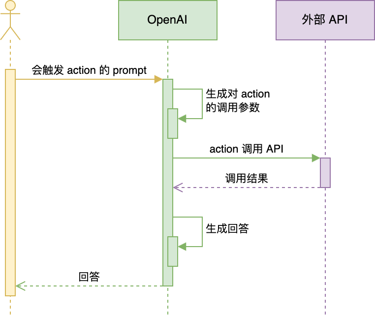
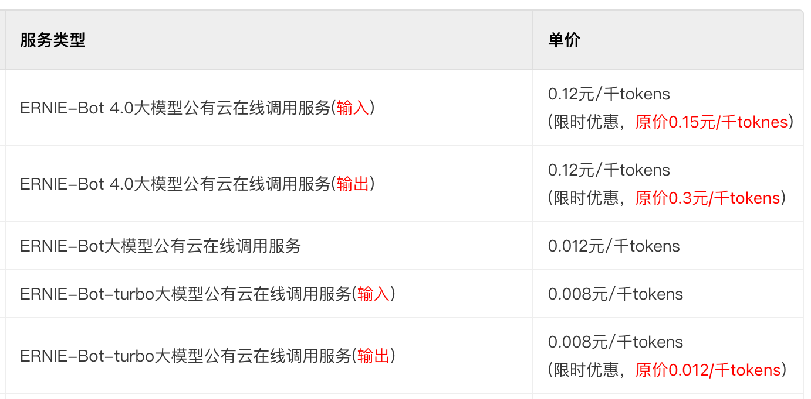

# Function Calling

## 💡 这节课会带给你

1. 用自然语言连接系统的认知，面向未来思考系统间的集成
2. GPTs 是如何连接外部世界的
3. 用 Function Calling 把大模型和业务连接起来

开始上课！


## 接口（Interface）


两种常见接口：

1. 人机交互接口，User Interface，简称 UI
2. 应用程序编程接口，Application Programming Interface，简称 API

接口能「通」的关键，是两边都要遵守约定。

- 人要按照 UI 的设计来操作。UI 的设计要符合人的习惯
- 程序要按照 API 的设计来调用。API 的设计要符合程序惯例

你是不是有很多调接口的痛苦经历？比如：

- 文档坑
- 大小写坑
- 参数顺序坑
- 参数类型坑
- ……


## 接口的进化


UI 进化的趋势是：越来越适应人的习惯，越来越自然

1. 命令行，Command Line Interface，简称 CLI（DOS、Unix/Linux shell, Windows Power Shell）
2. 图形界面，Graphical User Interface，简称 GUI（Windows、MacOS、iOS、Android）
3. 语言界面，Conversational User Interface，简称 CUI，或 Natural-Language User Interface，简称 LUI ← **我们在这里**
4. 脑机接口，Brain–Computer Interface，简称 BCI


API：

1. 从本地到远程，从同步到异步，媒介发生很多变化，但本质一直没变：**程序员的约定**
2. 现在，开始进化到自然语言接口，Natural-Language Interface，简称 NLI


## 自然语言连接一切（Natural Language Interface）


NLI 是我们在[《以 ChatGPT 为代表的「大模型」会是多大的技术革命？》](https://mp.weixin.qq.com/s/t0Ml7E-CvlKfdaUMBGKJBg)一文中提出的概念。

> 用户操作习惯的迁移，会逼所有软件，都得提供「自然语言界面（Natural Language Interface，简称 NLI）」。这是我生造的词，指的是以自然语言为输入的接口。
>
> 不仅用户界面要 NLI，API 也要 NLI 化。这是因为用户发出的宏观指令，往往不会是一个独立软件能解决的，它需要很多软件、设备的配合。
>
> 一种实现思路是，入口 AI（比如 Siri、小爱同学，机器人管家）非常强大，能充分了解所有软件和设备的能力，且能准确地把用户任务拆解和分发下去。这对入口 AI 的要求非常高。
>
> 另一种实现思路是，入口 AI 收到自然语言指令，把指令通过 NLI 广播出去（也可以基于某些规则做有选择的广播，保护用户隐私），由各个软件自主决策接不接这个指令，接了要怎么做，该和谁配合。
>
> ……
>
> 当 NLI 成为事实标准，那么互联网上软件、服务的互通性会大幅提升，不再受各种协议、接口的限制。

最自然的接口，就是自然语言接口：

以前因为计算机处理不对自然语言，所以有了那么多编程语言，那么多接口，那么多协议，那么多界面风格。而且，它们每一次进化，都是为了「更自然」。现在，终极的自然，到来了。**我们终于可以把计算机当人看了！**

OpenAI 是如何用自然语言连接一切的呢？


## 为什么要大模型连接外部世界？


<div class="alert alert-success">
<b>大模型两大缺陷：</b>
<ol>
<li><b>并非知晓一切</b>
    <ol>
    <li>训练数据不可能什么都有。垂直、非公开数据必有欠缺</li>
    <li>不知道最新信息。大模型的训练周期很长，且更新一次耗资巨大，还有越训越傻的风险。所以 ta 不可能实时训练。GPT-3.5 的知识截至 2022 年 1 月，GPT-4 是 2023 年 4 月。</li>
    </ol>
<li><b>没有「真逻辑」</b>。它表现出的逻辑、推理，是训练文本的统计规律，而不是真正的逻辑。</li>
</ol>
<p>所以：大模型需要连接真实世界，并对接真逻辑系统。</p>
</div>

比如算加法：

1. 把 100 以内所有加法算式都训练给大模型，ta 就能回答 100 以内的加法算式
2. 如果问 ta 更大数字的加法，就不一定对了
3. 因为 ta 并不懂「加法」，只是记住了 100 以内的加法算式的统计规律
4. Ta 是用字面意义做数学

数学能力最强的软件系统是 Wolfram Alpha，推荐阅读这篇文章了解它和 ChatGPT 原理的不同：[《Wolfram|Alpha as the Way to Bring Computational Knowledge Superpowers to ChatGPT》](https://writings.stephenwolfram.com/2023/01/wolframalpha-as-the-way-to-bring-computational-knowledge-superpowers-to-chatgpt/)

PS. Wolfram 的书《[这就是 ChatGPT！](https://u.jd.com/p8x8bdp)》是从神经网络层面解释大模型原理的最好读的书。[英文版免费](https://writings.stephenwolfram.com/2023/02/what-is-chatgpt-doing-and-why-does-it-work/)


## OpenAI 用 Actions 连接外部世界

第一次尝试用 Plugins 连接真实世界，但产品很不成功，原因：

1. 不在「场景」中，不能提供端到端一揽子服务
2. 缺少「强 Agent」调度，只能手工选三个 plugin，使用成本太高

第二次尝试，升级为 Actions，内置到 GPTs 中，解决了落地场景问题。

小瓜 GPT 已经接入了高德地图 actions，可以试试问位置相关的问题：https://chat.openai.com/g/g-DxRsTzzep-xiao-gua


工作流程：



<div class="alert alert-warning">
<b>思考：</b>GPT 怎么把 prompt 和 API 功能做匹配的？
</div>


## Actions ~~开发~~对接


Actions 官方文档：https://platform.openai.com/docs/actions


把 API 对接到 GPTs 里，只需要配置一段 API 描述信息：

```yaml
openapi: 3.1.0
info:
  title: 高德地图
  description: 获取 POI 的相关信息
  version: v1.0.0
servers:
  - url: https://restapi.amap.com/v5/place
paths:
  /text:
    get:
      description: 根据POI名称，获得POI的经纬度坐标
      operationId: get_location_coordinate
      parameters:
        - name: keywords
          in: query
          description: POI名称，必须是中文
          required: true
          schema:
            type: string
        - name: region
          in: query
          description: POI所在的区域名，必须是中文
          required: false
          schema:
            type: string
      deprecated: false
  /around:
    get:
      description: 搜索给定坐标附近的POI
      operationId: search_nearby_pois
      parameters:
        - name: keywords
          in: query
          description: 目标POI的关键字
          required: true
          schema:
            type: string
        - name: location
          in: query
          description: 中心点的经度和纬度，用逗号分隔
          required: false
          schema:
            type: string
      deprecated: false
components:
  schemas: {}
```

还需要配置 API key 来满足权限要求。


这里的所有 `name`、`description` 都是 prompt，决定了 GPT 会不会调用你的 API，调用得是否正确。

<div class="alert alert-warning">
<b>思考：</b>为什么不干脆整个描述文件都用自然语言写？非要用结构化的 JSON 或 YAML？
</div>


## GPTs 与它的平替们

[OpenAI GPTs](https://chat.openai.com/gpts/discovery)

1. 无需编程，就能定制个性对话机器人的平台
2. 可以放入自己的知识库，实现 RAG（后面会讲）
3. 可以通过 actions 对接专有数据和功能
4. 内置 DALL·E 3 文生图和 Code Interpreter 能力
5. 只有 ChatGPT Plus 会员可以使用

推荐两款平替：

[字节跳动 Coze](https://www.coze.com/)

1. 可以免科学上网，免费使用 GPT-4 等 OpenAI 的服务！大羊毛！
2. 只有英文界面，但其实对中文更友好
3. Prompt 优化功能更简单直接

[Dify](https://dify.ai/)

1. 开源，中国公司开发
2. 功能最丰富
3. 可以本地部署，支持非常多的大模型
4. 有 GUI，也有 API

有这类无需开发的工具，为什么还要学大模型开发技术呢？

1. 它们都无法针对业务需求做极致调优
2. 它们和其它业务系统的集成不是特别方便

Function Calling 技术可以把自己开发的大模型应用和其它业务系统连接。


## Function Calling 的机制


Function Calling 完整的官方接口文档：https://platform.openai.com/docs/guides/gpt/function-calling

值得一提： 接口里叫 `tools`，是从 `functions` 改的。这是一个很有趣的指向


## 示例 1：调用本地函数


需求：实现一个回答问题的 AI。题目中如果有加法，必须能精确计算。


```python
# 初始化
from openai import OpenAI
from dotenv import load_dotenv, find_dotenv
import os
import json

_ = load_dotenv(find_dotenv())

client = OpenAI()


def print_json(data):
    """
    打印参数。如果参数是有结构的（如字典或列表），则以格式化的 JSON 形式打印；
    否则，直接打印该值。
    """
    if hasattr(data, 'model_dump_json'):
        data = json.loads(data.model_dump_json())

    if (isinstance(data, (list, dict))):
        print(json.dumps(
            data,
            indent=4,
            ensure_ascii=False
        ))
    else:
        print(data)
```


```python
def get_completion(messages, model="gpt-3.5-turbo"):
    response = client.chat.completions.create(
        model=model,
        messages=messages,
        temperature=0.7,  # 模型输出的随机性，0 表示随机性最小
        tools=[{  # 用 JSON 描述函数。可以定义多个。由大模型决定调用谁。也可能都不调用
            "type": "function",
            "function": {
                "name": "sum",
                "description": "加法器，计算一组数的和",
                "parameters": {
                    "type": "object",
                    "properties": {
                        "numbers": {
                            "type": "array",
                            "items": {
                                "type": "number"
                            }
                        }
                    }
                }
            }
        }],
    )
    return response.choices[0].message
```


```python
from math import *

prompt = "Tell me the sum of 1, 2, 3, 4, 5, 6, 7, 8, 9, 10."
# prompt = "桌上有 2 个苹果，四个桃子和 3 本书，一共有几个水果？"
# prompt = "1+2+3...+99+100"
# prompt = "1024 乘以 1024 是多少？"   # Tools 里没有定义乘法，会怎样？
# prompt = "太阳从哪边升起？"           # 不需要算加法，会怎样？

messages = [
    {"role": "system", "content": "你是一个数学家"},
    {"role": "user", "content": prompt}
]
response = get_completion(messages)

# 把大模型的回复加入到对话历史中
print_json(response)
messages.append(response)

print("=====GPT回复=====")
print_json(response)

# 如果返回的是函数调用结果，则打印出来
if (response.tool_calls is not None):
    # 是否要调用 sum
    tool_call = response.tool_calls[0]
    if (tool_call.function.name == "sum"):
        # 调用 sum
        args = json.loads(tool_call.function.arguments)
        result = sum(args["numbers"])
        print("=====函数返回=====")
        print(result)

        # 把函数调用结果加入到对话历史中
        messages.append(
            {
                "tool_call_id": tool_call.id,  # 用于标识函数调用的 ID
                "role": "tool",
                "name": "sum",
                "content": str(result)  # 数值 result 必须转成字符串
            }
        )

        # 再次调用大模型
        print("=====最终回复=====")
        print(get_completion(messages).content)
```

    {
        "content": "",
        "role": "assistant",
        "function_call": null,
        "tool_calls": [
            {
                "id": "call_Bsm2xU6jjB4BAeAwZsrP9kNW",
                "function": {
                    "arguments": "{\n  \"numbers\": [1, 2, 3, 4, 5, 6, 7, 8, 9, 10]\n}",
                    "name": "sum"
                },
                "type": "function"
            }
        ]
    }
    =====GPT回复=====
    {
        "content": "",
        "role": "assistant",
        "function_call": null,
        "tool_calls": [
            {
                "id": "call_Bsm2xU6jjB4BAeAwZsrP9kNW",
                "function": {
                    "arguments": "{\n  \"numbers\": [1, 2, 3, 4, 5, 6, 7, 8, 9, 10]\n}",
                    "name": "sum"
                },
                "type": "function"
            }
        ]
    }
    =====函数返回=====
    55
    =====最终回复=====
    The sum of 1, 2, 3, 4, 5, 6, 7, 8, 9, 10 is 55.


<div class="alert alert-success">
<b>划重点：</b>
<ol>
<li>Function Calling 中的函数与参数的描述也是一种 Prompt</li>
<li>这种 Prompt 也需要调优，否则会影响函数的召回、参数的准确性，甚至让 GPT 产生幻觉</li>
</ol>
</div>


## 示例 2：多 Function 调用

需求：查询某个地点附近的酒店、餐厅、景点等信息。即，查询某个 POI 附近的 POI。


```python
def get_completion(messages, model="gpt-3.5-turbo"):
    response = client.chat.completions.create(
        model=model,
        messages=messages,
        temperature=0,  # 模型输出的随机性，0 表示随机性最小
        seed=1024,      # 随机种子保持不变，temperature 和 prompt 不变的情况下，输出就会不变
        tool_choice="auto",  # 默认值，由 GPT 自主决定返回 function call 还是返回文字回复。也可以强制要求必须调用指定的函数，详见官方文档
        tools=[{
            "type": "function",
            "function": {

                "name": "get_location_coordinate",
                "description": "根据POI名称，获得POI的经纬度坐标",
                "parameters": {
                    "type": "object",
                    "properties": {
                        "location": {
                            "type": "string",
                            "description": "POI名称，必须是中文",
                        },
                        "city": {
                            "type": "string",
                            "description": "POI所在的城市名，必须是中文",
                        }
                    },
                    "required": ["location", "city"],
                }
            }
        },
            {
            "type": "function",
            "function": {
                "name": "search_nearby_pois",
                "description": "搜索给定坐标附近的poi",
                "parameters": {
                    "type": "object",
                    "properties": {
                        "longitude": {
                            "type": "string",
                            "description": "中心点的经度",
                        },
                        "latitude": {
                            "type": "string",
                            "description": "中心点的纬度",
                        },
                        "keyword": {
                            "type": "string",
                            "description": "目标poi的关键字",
                        }
                    },
                    "required": ["longitude", "latitude", "keyword"],
                }
            }
        }],
    )
    return response.choices[0].message
```


```python
import requests

amap_key = "6d672e6194caa3b639fccf2caf06c342"


def get_location_coordinate(location, city):
    url = f"https://restapi.amap.com/v5/place/text?key={amap_key}&keywords={location}&region={city}"
    print(url)
    r = requests.get(url)
    result = r.json()
    if "pois" in result and result["pois"]:
        return result["pois"][0]
    return None


def search_nearby_pois(longitude, latitude, keyword):
    url = f"https://restapi.amap.com/v5/place/around?key={amap_key}&keywords={keyword}&location={longitude},{latitude}"
    print(url)
    r = requests.get(url)
    result = r.json()
    ans = ""
    if "pois" in result and result["pois"]:
        for i in range(min(3, len(result["pois"]))):
            name = result["pois"][i]["name"]
            address = result["pois"][i]["address"]
            distance = result["pois"][i]["distance"]
            ans += f"{name}\n{address}\n距离：{distance}米\n\n"
    return ans
```


```python
prompt = "我想在北京五道口附近喝咖啡，给我推荐几个"
# prompt = "我到北京出差，给我推荐三里屯的酒店，和五道口附近的咖啡"

messages = [
    {"role": "system", "content": "你是一个地图通，你可以找到任何地址。"},
    {"role": "user", "content": prompt}
]
response = get_completion(messages)
messages.append(response)  # 把大模型的回复加入到对话中
print("=====GPT回复=====")
print_json(response)

while (response.tool_calls is not None):
    # 1106 版新模型支持一次返回多个函数调用请求，所以要考虑到这种情况
    for tool_call in response.tool_calls:
        args = json.loads(tool_call.function.arguments)
        print("函数参数展开：")
        print_json(args)

        if (tool_call.function.name == "get_location_coordinate"):
            print("Call: get_location_coordinate")
            result = get_location_coordinate(**args)
        elif (tool_call.function.name == "search_nearby_pois"):
            print("Call: search_nearby_pois")
            result = search_nearby_pois(**args)

        print("=====函数返回=====")
        print_json(result)

        messages.append({
            "tool_call_id": tool_call.id,  # 用于标识函数调用的 ID
            "role": "tool",
            "name": tool_call.function.name,
            "content": str(result)  # 数值result 必须转成字符串
        })

    response = get_completion(messages)
    messages.append(response)  # 把大模型的回复加入到对话中

print("=====最终回复=====")
print(response.content)
```

    =====GPT回复=====
    {
        "content": null,
        "role": "assistant",
        "function_call": null,
        "tool_calls": [
            {
                "id": "call_WVpqDkc09ATorLhUqWOr155W",
                "function": {
                    "arguments": "{\n  \"location\": \"北京五道口\",\n  \"city\": \"北京\"\n}",
                    "name": "get_location_coordinate"
                },
                "type": "function"
            }
        ]
    }
    函数参数展开：
    {
        "location": "北京五道口",
        "city": "北京"
    }
    Call: get_location_coordinate
    https://restapi.amap.com/v5/place/text?key=6d672e6194caa3b639fccf2caf06c342&keywords=北京五道口&region=北京
    =====函数返回=====
    {
        "parent": "",
        "address": "海淀区",
        "distance": "",
        "pcode": "110000",
        "adcode": "110108",
        "pname": "北京市",
        "cityname": "北京市",
        "type": "地名地址信息;热点地名;热点地名",
        "typecode": "190700",
        "adname": "海淀区",
        "citycode": "010",
        "name": "五道口",
        "location": "116.338611,39.992552",
        "id": "B000A8WSBH"
    }
    函数参数展开：
    {
        "longitude": "116.338611",
        "latitude": "39.992552",
        "keyword": "咖啡"
    }
    Call: search_nearby_pois
    https://restapi.amap.com/v5/place/around?key=6d672e6194caa3b639fccf2caf06c342&keywords=咖啡&location=116.338611,39.992552
    =====函数返回=====
    星巴克(北京五道口购物中心店)
    成府路28号1层101-10B及2层201-09号
    距离：40米
    
    瑞幸咖啡(五道口购物中心店)
    成府路28号五道口购物中心负一层101号
    距离：67米
    
    MANNER COFFEE(五道口购物中心店)
    成府路28号五道口购物中心一层东侧L1-04
    距离：82米


​    
    =====最终回复=====
    我为您找到了几个在北京五道口附近的咖啡店：
    
    1. 星巴克(北京五道口购物中心店)
       地址：成府路28号1层101-10B及2层201-09号
       距离：40米
    
    2. 瑞幸咖啡(五道口购物中心店)
       地址：成府路28号五道口购物中心负一层101号
       距离：67米
    
    3. MANNER COFFEE(五道口购物中心店)
       地址：成府路28号五道口购物中心一层东侧L1-04
       距离：82米
    
    您可以根据距离和个人喜好选择其中一家前往品尝咖啡。祝您享受愉快的咖啡时光！


## 示例 3：用 Function Calling 获取 JSON 结构

Function calling 生成 JSON 的稳定性比较高。

第一课中的例子：从一段文字中抽取联系人姓名、地址和电话


```python
def get_completion(messages, model="gpt-3.5-turbo"):
    response = client.chat.completions.create(
        model=model,
        messages=messages,
        temperature=0,  # 模型输出的随机性，0 表示随机性最小
        tools=[{
            "type": "function",
            "function": {
                "name": "add_contact",
                "description": "添加联系人",
                "parameters": {
                    "type": "object",
                    "properties": {
                        "name": {
                            "type": "string",
                            "description": "联系人姓名"
                        },
                        "address": {
                            "type": "string",
                            "description": "联系人地址"
                        },
                        "tel": {
                            "type": "string",
                            "description": "联系人电话"
                        },
                    }
                }
            }
        }],
    )
    return response.choices[0].message


prompt = "帮我寄给王卓然，地址是北京市朝阳区亮马桥外交办公大楼，电话13012345678。"
messages = [
    {"role": "system", "content": "你是一个联系人录入员。"},
    {"role": "user", "content": prompt}
]
response = get_completion(messages)
print("====GPT回复====")
print_json(response)
args = json.loads(response.tool_calls[0].function.arguments)
print("====函数参数====")
print_json(args)
```

    ====GPT回复====
    {
        "content": null,
        "role": "assistant",
        "function_call": null,
        "tool_calls": [
            {
                "id": "call_7tV9MMK1JN8jhaiQ6Ayii1WO",
                "function": {
                    "arguments": "{\n  \"name\": \"王卓然\",\n  \"address\": \"北京市朝阳区亮马桥外交办公大楼\",\n  \"tel\": \"13012345678\"\n}",
                    "name": "add_contact"
                },
                "type": "function"
            }
        ]
    }
    ====函数参数====
    {
        "name": "王卓然",
        "address": "北京市朝阳区亮马桥外交办公大楼",
        "tel": "13012345678"
    }


<div class="alert alert-success">
用最新的 <a href="https://platform.openai.com/docs/guides/text-generation/json-mode">JSON Mode</a>，也可以不用 function calling 而获得稳定的 JSON 输出。
</div>


## 示例 4：通过 Function Calling 查询数据库


需求：从订单表中查询各种信息，比如某个用户的订单数量、某个商品的销量、某个用户的消费总额等等。


```python
def get_sql_completion(messages, model="gpt-3.5-turbo"):
    response = client.chat.completions.create(
        model=model,
        messages=messages,
        temperature=0,
        tools=[{  # 摘自 OpenAI 官方示例 https://github.com/openai/openai-cookbook/blob/main/examples/How_to_call_functions_with_chat_models.ipynb
            "type": "function",
            "function": {
                "name": "ask_database",
                "description": "Use this function to answer user questions about business. \
                            Output should be a fully formed SQL query.",
                "parameters": {
                    "type": "object",
                    "properties": {
                        "query": {
                            "type": "string",
                            "description": f"""
                            SQL query extracting info to answer the user's question.
                            SQL should be written using this database schema:
                            {database_schema_string}
                            The query should be returned in plain text, not in JSON.
                            The query should only contain grammars supported by SQLite.
                            """,
                        }
                    },
                    "required": ["query"],
                }
            }
        }],
    )
    return response.choices[0].message
```


```python
#  描述数据库表结构
database_schema_string = """
CREATE TABLE orders (
    id INT PRIMARY KEY NOT NULL, -- 主键，不允许为空
    customer_id INT NOT NULL, -- 客户ID，不允许为空
    product_id STR NOT NULL, -- 产品ID，不允许为空
    price DECIMAL(10,2) NOT NULL, -- 价格，不允许为空
    status INT NOT NULL, -- 订单状态，整数类型，不允许为空。0代表待支付，1代表已支付，2代表已退款
    create_time TIMESTAMP DEFAULT CURRENT_TIMESTAMP, -- 创建时间，默认为当前时间
    pay_time TIMESTAMP -- 支付时间，可以为空
);
"""
```


```python
import sqlite3

# 创建数据库连接
conn = sqlite3.connect(':memory:')
cursor = conn.cursor()

# 创建orders表
cursor.execute(database_schema_string)

# 插入5条明确的模拟记录
mock_data = [
    (1, 1001, 'TSHIRT_1', 50.00, 0, '2023-10-12 10:00:00', None),
    (2, 1001, 'TSHIRT_2', 75.50, 1, '2023-10-16 11:00:00', '2023-08-16 12:00:00'),
    (3, 1002, 'SHOES_X2', 25.25, 2, '2023-10-17 12:30:00', '2023-08-17 13:00:00'),
    (4, 1003, 'HAT_Z112', 60.75, 1, '2023-10-20 14:00:00', '2023-08-20 15:00:00'),
    (5, 1002, 'WATCH_X001', 90.00, 0, '2023-10-28 16:00:00', None)
]

for record in mock_data:
    cursor.execute('''
    INSERT INTO orders (id, customer_id, product_id, price, status, create_time, pay_time)
    VALUES (?, ?, ?, ?, ?, ?, ?)
    ''', record)

# 提交事务
conn.commit()
```


```python
def ask_database(query):
    cursor.execute(query)
    records = cursor.fetchall()
    return records


prompt = "10月的销售额"
# prompt = "统计每月每件商品的销售额"
# prompt = "哪个用户消费最高？消费多少？"

messages = [
    {"role": "system", "content": "基于 order 表回答用户问题"},
    {"role": "user", "content": prompt}
]
response = get_sql_completion(messages)
if response.content is None:
    response.content = ""
messages.append(response)
print("====Function Calling====")
print_json(response)

if response.tool_calls is not None:
    tool_call = response.tool_calls[0]
    if tool_call.function.name == "ask_database":
        arguments = tool_call.function.arguments
        args = json.loads(arguments)
        print("====SQL====")
        print(args["query"])
        result = ask_database(args["query"])
        print("====DB Records====")
        print(result)

        messages.append({
            "tool_call_id": tool_call.id,
            "role": "tool",
            "name": "ask_database",
            "content": str(result)
        })
        response = get_sql_completion(messages)
        print("====最终回复====")
        print(response.content)
```

    ====Function Calling====
    {
        "content": "",
        "role": "assistant",
        "function_call": null,
        "tool_calls": [
            {
                "id": "call_6K8wpQeTWXg3ka1G1x0nbERl",
                "function": {
                    "arguments": "{\n  \"query\": \"SELECT SUM(price) FROM orders WHERE strftime('%m', create_time) = '10' AND status = 1\"\n}",
                    "name": "ask_database"
                },
                "type": "function"
            }
        ]
    }
    ====SQL====
    SELECT SUM(price) FROM orders WHERE strftime('%m', create_time) = '10' AND status = 1
    ====DB Records====
    [(136.25,)]
    ====最终回复====
    10月的销售额为136.25。


## 示例 5：用 Function Calling 实现多表查询


```python
#  描述数据库表结构
database_schema_string = """
CREATE TABLE customers (
    id INT PRIMARY KEY NOT NULL, -- 主键，不允许为空
    customer_name VARCHAR(255) NOT NULL, -- 客户名，不允许为空
    email VARCHAR(255) UNIQUE, -- 邮箱，唯一
    register_time TIMESTAMP DEFAULT CURRENT_TIMESTAMP -- 注册时间，默认为当前时间
);
CREATE TABLE products (
    id INT PRIMARY KEY NOT NULL, -- 主键，不允许为空
    product_name VARCHAR(255) NOT NULL, -- 产品名称，不允许为空
    price DECIMAL(10,2) NOT NULL -- 价格，不允许为空
);
CREATE TABLE orders (
    id INT PRIMARY KEY NOT NULL, -- 主键，不允许为空
    customer_id INT NOT NULL, -- 客户ID，不允许为空
    product_id INT NOT NULL, -- 产品ID，不允许为空
    price DECIMAL(10,2) NOT NULL, -- 价格，不允许为空
    status INT NOT NULL, -- 订单状态，整数类型，不允许为空。0代表待支付，1代表已支付，2代表已退款
    create_time TIMESTAMP DEFAULT CURRENT_TIMESTAMP, -- 创建时间，默认为当前时间
    pay_time TIMESTAMP -- 支付时间，可以为空
);
"""

prompt = "统计每月每件商品的销售额"
# prompt = "这星期消费最高的用户是谁？他买了哪些商品？ 每件商品买了几件？花费多少？"
messages = [
    {"role": "system", "content": "基于 order 表回答用户问题"},
    {"role": "user", "content": prompt}
]
response = get_sql_completion(messages)
print(response.tool_calls[0].function.arguments)
```

    {
      "query": "SELECT strftime('%Y-%m', create_time) AS month, product_name, SUM(price) AS total_sales FROM orders JOIN products ON orders.product_id = products.id WHERE status = 1 GROUP BY month, product_name ORDER BY month, product_name"
    }


## 示例 6：Stream 模式

流式（stream）输出不会一次返回完整 JSON 结构，所以需要拼接后再使用。


```python
def get_completion(messages, model="gpt-3.5-turbo"):
    response = client.chat.completions.create(
        model=model,
        messages=messages,
        temperature=0,
        tools=[{
            "type": "function",
            "function": {
                "name": "sum",
                "description": "计算一组数的加和",
                "parameters": {
                    "type": "object",
                    "properties": {
                        "numbers": {
                            "type": "array",
                            "items": {
                                "type": "number"
                            }
                        }
                    }
                }
            }
        }],
        stream=True,    # 启动流式输出
    )
    return response


prompt = "1+2+3"
# prompt = "你是谁"

messages = [
    {"role": "system", "content": "你是一个小学数学老师，你要教学生加法"},
    {"role": "user", "content": prompt}
]
response = get_completion(messages)

function_name, args, text = "", "", ""

print("====Streaming====")

# 需要把 stream 里的 token 拼起来，才能得到完整的 call
for msg in response:
    delta = msg.choices[0].delta
    if delta.tool_calls:
        if not function_name:
            function_name = delta.tool_calls[0].function.name
        args_delta = delta.tool_calls[0].function.arguments
        print(args_delta)  # 打印每次得到的数据
        args = args + args_delta
    elif delta.content:
        text_delta = delta.content
        print(text_delta)
        text = text + text_delta

print("====done!====")

if function_name or args:
    print(function_name)
    print_json(args)
if text:
    print(text)
```

    ====Streaming====
    
    {


​     
     "
    numbers
    ":
     [
    1
    ,
     
    2
    ,
     
    3
    ]
    
    }
    ====done!====
    sum
    {
      "numbers": [1, 2, 3]
    }


## Function Calling 的注意事项


<div class="alert alert-success">
<b>划重点：</b>
<ol>
<li>只有 <code>gpt-3.5-turbo-1106</code> 和 <code>gpt-4-1106-preview</code> 可用本次课介绍的方法</li>
<li><code>gpt-3.5-turbo</code> 是 <code>gpt-3.5-turbo-1106</code> 的别名</li>
<li><code>gpt-4</code> 和 <code>gpt-4-1106-preview</code> 是两个不同的模型</li>
<li>OpenAI 针对 Function Calling 做了 fine-tuning，以尽可能保证函数调用参数的正确。机理后面课时会讲</li>
<li>函数声明是消耗 token 的。要在功能覆盖、省钱、节约上下文窗口之间找到最佳平衡</li>
<li>Function Calling 不仅可以调用读函数，也能调用写函数。但<a href="https://platform.openai.com/docs/guides/function-calling/introduction">官方强烈建议，在写之前，一定要有人做确认</a></li>
</ol>
</div>


## 支持 Function Calling 的国产大模型

- Function Calling 会成为所有大模型的标配，支持它的越来越多
- 不支持的大模型，某种程度上是不大可用的


### 百度文心大模型

官方文档：https://cloud.baidu.com/doc/WENXINWORKSHOP/index.html

百度文心系列大模型有三个。按发布时间从早到晚是：

1. ERNIE-Bot - 支持 Function Calling
2. ERNIE-Bot-turbo
3. ERNIE-Bot 4.0 - 支持 Function Calling（暂时白名单制）

从价格看区别：



Function Calling 的 API 和 OpenAI 1106 之前版本完全一样。


### MiniMax

官方文档：https://api.minimax.chat/document/guides/chat-pro?id=64b79fa3e74cddc5215939f4

- 这是个公众不大知道，但其实挺强的大模型，尤其角色扮演能力
- 如果你曾经在一个叫 Glow 的 app 流连忘返，那么你已经用过它了
- 应该是最早支持 Function Calling 的国产大模型
- Function Calling 的 API 和 OpenAI 1106 版之前完全一样，但其它 API 有很大的特色


### ChatGLM3-6B

官方文档：https://github.com/THUDM/ChatGLM3/blob/main/tool_using/README.md

- 最著名的国产开源大模型，生态最好
- 早就使用 `tools` 而不是 `function` 来做参数，其它和 OpenAI 1106 版之前完全一样


### 讯飞星火 3.0

官方文档：https://www.xfyun.cn/doc/spark/Web.html#_2-function-call%E8%AF%B4%E6%98%8E

和 OpenAI 1106 版之前完全一样


## Function Calling 的想象空间


想象你是下面产品的研发，怎样用 Function Calling 实现下面的功能？

1. 对着微信说：「给我每个好友发一条情真意切的拜年消息，还要带点儿小幽默」
2. 对着富途牛牛说：「人工智能相关股票，市盈率最低的是哪几个？最近交易量如何？都有哪些机构持有？」
3. 对着京东说：「我想买一台 65 寸的电视，不要日货，价格在 5000 元左右」

基本上：

1. 我们的任何功能都可以和大模型结合，提供更好的用户体验
2. 通过大模型，完成内部功能的组合调用，完全 agent 化设计系统架构

当然，「幻觉」仍然是存在的。如何尽量减少幻觉的影响，参考以下资料：

- 自然语言生成中关于幻觉研究的综述：https://arxiv.org/abs/2202.03629
- 语言模型出现的幻觉是如何滚雪球的：https://arxiv.org/abs/2305.13534
- ChatGPT 在推理、幻觉和交互性上的评估：https://arxiv.org/abs/2302.04023
- 对比学习减少对话中的幻觉：https://arxiv.org/abs/2212.10400
- 自洽性提高了语言模型的思维链推理能力：https://arxiv.org/abs/2203.11171
- 生成式大型语言模型的黑盒幻觉检测：https://arxiv.org/abs/2303.08896


<div class="alert alert-success">
<b>NLP 算法工程师视角：</b>
<ol>
<li>模型砍大面，规则修细节</li>
<li>一个模型搞不定的问题，拆成多个解决</li>
<li>评估算法的准确率（所以要先有测试集，否则别问「能不能做」）</li>
<li>评估 bad case 的影响面</li>
<li>算法的结果永远不是100%正确的，建立在这个假设基础上推敲产品的可行性</li>
</ol>
</div>


## 彩蛋


第一期同学/现任助教「拐爷&&老拐瘦」可能是国内最早在真实业务里落地 Function Calling 的人。

本节课从他的经验中吸取了不少营养，特此致谢。下面是它的产品 demo 视频:

<video src="./demo.mp4" controls="controls" width=600px style="margin-left: 0px"></video>

**产品链接：https://assistant.kattgatt.com/**


## 作业

尝试用 Function Calling 的方式实现第二课手机中流量包智能客服的例子。

