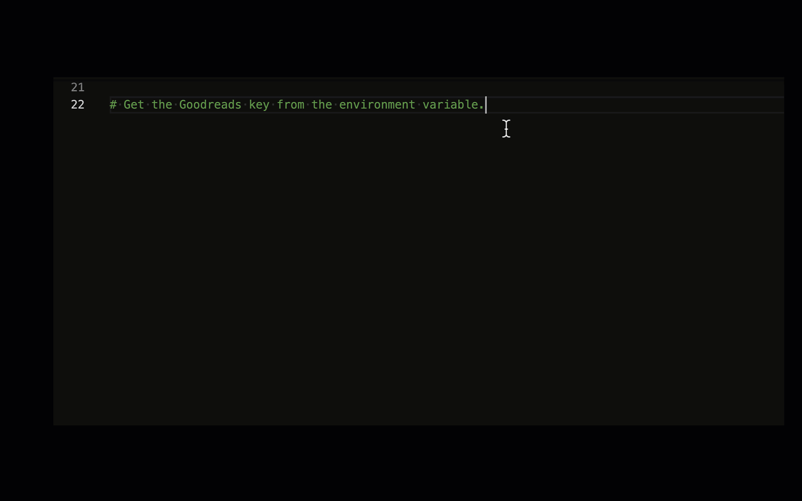

# 从 AI 编程认知 AI


## 💡 这节课会带给你


1. 所有人：通过 AI 编程，洞察 AI 的能力本质
1. 编程新手：掌握十倍提升学习、编码效率的工具
1. 编程老手：了解 AI 编程的原理，触类旁通其它应用场景

开始上课！


## 最好的学习方式，是天天用

问自己两个问题：

1. 我时间都消耗在哪里？
2. 怎么让 AI 帮我省时间？

<div class="alert alert-success">
<b>划重点：</b>凡是「输入和输出都是文本」的场景，都值得尝试用大模型提效。
</div>


AI 编程提效案例一：


AI 编程提效案例二：[编程小白的逆袭：借助 AI 打造第一个独立编程项目](https://mp.weixin.qq.com/s/rLlx8yuahQdSbHLNITXSFA)

软件开发过程，已验证的 AI 提效场景：

- 市场调研
- 需求分析
- PRD 撰写
- 图形元素绘制
- 技术选型
- 从需求文本生成代码
- 从设计图生成代码
- 代码审查
- 编写测试用例
- 运维

此外，撰写标书、营销文案、宣传图片、LOGO、商标等等周边场景，都可以用 AI 提效。

方法可以简化成一句话：**用 ChatGPT Plus**。

使用技巧：

- 所有 prompt engineering 的技巧都有效，可以把代码、错误信息直接粘贴进去
- 任何技术相关的问题都可以问，比自己搜索效率高很多
- ChatALL 大量依赖 GPT-4。过程实录：https://chat.openai.com/share/ecfafa99-aaad-4432-a40c-81c261376758 （对话轮次非常多加载慢，所以几乎总是 404）。如果打不开，别到群里问题，看[这个图](gpt-4-chatall.png)吧
- 其实，太多轮次对话并不会带来性能提升，可能反倒引入不相关的东西。开新轮次，最近 5 轮对话带足够的信息量，效果更好

但是，落到**写代码**这件事，还有更好的工具。


## 编程能力是大模型各项能力的天花板

使用 AI 编程的感受：秒变技术总监，并拥有一个**不疲倦、不拒绝、不抱怨、不顶嘴、不要加薪**还啥都懂的全能下属。

1. 省却繁琐重复性工作，幸福感提升。但下属表现不稳定，也挺闹心
2. 突破个人能力边界，下属会就相当于我会。但总拿不准下属做得对不对，怕被糊弄

当 AI 的总监，能更了解 AI：

- 「编程」是目前大模型能力最强的垂直领域，甚至超越了对「自然语言」本身的处理能力。因为：
  - 训练数据质量高
  - 结果可衡量
  - 编程语言无二义性
  - 有[论文](https://arxiv.org/pdf/2211.09110.pdf)证明编程训练能增强模型的推理能力，所以会特别着意训练
- 知道怎么用好 AI 编程，了解它的能力边界、使用场景，就能类比出在其他领域 AI 怎么落地，能力上限在哪
  - 此观点是我们原创，在分享过数次后，GitHub 官方发了一篇文章：[How to build an enterprise LLM application: Lessons from GitHub Copilot](https://github.blog/2023-09-06-how-to-build-an-enterprise-llm-application-lessons-from-github-copilot/)。当然，这只是巧合。

所以：

<div class="alert alert-success">
<b>划重点：</b>使用 AI 编程，除了解决编程问题以外，更重要是形成对 AI 的正确认知。
</div>


## GitHub Copilot


[GitHub Copilot](https://github.com/features/copilot) 创造了一个奇迹：

**所有竞争对手（Amazon、Google、Meta、腾讯等）都是免费的，每月 10-20 美元的它仍市占率最高。**

不使用它只有一个理由：保密自己的代码。

这是一个能提升**幸福感**的工具，随时都有 Aha! 时刻。

几个事实：

- 2021 年 6 月上线，比 ChatGPT 早近一年半
- GitHub 统计：
  - 88% 的用户获得效率提升
  - 平均 46% 的代码由它完成
  - 平均效率提升 55%（网易内部统计 38%）
- AGI 课堂调研试用到付费转化率：69%
- 个人版 10 美元/月，企业版 19 美元/月


### 安装

1. 首先，需要有 GitHub 账号
2. 然后，到 https://github.com/settings/copilot 启用
3. 最后，安装 IDE 插件，比如
   - VSCode: https://marketplace.visualstudio.com/items?itemName=GitHub.copilot
   - PyCharm: https://plugins.jetbrains.com/plugin/17718-github-copilot

注意：要全局科学上网才能正常使用


### 刷刷写代码

Copilot 的使用其实不需要学习……正常写代码，就会收获不断的惊喜。

它根据上下文，自动生成建议代码。如果觉得合适，按下 tab 就行了。比如：

#### 完成整个函数


#### 写测试用例


#### 根据注释写代码



但这种用法不太推荐，因为注释里针对 AI 而写的 prompt，并不适合人类阅读。

如果想从需求生成代码，更推荐后面介绍的「Copilot chat」。


#### 一些技巧

1. 代码有了，再写注释，更省力
2. 改写当前代码，可另起一块新写，AI 补全得更准，完成后再删旧代码
3. `Cmd/Ctrl + →` 只接受一个 token
4. 如果有旧代码希望被参考，就把代码文件在新 tab 页里打开


#### 原理

- 最初使用 OpenAI Codex 模型，它也是 GPT-3.5、GPT-4 的「一部分」。[现在已经完全升级，模型细节未知](https://github.blog/2023-07-28-smarter-more-efficient-coding-github-copilot-goes-beyond-codex-with-improved-ai-model/)。
- 应用层的技术就是 prompt engineering。Prompt 中包含：
  1. 光标前和光标后的代码片段
  1. 其它相关代码片段。当前文件和其它打开的 tab 里的代码被切成每个 60 行的片段，用 [Jaccard 相似度](https://zh.wikipedia.org/wiki/%E9%9B%85%E5%8D%A1%E5%B0%94%E6%8C%87%E6%95%B0)评分，取高分的
  1. 被取用的代码片段的路径。用注释的方式插入，例如：`# filepath: foo/bar.py`，或者 `// filepath: foo.bar.js`
- 在函数定义、类定义、if-else 等之后，会补全整段代码，其它时候只补全当前行


#### 了解更多

- [Inside GitHub: Working with the LLMs behind GitHub Copilot](https://github.blog/2023-05-17-inside-github-working-with-the-llms-behind-github-copilot/)
- [How GitHub Copilot is getting better at understanding your code](https://github.blog/2023-05-17-how-github-copilot-is-getting-better-at-understanding-your-code/)
- [A developer’s guide to prompt engineering and LLMs](https://github.blog/2023-07-17-prompt-engineering-guide-generative-ai-llms/)


### GitHub Copilot Chat

- 一个独立插件
- 安装地址：https://marketplace.visualstudio.com/items?itemName=GitHub.copilot-chat
- 背后是 GPT-4 Turbo

官方使用演示：

<video src="Copilot-Chat-Debug-Blog.mp4" controls="controls" width="100%" height="auto" preload="none"></video>

敲「/」可以看到特殊指令：


选中要操作的代码，或者光标停留在想插入代码的地方，按 `Cmd/Ctrl + i`，可以内嵌呼出 Copilot chat：

<video src="CopilotChatVSInlineRefinement.mp4" controls="controls" width="100%" height="auto" preload="none"></video>


### 命令行的 Copilot

先要安装 GitHub CLI：https://cli.github.com/

然后：

```bash
gh copilot suggest 怎样把 python 的 openai 库升级到最新
gh copilot explain "rm -rf /*"
```


### 生成 git commit message

入口自己找吧……


## Copilot 的平替


### 国产开源 CodeGeeX

CodeGeeX：https://codegeex.cn/

- 纯国产，智谱 AI 制造
- IDE 插件免费使用
- 模型开源，个人使用免费，商用需授权
- 补全和对话插件都有


### 可本机部署的 Tabby

Tabby：https://tabby.tabbyml.com/

- 全开源
- 可以本机部署，也可以独立本地部署
- 支持所有开源编程模型


### 其它

1. [Bito](https://bito.ai/) - 比 Copilot 还多些创新
2. [Amazon CodeWhisperer](https://aws.amazon.com/codewhisperer/) - 代码补全，免费。AWS 相关的编程能力卓越。其它凑合
3. [Cursor](https://www.cursor.so/) - AI first 的 IDE。被逼开源
4. [Tabnine](https://www.tabnine.com/) - 代码补全，个人基础版免费


### 更多开源编程大模型

1. [Code Llama](https://ai.meta.com/blog/code-llama-large-language-model-coding/) - Meta 出品，可能是开源中最强的
2. [姜子牙 Ziya-Coding-15B-v1](https://huggingface.co/IDEA-CCNL/Ziya-Coding-15B-v1) - 深圳 IDEA 研究院出品
3. [CodeFuse-CodeLlama-34B](https://huggingface.co/codefuse-ai/CodeFuse-CodeLlama-34B) - 阿里出品
4. [WizardCoder](https://github.com/nlpxucan/WizardLM) - WizardLM 出品


## 编程 Agents

前面的工具都是帮你编程，而 Agent 是完全代替你编程。甚至能做更多……

<div class="alert alert-warning">
<b>警告：</b>以下介绍的现在都只能玩玩，做技术探讨，还远没到实用的程度。
</div>


### MetaGPT：多智能体元编程框架

https://github.com/geekan/MetaGPT

它不只写代码，而且写文档、画图。详见讲座课里 MetaGPT 核心工程师的分享。

核心 prompts：https://github.com/geekan/MetaGPT/tree/main/metagpt/prompts

评价：

- 让 agent 模拟岗位这个思路挺有意思。未来的公司就是人和 agent 混合的，这样的系统架构更匹配公司治理
- 所以 MetaGPT 其实是个多 Agent 开发框架，而不是单纯的编程工具


### GPT Engineer

https://github.com/AntonOsika/gpt-engineer

指定您想要它构建的内容，AI 会要求澄清，然后构建它。

只需三步操作：

```bash
pip install gpt-engineer
vim prompt
gpt-engineer .
```

核心 prompts：https://github.com/AntonOsika/gpt-engineer/tree/main/gpt_engineer/preprompts

一句话评价：什么都能干，所以还什么都干不好。

有个专门开发 Web App 的，可用性好一些：https://gptengineer.app/


### MAGE - GPT Web App Generator

主页：https://usemage.ai/

源代码：https://github.com/wasp-lang/wasp

用 Wasp, React, Node.js 和 Prisma 生成全栈 Web 应用程序。

纯在线操作，跟着提示下载到本地执行。

核心 prompts：https://github.com/wasp-lang/wasp/blob/main/waspc/src/Wasp/AI/GenerateNewProject/Operation.hs

一句话评价：限定了技术栈，用参数做配置，提供框架代码，成品率更高。各种框架都该效仿。


### Agent 的落地难题

<div class="alert alert-success">
Agent 落地需要两个条件：
<ol>
<li>LLM 能力足够强</li>
<li>使用场景足够窄</li>
</ol>
</div>

用「把 AI 当人看」来理解：

1. 人的能力足够强，可以解决更复杂问题
2. 但人不可能在所有方面都是专家
3. 细分领域越窄，人越可能成为专家


## 总结

<div class="alert alert-success">
<b>划重点：</b>
<ol>
<li>GPT-4 是目前最强编程大模型，没有之一。第二强是 GPT-3.5。<b>剩下的非不得已不要用</b></li>
<li>GitHub Copilot 是最好的智能编程工具，没有之一</li>
<li>开源的 Code Llama、CodeGeeX 可以用</li>
<li>本地部署，可以考虑 Tabby</li>
</ol>
</div>


## AI 两大定律：能力定律，提效定律


### AI 编程的适用场景

1. 技术我懂，不想自己写
   - 帮我完成重复性工作
   - 帮我完成也要费费脑子才能写出来代码
2. 技术不大懂，让 AI 先做，自己边用边学
   - 当心 ta 犯错
   - 当心给的不是最佳方案

如果完全不懂技术，AI 编程的帮助不大。


### AI 幻觉的必然性，和 AI 能力的天花板

AI 祖师爷阿兰·图灵 1947 年在[伦敦数学学会的演讲](https://www.vordenker.de/downloads/turing-vorlesung.pdf)上说过：

> ...if a machine is expected to be infallible, it cannot also be intelligent.

翻译成中文是：

> 如果一个机器绝对不会犯错，它就不可能是智能的。

拥有类人的智能，就一定和人类一样，说胡话、瞎话、错话，说有争议的话。

所以，AI 的幻觉不可完全消除，只能尽可能压制。

所以，使用者的判断力，决定了 AI 能力的上限。 就像团队领导，是团队的上限一样。

我们原创了两个定律：

<div class="alert alert-success">
<h4>AI 能力定律：</h4>
<p>AI 能力的上限，是使用者的判断力</p>
<p>$\text{AI 能力} = \min(\text{AI 能力}, \text{使用者判断力})$ </p>
<h4>AI 提效定律：</h4>
<p>AI 提升的效率，与使用者的判断力成正比，与生产力成反比</p>
<p>$\text{效率提升幅度} = \frac{\text{使用者判断力}}{\text{使用者生产力}}$</p>
</div>

解读：

1. 使用者的判断力，是最重要的
2. 提升判断力，比提升实操能力更重要。所谓「眼高手低」者的福音
3. 广阔的视野是判断力的养料


## 彩蛋


Copilot 白嫖指南：

- 参与开源项目，可免费使用。ChatALL 随时欢迎大家参与
- 在校生，免费使用。[在此申请](https://docs.github.com/en/education/explore-the-benefits-of-teaching-and-learning-with-github-education/github-global-campus-for-students/apply-to-github-global-campus-as-a-student)


## 作业


开始使用 AI 编程，把 Aha! 时刻分享到群

