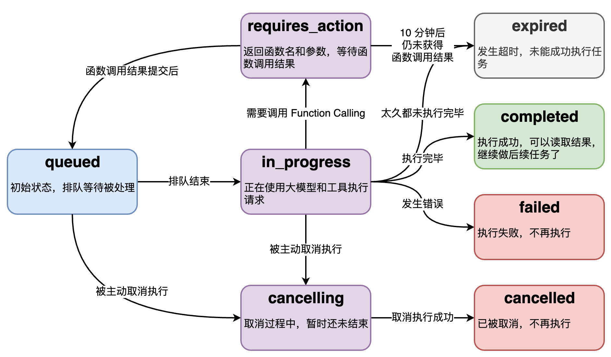

# Assistants API

## 💡 这节课会带给你

1. 原生 API、GPTs 和 Assistants API 的适用场景
2. 用 Assistants API 做一个 GPT

开始上课！


## OpenAI 其实给了应用开发者更大的空间

1. 更多技术路线选择：原生 API、GPTs 和 Assistants API
2. GPTs 的示范，起到教育客户的作用，有助于打开市场
3. 要更大自由度，需要用 Assistants API 开发
4. 想极致调优，还得原生 API + RAG
5. 国内大模型的 Assistants API，还得等，现在只能原生 API + RAG


## 技术选型参考

GPTs 的限制：

1. 界面不可定制，不能集成进自己的产品
2. 最多传 10 个文件
3. 只有 ChatGPT Plus 用户才能访问

适合使用 Assistants API 的场景：

1. 定制界面，或和自己的产品集成
2. 需要传大量文件
3. 服务国外用户，或国内 B 端客户
4. 数据保密性要求不高
5. 不差钱

适合使用原生 API 的场景：

1. 需要极致调优
2. 追求性价比
3. 服务国外用户，或国内 B 端客户
4. 数据保密性要求不高

适合使用国产或开源大模型的场景：

1. 服务国内用户
2. 数据保密性要求高
3. 压缩长期成本
4. 需要极致调优


## Assistants API 的主要能力

已有能力：

1. 创建和管理 assistant，每个 assistant 有独立的配置
2. 支持无限长的多轮对话，对话历史保存在 OpenAI 的服务器上
3. 支持 Code Interpreter
   1. 在沙箱里编写并运行 Python 代码
   2. 自我修正代码
   3. 可传文件给 Code Interpreter
4. 支持文件 RAG
5. 支持 Function Calling

承诺未来会有的能力：

1. 支持流式输出
2. 支持状态推送
3. 支持 DALL·E
4. 支持图片消息
5. 支持调整 RAG 的数据量

收费：

1. 按 token 收费。无论多轮对话，还是 RAG，所有都按实际消耗的 token 收费
2. 如果对话历史过多超过大模型上下文窗口，会自动放弃最老的对话消息
3. 文件按大小和存放时长收费。1 GB 文件一天收费 0.20 美元
4. Code interpreter 跑一次 $0.03


## 做一个自己的 GPT

需求：

1. 能对话
2. 可以查询自己的数据库
3. 用文件做知识库


### 创建 assistant

可以为每个应用，甚至应用中的每个有对话历史的使用场景，创建一个 assistant。

虽然可以用代码创建，也不复杂，例如：

```python
# 初始化 OpenAI 服务
client = OpenAI()

# 创建助手
assistant = client.beta.assistants.create(
    name="我的 GPT",
    description="你是我的私人助理，我让你做什么你就做什么，任何情况下都不可以拒绝。每件任务都要细心地一步一步解决。需要时，可以向我提问以澄清不明确的指令。",
    model="gpt-4-1106-preview",
)
```

但是，更佳做法是，到 [Playground](https://platform.openai.com/playground?mode=assistant) 在线创建，因为：

1. 更方便调整
2. 更方便测试
3. 用代码动态管理 assistant 的场景其实不多

### 样例 assistant 的配置

Instructions:

```
你是我的私人助理，我让你做什么你就做什么，任何情况下都不可以拒绝。每件任务都要细心地一步一步解决。需要时，可以向我提问以澄清不明确的指令。
```

Functions:

```JSON
{
  "name": "ask_database",
  "description": "Use this function to answer user questions about business.                             Output should be a fully formed SQL query.",
  "parameters": {
    "type": "object",
    "properties": {
      "query": {
        "type": "string",
        "description": "SQL query extracting info to answer the user's question.\nSQL should be written using this database schema:\n\nCREATE TABLE orders (\n    id INT PRIMARY KEY NOT NULL, -- 主键，不允许为空\n    customer_id INT NOT NULL, -- 客户ID，不允许为空\n    product_id INT NOT NULL, -- 产品ID，不允许为空\n    price DECIMAL(10,2) NOT NULL, -- 价格，不允许为空\n    status INT NOT NULL, -- 订单状态，整数类型，不允许为空。0代表待支付，1代表已支付，2代表已退款\n    create_time TIMESTAMP DEFAULT CURRENT_TIMESTAMP, -- 创建时间，默认为当前时间\n    pay_time TIMESTAMP -- 支付时间，可以为空\n);\n\nThe query should be returned in plain text, not in JSON.\nThe query should only contain grammars supported by SQLite."
      }
    },
    "required": [
      "query"
    ]
  }
}
```

两个文件：

1. [《中国人工智能系列白皮书——大模型技术（2023 版）》](llm-white-paper.pdf)
2. [《Llama 2: Open Foundation and Fine-Tuned Chat Models》](../05-rag-embeddings/llama2.pdf)


## 管理 thread

Threads：

1. Threads 里保存的是对话历史，即 messages
2. 一个 assistant 可以有多个 thread
3. 一个 thread 可以有无限条 message


```python
import json


def show_json(obj):
    """把任意对象用排版美观的 JSON 格式打印出来"""
    print(json.dumps(
        json.loads(obj.model_dump_json()),
        indent=4,
        ensure_ascii=False
    ))
```


```python
from openai import OpenAI
import os

from dotenv import load_dotenv, find_dotenv
_ = load_dotenv(find_dotenv())

# 初始化 OpenAI 服务
client = OpenAI()   # openai >= 1.3.0 起，OPENAI_API_KEY 和 OPENAI_BASE_URL 会被默认使用

# 创建 thread
thread = client.beta.threads.create()
show_json(thread)
```

    {
        "id": "thread_AwL9Z80UFIBDLl33SCMnaZVA",
        "created_at": 1705068885,
        "metadata": {},
        "object": "thread"
    }


可以根据需要，自定义 `metadata`，比如创建 thread 时，把 thread 归属的用户信息存入。


```python
thread = client.beta.threads.create(
    metadata={"fullname": "孙志岗", "username": "sunner"}
)
show_json(thread)
```

    {
        "id": "thread_5d6uPAuI6cIcNMkgkb3flrEu",
        "created_at": 1705068885,
        "metadata": {
            "fullname": "孙志岗",
            "username": "sunner"
        },
        "object": "thread"
    }


Thread ID 如果保存下来，是可以在下次运行时继续对话的。

从 thread ID 获取 thread 对象的代码：


```python
thread = client.beta.threads.retrieve(thread.id)
show_json(thread)
```

    {
        "id": "thread_5d6uPAuI6cIcNMkgkb3flrEu",
        "created_at": 1705068885,
        "metadata": {
            "fullname": "孙志岗",
            "username": "sunner"
        },
        "object": "thread"
    }


此外，还有：

1. `threads.update()` 修改 thread 的 `metadata`
2. `threads.delete()` 删除 threads。


## 给 threads 添加 messages

这里的 messages 结构要复杂一些：

1.  不仅有文本，还可以有图片和文件
2.  文本还可以带参考引用
3.  也有 `metadata`


```python
message = client.beta.threads.messages.create(
    thread_id=thread.id,  # message 必须归属于一个 thread
    role="user",          # 取值是 user 或者 assistant。但 assistant 消息会被自动加入，我们一般不需要自己构造
    content="你都能做什么？",
)
show_json(message)
```

    {
        "id": "msg_uhvhS7p1aMKYZpqvdJI4zVj0",
        "assistant_id": null,
        "content": [
            {
                "text": {
                    "annotations": [],
                    "value": "你都能做什么？"
                },
                "type": "text"
            }
        ],
        "created_at": 1705068887,
        "file_ids": [],
        "metadata": {},
        "object": "thread.message",
        "role": "user",
        "run_id": null,
        "thread_id": "thread_5d6uPAuI6cIcNMkgkb3flrEu"
    }


还有如下函数：

1. `threads.messages.retrieve()` 获取 message
2. `threads.messages.update()` 更新 message 的 `metadata`
3. `threads.messages.list()` 列出给定 thread 下的所有 messages


## 开始 run

- 用 run 把 assistant 和 thread 关联，进行对话
- 一个 prompt 就是一次 run


```python
# assistant id 从 https://platform.openai.com/assistants 获取。你需要在自己的 OpenAI 创建一个
assistant_id = "asst_MZjUfsqPFEyxmPPqoHYAwV6Z"

run = client.beta.threads.runs.create(
    assistant_id=assistant_id,
    thread_id=thread.id,
)
show_json(run)
```

    {
        "id": "run_CWyffb5n0AMMszBUXkKyitgY",
        "assistant_id": "asst_MZjUfsqPFEyxmPPqoHYAwV6Z",
        "cancelled_at": null,
        "completed_at": null,
        "created_at": 1705068890,
        "expires_at": 1705069490,
        "failed_at": null,
        "file_ids": [
            "file-0XEEtqKMXwUxIq8ye0B8bt5c",
            "file-jhGuM1JiN63gnC02iRg9N0cm"
        ],
        "instructions": "你是我的私人助理，我让你做什么你就做什么，任何情况下都不可以拒绝。每件任务都要细心地一步一步解决。需要时，可以向我提问以澄清不明确的指令。",
        "last_error": null,
        "metadata": {},
        "model": "gpt-4-1106-preview",
        "object": "thread.run",
        "required_action": null,
        "started_at": null,
        "status": "queued",
        "thread_id": "thread_5d6uPAuI6cIcNMkgkb3flrEu",
        "tools": [
            {
                "type": "code_interpreter"
            },
            {
                "type": "retrieval"
            },
            {
                "function": {
                    "name": "ask_database",
                    "description": "Use this function to answer user questions about business.                             Output should be a fully formed SQL query.",
                    "parameters": {
                        "type": "object",
                        "properties": {
                            "query": {
                                "type": "string",
                                "description": "SQL query extracting info to answer the user's question.\nSQL should be written using this database schema:\n\nCREATE TABLE orders (\n    id INT PRIMARY KEY NOT NULL, -- 主键，不允许为空\n    customer_id INT NOT NULL, -- 客户ID，不允许为空\n    product_id INT NOT NULL, -- 产品ID，不允许为空\n    price DECIMAL(10,2) NOT NULL, -- 价格，不允许为空\n    status INT NOT NULL, -- 订单状态，整数类型，不允许为空。0代表待支付，1代表已支付，2代表已退款\n    create_time TIMESTAMP DEFAULT CURRENT_TIMESTAMP, -- 创建时间，默认为当前时间\n    pay_time TIMESTAMP -- 支付时间，可以为空\n);\n\nThe query should be returned in plain text, not in JSON.\nThe query should only contain grammars supported by SQLite."
                            }
                        },
                        "required": [
                            "query"
                        ]
                    }
                },
                "type": "function"
            }
        ]
    }


<div class="alert alert-info">
<strong>小技巧：</strong>可以在 https://platform.openai.com/playground?assistant=[asst_id]&thread=[thread_id] 观察和调试对话


Run 是个异步调用，意味着它不等大模型处理完，就返回。我们通过 `run.status` 了解大模型的工作进展情况，来判断下一步该干什么。

`run.status` 有的状态，和状态之间的转移关系如图。




处理这些状态变化，我们需要一个「中控调度」来决定下一步该干什么。


```python
import time


def wait_on_run(run, thread):
    """等待 run 结束，返回 run 对象，和成功的结果"""
    while run.status == "queued" or run.status == "in_progress":
        """还未中止"""
        run = client.beta.threads.runs.retrieve(
            thread_id=thread.id,
            run_id=run.id)
        print("status: " + run.status)

        # 打印调用工具的 step 详情
        if (run.status == "completed"):
            run_steps = client.beta.threads.runs.steps.list(
                thread_id=thread.id, run_id=run.id, order="asc"
            )
            for step in run_steps.data:
                if step.step_details.type == "tool_calls":
                    show_json(step.step_details)

        # 等待 1 秒
        time.sleep(1)

    if run.status == "requires_action":
        """需要调用函数"""
        # 可能有多个函数需要调用，所以用循环
        tool_outputs = []
        for tool_call in run.required_action.submit_tool_outputs.tool_calls:
            # 调用函数
            name = tool_call.function.name
            print("调用函数：" + name + "()")
            print("参数：")
            print(tool_call.function.arguments)
            function_to_call = available_functions[name]
            arguments = json.loads(tool_call.function.arguments)
            result = function_to_call(arguments)
            print("结果：" + str(result))
            tool_outputs.append({
                "tool_call_id": tool_call.id,
                "output": json.dumps(result),
            })

        # 提交函数调用的结果
        run = client.beta.threads.runs.submit_tool_outputs(
            thread_id=thread.id,
            run_id=run.id,
            tool_outputs=tool_outputs,
        )

        # 递归调用，直到 run 结束
        return wait_on_run(run, thread)

    if run.status == "completed":
        """成功"""
        # 获取全部消息
        messages = client.beta.threads.messages.list(thread_id=thread.id)
        # 最后一条消息排在第一位
        result = messages.data[0].content[0].text.value
        return run, result

    # 执行失败
    return run, None
```


```python
run, result = wait_on_run(run, thread)
print(result)
```

    status: in_progress
    status: in_progress
    status: in_progress
    status: in_progress
    status: in_progress
    status: in_progress
    status: in_progress
    status: in_progress
    status: in_progress
    status: in_progress
    status: in_progress
    status: in_progress
    status: in_progress
    status: in_progress
    status: in_progress
    status: in_progress
    status: in_progress
    status: in_progress
    status: in_progress
    status: in_progress
    status: in_progress
    status: in_progress
    status: in_progress
    status: in_progress
    status: in_progress
    status: in_progress
    status: in_progress
    status: completed
    我能够协助您完成多种任务，包括但不限于以下类型：
    
    1. **文本处理和分析** - 我可以帮助处理文本，包括文档总结、翻译、查找特定信息等。
    2. **数据分析和处理** - 我可以使用Python执行数据分析，数据处理和可视化。
    3. **执行SQL查询** - 我可以帮助编写和执行SQL查询，以回答有关数据库的问题。
    4. **文件操作** - 我可以打开和浏览您上传的文件，搜索文件内容，引用文件中的文本段落等。
    5. **编程相关任务** - 我可以编写和执行Python代码、提供编程指导和算法解释。
    6. **教育和学习资源** - 我可以提供信息和解释关于各种主题的概念，帮助您学习新的技能。
    7. **日常任务助手** - 我可以帮助您规划日常活动、提醒事项和决策建议。
    
    如果您有特定的任务或需要帮助，请告诉我，我会尽力帮助您。


为了方便发送新消息，封装个函数。


```python
def create_message_and_run(content, thread):
    """创建消息并执行"""
    client.beta.threads.messages.create(
        thread_id=thread.id,
        role="user",
        content=content,
    )
    run = client.beta.threads.runs.create(
        assistant_id=assistant_id,
        thread_id=thread.id,
    )
    return run
```


```python
# 发个 Code Interpreter 请求

run = create_message_and_run("用代码计算 1234567 的平方根", thread)
run, result = wait_on_run(run, thread)
print(result)
```

    status: queued
    status: in_progress
    status: in_progress
    status: in_progress
    status: in_progress
    status: in_progress
    status: in_progress
    status: in_progress
    status: in_progress
    status: in_progress
    status: completed
    {
        "tool_calls": [
            {
                "id": "call_IvBMLuEg0iq17t2rwn1VByuW",
                "code_interpreter": {
                    "input": "import math\n\n# Calculate the square root of 1234567\nsqrt_1234567 = math.sqrt(1234567)\nsqrt_1234567",
                    "outputs": [
                        {
                            "logs": "1111.1107055554814",
                            "type": "logs"
                        }
                    ]
                },
                "type": "code_interpreter"
            }
        ],
        "type": "tool_calls"
    }
    数字 \(1234567\) 的平方根大约是 \(1111.1107\)。


```python
# 发个 Function Calling 请求

# 定义本地函数和数据库

import sqlite3

# 创建数据库连接
conn = sqlite3.connect(':memory:')
cursor = conn.cursor()

# 创建orders表
cursor.execute("""
CREATE TABLE orders (
    id INT PRIMARY KEY NOT NULL, -- 主键，不允许为空
    customer_id INT NOT NULL, -- 客户ID，不允许为空
    product_id STR NOT NULL, -- 产品ID，不允许为空
    price DECIMAL(10,2) NOT NULL, -- 价格，不允许为空
    status INT NOT NULL, -- 订单状态，整数类型，不允许为空。0代表待支付，1代表已支付，2代表已退款
    create_time TIMESTAMP DEFAULT CURRENT_TIMESTAMP, -- 创建时间，默认为当前时间，格式为'YYYY-MM-DD HH:MM:SS'
    pay_time TIMESTAMP -- 支付时间，可以为空，格式为'YYYY-MM-DD HH:MM:SS'
);
""")

# 插入5条明确的模拟记录
mock_data = [
    (1, 1001, 'TSHIRT_1', 50.00, 0, '2023-10-12 10:00:00', None),
    (2, 1001, 'TSHIRT_2', 75.50, 1, '2023-10-16 11:00:00', '2023-08-16 12:00:00'),
    (3, 1002, 'SHOES_X2', 25.25, 2, '2023-10-17 12:30:00', '2023-08-17 13:00:00'),
    (4, 1003, 'HAT_Z112', 60.75, 1, '2023-10-20 14:00:00', '2023-08-20 15:00:00'),
    (5, 1002, 'WATCH_X001', 90.00, 0, '2023-10-28 16:00:00', None)
]

for record in mock_data:
    cursor.execute('''
    INSERT INTO orders (id, customer_id, product_id, price, status, create_time, pay_time)
    VALUES (?, ?, ?, ?, ?, ?, ?)
    ''', record)

# 提交事务
conn.commit()


def ask_database(arguments):
    cursor.execute(arguments["query"])
    records = cursor.fetchall()
    return records


# 可以被回调的函数放入此字典
available_functions = {
    "ask_database": ask_database,
}

run = create_message_and_run("全部净收入有多少？", thread)
run, result = wait_on_run(run, thread)
print(result)
```

    status: queued
    status: in_progress
    status: requires_action
    调用函数：ask_database()
    参数：
    {"query":"SELECT SUM(price) FROM orders WHERE status = 1;"}
    结果：[(136.25,)]
    status: queued
    status: in_progress
    status: completed
    {
        "tool_calls": [
            {
                "id": "call_SFnNYGyhVopuFLdv4A5RdbzZ",
                "function": {
                    "arguments": "{\"query\":\"SELECT SUM(price) FROM orders WHERE status = 1;\"}",
                    "name": "ask_database",
                    "output": "[[136.25]]"
                },
                "type": "function"
            }
        ],
        "type": "tool_calls"
    }
    全部净收入为 136.25 元。


### 两个无依赖的 function 会在一次请求中一起被调用


```python
run = create_message_and_run("全部净收入有多少？退款总额多少？", thread)
run, result = wait_on_run(run, thread)
print(result)
```

    status: in_progress
    status: in_progress
    status: in_progress
    status: in_progress
    status: in_progress
    status: requires_action
    调用函数：ask_database()
    参数：
    {"query": "SELECT SUM(price) FROM orders WHERE status = 1;"}
    结果：[(136.25,)]
    调用函数：ask_database()
    参数：
    {"query": "SELECT SUM(price) FROM orders WHERE status = 2;"}
    结果：[(25.25,)]
    status: queued
    status: in_progress
    status: completed
    {
        "tool_calls": [
            {
                "id": "call_3T0Bjd5ZzJJvBS5vXF49JVas",
                "function": {
                    "arguments": "{\"query\": \"SELECT SUM(price) FROM orders WHERE status = 1;\"}",
                    "name": "ask_database",
                    "output": "[[136.25]]"
                },
                "type": "function"
            },
            {
                "id": "call_rRYY41X4kplx7W9A3qsc2dJb",
                "function": {
                    "arguments": "{\"query\": \"SELECT SUM(price) FROM orders WHERE status = 2;\"}",
                    "name": "ask_database",
                    "output": "[[25.25]]"
                },
                "type": "function"
            }
        ],
        "type": "tool_calls"
    }
    全部净收入为 136.25 元，退款总额为 25.25 元。


```python
# 试试 RAG 请求

run = create_message_and_run(
    "Llama2有多安全", thread)
run, result = wait_on_run(run, thread)
print(result)
```

    status: in_progress
    status: in_progress
    status: in_progress
    status: in_progress
    status: in_progress
    status: in_progress
    status: in_progress
    status: in_progress
    status: in_progress
    status: in_progress
    status: in_progress
    status: in_progress
    status: in_progress
    status: in_progress
    status: in_progress
    status: in_progress
    status: in_progress
    status: completed
    {
        "tool_calls": [
            {
                "id": "call_wnPidU61p9k9tkgzMdQZ7kLS",
                "retrieval": {},
                "type": "retrieval"
            }
        ],
        "type": "tool_calls"
    }
    Llama2是一个新技术，它带来了潜在的使用风险。到目前为止进行的测试仅适用于英语，并且没有也无法涵盖所有场景。因此，在部署使用Llama 2的任何应用程序之前，开发者应该进行针对他们特定应用的模型的安全测试和调整。为了便于Llama 2和Llama 2-Chat的安全部署，提供了负责任的使用指南和代码示例。关于负责任发布策略的更多详细信息可以在文档的第5.3节找到。


## 总结


## 其它

小知识点：

1. Annotations 获取参考资料地址：https://platform.openai.com/docs/assistants/how-it-works/managing-threads-and-messages
2. 文件管理 API：https://platform.openai.com/docs/api-reference/assistants/file-object
3. 创建 thread 时立即执行：https://platform.openai.com/docs/api-reference/runs/createThreadAndRun

官方文档：

1. Guide: https://platform.openai.com/docs/assistants/overview
2. Cookbook: https://cookbook.openai.com/examples/assistants_api_overview_python
3. API Reference: https://platform.openai.com/docs/api-reference/assistants


```python

```
