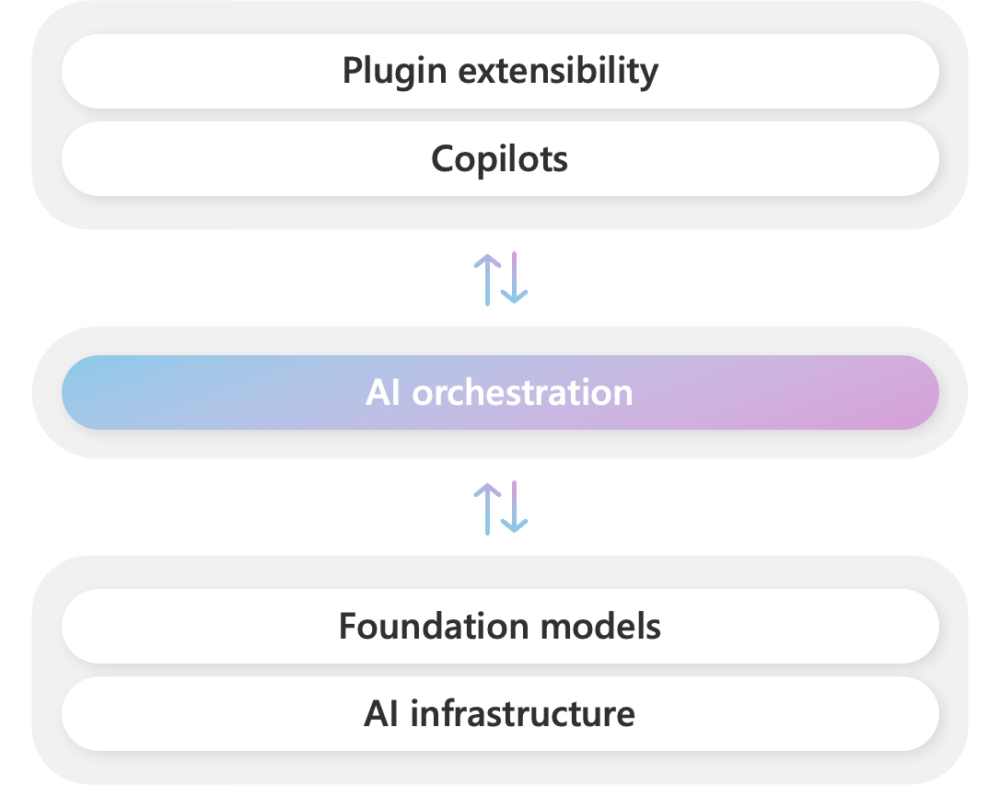
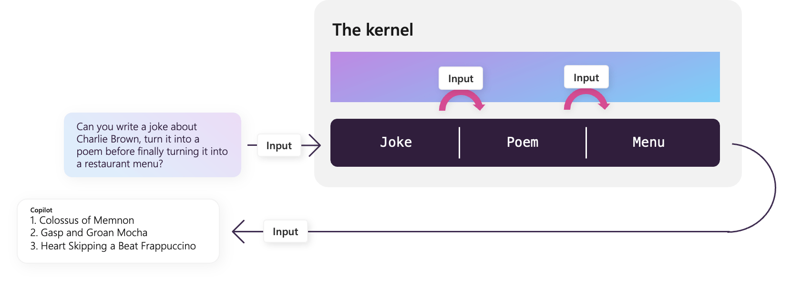

# 💡 这节课会带给你

1. Semantic Kernel 的特点和基本用法
2. 了解 Semantic Kernel 内置的工具
3. 如何用好 SDK 简化基于 LLM 的应用开发

开始上课！


## 1、大语言模型开发框架的价值是什么？


所有开发框架（SDK）的核心价值，都是降低开发、维护成本。

大语言模型开发框架的价值，是让开发者可以更方便地开发基于大语言模型的应用。主要提供两类帮助：

1. 第三方能力抽象。比如 LLM、向量数据库、搜索引擎等
2. 常用工具、方案封装
3. 底层实现封装。比如流式接口、超时重连、异步与并行等

好的开发框架，需要具备以下特点：

1. 可靠性、鲁棒性
2. 可维护性高
3. 高内聚、低耦合
4. 易用

举些通俗的例子：

- 与外部功能解依赖
  - 比如可以随意更换 LLM 而不用大量重构代码
  - 更换三方工具也同理
- 经常变的部分要在外部维护而不是放在代码里
  - 比如 Prompt 模板
- 各种环境下都适用
  - 比如线程安全
- 方便调试和测试
  - 至少要能感觉到用了比不用方便吧
  - 合法的输入不会引发框架内部的报错

<div class="alert alert-success">
<b>划重点：</b>选对了框架，事半功倍；反之，事倍功半。
</div>


## 2、Semantic Kernel

「 Semantic Kernel (SK) is a lightweight SDK that lets you easily mix conventional programming languages with the latest in Large Language Model (LLM) AI "prompts" with templating, chaining, and planning capabilities out-of-the-box. 」

1. Semantic Kernel 是微软研发的一个开源的，面向大模型的开发框架（SDK）；
2. 它支持你用不同开发语言（C#/Python/Java）基于 OpenAI API/Azure OpenAI API/Huggingface 开发大模型应用；
3. 它封装了一系列开箱即用的工具，包括：提示词模板、链式调用、规划能力等。


_SDK：Software Development Kit，它是一组软件工具和资源的集合，旨在帮助开发者创建、测试、部署和维护应用程序或软件。_


<div class="alert alert-info">

<b>什么是 SDK?</b> https://aws.amazon.com/cn/what-is/sdk/
<br/>
<b>SDK 和 API 的区别是什么?</b> https://aws.amazon.com/cn/compare/the-difference-between-sdk-and-api/
</div>

## 2.1、SK 的开发进展


1. C# 版最成熟，已开始 1.0.1：https://github.com/microsoft/semantic-kernel
2. Python 版还在 dev 状态，但可用：https://github.com/microsoft/semantic-kernel
3. Java 版 alpha 阶段：https://github.com/microsoft/semantic-kernel/tree/experimental-java
4. TypeScript 版……，已经放弃了：https://github.com/microsoft/semantic-kernel/tree/experimental-typescript
5. 文档写得特别好，但追不上代码更新速度：
   - 更多讲解：https://learn.microsoft.com/en-us/semantic-kernel/overview/
   - 更偏实操：https://github.com/microsoft/semantic-kernel/blob/main/samples/notebooks/python/00-getting-started.ipynb
   - API Reference (C#): https://learn.microsoft.com/en-us/dotnet/api/microsoft.semantickernel?view=semantic-kernel-dotnet 
6. 更多生态：https://github.com/geffzhang/awesome-semantickernel

这里可以了解最新进展：https://learn.microsoft.com/en-us/semantic-kernel/get-started/supported-languages

不同语言之间的概念都是相通的。本课程以 Python 版为例。


## 2.2、SK 的生态位


微软将此技术栈命名为 Copilot Stack。



解释：

- Plugin extensibility: 插件扩展
- Copilots: AI 助手（副驾驶），例如 GitHub Copilot、Office 365 Copilot、Windows Copilot
- AI orchestration: AI 编排，SK 就在这里
- Foundation models: 基础大模型，例如 GPT-4
- AI infrastructure: AI 基础设施，例如 PyTorch、GPU


### 怎么理解这个 **AI 编排**


SK 是个野心勃勃的项目，它希望：

1. 让开发者更容易的把 LLM 的能力集成到应用中，像调用函数一样简单
2. 让 Prompt 构成的「函数」（Semantic Function，见下文）与原生函数之间，可以很方便的互相嵌套调用
3. 让开发者开发的 LLM 能力与应用解耦，高度可复用
4. 让开发者能与微软的整个 Copilot 生态紧密结合，互相提供养料

请带着这个视角，逐步体会后面所讲的知识。


## 2.3、SK 基础架构


解释：

- Models and Memory: 类比为大脑
- Connectors: 用来连接各种外部服务，类似驱动程序
- Plugins: 用来连接内部技能
- Triggers and actions: 外部系统的触发器和动作，类比为四肢


**类比：** Semantic Kernel 用 **Kernel** 命名，是因为它确实像个操作系统 kernel，做核心资源调配，各种资源都可以挂在它上。


**说明：** Sematic Kernel 通过 **Kernel** 链接 LLM 与 **Functions**（功能）:

- Semantic Functions：通过 Prompt 实现的 LLM 能力
- Native Functions: 编程语言原生的函数功能

在 SK 中，一组 Function 组成一个技能（Skill/Plugin）。要运行 Skill/Plugin，需要有一个配置和管理的单元，这个组织管理单元就是 Kernel。

Kernel 负责管理底层接口与调用顺序，例如：OpenAI/Azure OpenAI 的授权信息、默认的 LLM 模型选择、对话上下文、技能参数的传递等等。


## 3、环境搭建


1. 安装 Python 3.x：https://www.python.org/downloads/
2. 安装 SK 包：`pip install semantic-kernel`
3. 在项目目录创建 .env 文件，添加以下内容：

```bash
# .env
OPENAI_API_KEY=""
OPENAI_BASE_URL=""
AZURE_OPENAI_DEPLOYMENT_NAME=""
AZURE_OPENAI_ENDPOINT=""
AZURE_OPENAI_API_KEY=""
```

OpenAI 和 Azure，配置好一个就行。


## 3.1、Hello, World!


这是一个简单示例。

第一段代码是初始化。后面所有代码都要在执行过这段代码后，才能执行。


```python
import semantic_kernel as sk
from semantic_kernel.connectors.ai.open_ai import OpenAIChatCompletion
import os

# 加载 .env 到环境变量
from dotenv import load_dotenv, find_dotenv
_ = load_dotenv(find_dotenv())

# 创建 semantic kernel
kernel = sk.Kernel()

# 配置 OpenAI 服务。OPENAI_BASE_URL 会被自动加载生效
api_key = os.getenv('OPENAI_API_KEY')
model = OpenAIChatCompletion(
    "gpt-3.5-turbo",
    api_key
)

# 把 LLM 服务加入 kernel
# 可以加多个。第一个加入的会被默认使用，非默认的要被指定使用
kernel.add_text_completion_service("my-gpt3", model)
```


    <semantic_kernel.kernel.Kernel at 0x7fd5601c7b10>


执行讲笑话的 prompt。


```python
import asyncio
# 定义 semantic function
# 参数由{{ }}标识

tell_joke_about = kernel.create_semantic_function("给我讲个关于{{$input}}的笑话吧")
# 运行 function 看结果


async def run_function():
    return await kernel.run_async(
        tell_joke_about,
        input_str="Hello world"
    )

# 注意这里直接使用 await 如果你在本地运行请执行：asyncio.run(run_function())
result = await run_function()
print(result)
```

    好的，这是一个关于Hello world的笑话：
    
    程序员A对程序员B说：“我刚刚写了一个非常简单的Hello world程序。”
    程序员B问：“真的吗？那你能不能把它运行起来？”
    程序员A回答：“当然可以！”
    程序员B疑惑地问：“那你为什么不运行它呢？”
    程序员A笑着说：“因为我还没写完它的文档。”


<div class="alert alert-success">
<b>划重点：</b>
用我们熟悉的操作系统来类比，可以更好地理解 SK。
<ol>
<li>启动操作系统：<code>kernel = sk.Kernel()</code></li>
<li>安装驱动程序：<code>kernel.add_xxx_service()</code></li>
<li>安装应用程序：<code>func = kernel.create_semantic_function()</code></li>
<li>运行应用程序：<code>func()</code></li>
</ol>
</div>

基于 SK 开发的主要工作是写「应用程序」，也就是 Plugins 也叫 Skills（见下文）


### 3.2、Semantic Functions


Semantic Functions 是纯用数据（Prompt + 配置文件）定义的，不需要编写任何代码。所以它与编程语言无关，可以被任何编程语言调用。

一个典型的 semantic function 包含两个文件：

- skprompt.txt: 存放 prompt，可以包含参数，还可以调用其它函数
- config.json: 存放配置，包括函数功能，参数的数据类型，以及调用大模型时的参数

举例：根据用户的自然语言指示，生成 Linux 命令


### 3.2.1、skprompt.txt

将用户的指令转换成 Linux 命令
只输出命令本身，不要分析，不要评论。

{{$input}}
### 3.2.2、config.json


```python
{
    "schema": 1,
    "type": "completion",
    "description": "将用户的指令转换成 Linux 命令",
    "completion": {
        "max_tokens": 256,
        "temperature": 0,
        "top_p": 0,
        "presence_penalty": 0,
        "frequency_penalty": 0
    },
    "input": {
        "parameters": [
            {
                "name": "input",
                "description": "用户的指令",
                "defaultValue": ""
            }
        ]
    }
}
```

说明：

- `type` 只有 `"completion"` 和 `"embedding"` 两种


上面两个文件都在 [sk_samples/SamplePlugin/GenerateCommand](sk_samples/SamplePlugin/GenerateCommand/) 目录下。


### 3.2.3、调用 Semantic Functions


```python
import asyncio
# 加载 semantic function。注意目录结构
my_skill = kernel.import_semantic_skill_from_directory(
    "./sk_samples", "SamplePlugin")

# 运行 function 看结果
async def run_function():
    # 运行 skill 看结果
    result = await kernel.run_async(
        my_skill["DayOfWeek"],
        input_str="将系统日期设为2023-04-01",
    )
    return result.result

result = await run_function()
print(result)
```

    根据提供的系统日期2023-04-01，我们可以使用日历工具来确定该日期是星期几。


### 3.2.4、多个输入变量

例如我们要维护一个多轮对话，通过 request 和 history 两个变量分别存储 当前输入 和 对话历史


```python
prompt = """对话历史如下:
{{$history}}
---
User: {{$request}}
Assistant:  """
```

<div class="alert alert-warning">
<b>注意：</b>实际开发中，将 Prompt 模板以文件形式存储更容易维护。
</div>


```python
history = []

while True:
    request = input("User > ").strip()
    if not request:
        break

    # 通过 ContextVariables 维护多个输入变量
    variables = sk.ContextVariables()
    variables["request"] = request
    variables["history"] = "\n".join(history)

    # 运行 prompt
    semantic_function = kernel.create_semantic_function(prompt)
    result = await kernel.run_async(
        semantic_function,
        input_vars=variables, # 注意这里从 input_str 改为 input_vars
    )

    # 将新的一轮添加到 history 中
    history.append("User: " + request)
    history.append("Assistant: " + result.result)

    print("Assistant > " + result.result)
```

    User >  你叫小明，你是一个编辑


    Assistant > 你好，我是小明，一个编辑。有什么我可以帮助你的吗？


    User >  你叫什么


    Assistant > 我叫小明，一个编辑。


    User >  


官方提供了大量的 Semantic Functions 可以参考：https://github.com/microsoft/semantic-kernel/tree/main/samples/skills


### 3.3、Native Functions


用编程语言写的函数，如果用 SK 的 Native Function 方式定义，就能纳入到 SK 的编排体系，可以被 Planner、其它 plugin 调用。

下面，写一个过滤有害 Linux 命令的函数，和 GenerateCommand 组合使用。

这个函数名是 `verify`。如果输入的命令不在规定范围内，就返回 `非法`，否则返回 `合法`。

它可以放到目录结构中，在 [sk_samples/SamplePlugin/SamplePlugin.py](sk_samples/SamplePlugin/SamplePlugin.py) 里加入。


```python
from semantic_kernel.skill_definition import sk_function


class CommandVerifier:
    @sk_function(
        description="检查命令是否合法",
        name="verifyCommand",
    )
    def verify(self, command: str) -> str:
        if ">" in command:
            return "非法"
        parts = command.replace(';', '|').split('|')
        for cmd in parts:
            name = cmd.split(" ")[0]
            if name not in ["ls", "cat", "head", "tail", "echo"]:
                return "非法"
        return "合法"
```


```python
# 加载 native function
verify_skill = kernel.import_skill(CommandVerifier(), "Verifier")

# 看结果
result = await kernel.run_async(
    verify_skill["verifyCommand"],
    # input_str='date -s "2023-04-01"',
    input_str="ls -l ./",
)

print(result)
```

    合法


<div class="alert alert-success">
<b>划重点：</b>在 SK 中，Semantic Function 和 Native Function 被 Kernel 平等对待。
</div>


### 3.4、用 SKContext 实现多参数 Functions


如果 Function 都只有一个参数，那么只要把参数定义为 `{{$input}}`，就可以按前面的例子来使用，比较直观。`{{$input}}`会默认被赋值。

多参数时，就不能用默认机制了，需要定义 `SKContext` 类型的变量。


### 3.4.1、多参数 Native Function 的写法


```python
from semantic_kernel.skill_definition import sk_function, sk_function_context_parameter
from semantic_kernel.orchestration.sk_context import SKContext


class Math:
    @sk_function(
        description="加法",
        name="add",
    )
    @sk_function_context_parameter(
        name="number1",
        description="被加数",
    )
    @sk_function_context_parameter(
        name="number2",
        description="加数",
    )
    def add(self, context: SKContext) -> str:
        return str(float(context["number1"]) + float(context["number2"]))

    @sk_function(
        description="减法",
        name="minus",
    )
    @sk_function_context_parameter(
        name="number1",
        description="被减数",
    )
    @sk_function_context_parameter(
        name="number2",
        description="减数",
    )
    def minus(self, context: SKContext) -> str:
        return str(float(context["number1"]) - float(context["number2"]))
```


```python
# 加载 native function
math_skill = kernel.import_skill(Math(), "Math")


# 创建 SKContext
context = sk.ContextVariables()

# 变量赋值
context["number1"] = 1024
context["number2"] = 65536

# 看结果
result = await kernel.run_async(
    math_skill["add"],
    input_vars=context
)
print(f"加法计算结果：{result}")

result = await kernel.run_async(
    math_skill["minus"],
    input_vars=context
)
print(f"减法计算结果：{result}")
```

    加法计算结果：66560.0
    减法计算结果：-64512.0


### 3.5、Plugins/Skills


简单说，plugin/skill 就是一组函数的集合。它可以包含两种函数：

- Semantic Functions - 语义函数，本质是 Prompt Engineering
- Native Functions - 原生函数，类似 OpenAI 的 Function Calling

值得一提的是，SK 的 plugin 会和 ChatGPT、Bing、Microsoft 365 通用。「很快」你用 SK 写的 plugin 就可以在这些平台上无缝使用了。这些平台上的 plugin 也可以通过 SK 被你调用。

<div class="alert alert-warning">
<b>注意：</b>Plugins 最初命名为 Skills，后来改为 Plugins。但是无论文档还是代码，都还有大量的「Skill」遗留。见到后，就知道两者是一回事就好。
</div>


### 3.5.1、内置 Plugins


SK 内置了若干好用的 plugin，但因为历史原因，它们叫 skill……

加载方法：

```python
from semantic_kernel.core_skills import SkillName
```

它们是：

- [`ConversationSummarySkill`](https://github.com/microsoft/semantic-kernel/blob/main/python/semantic_kernel/core_skills/conversation_summary_skill.py) - 生成对话的摘要
- [`FileIOSkill`](https://github.com/microsoft/semantic-kernel/blob/main/python/semantic_kernel/core_skills/file_io_skill.py) - 读写文件
- [`HttpSkill`](https://github.com/microsoft/semantic-kernel/blob/main/python/semantic_kernel/core_skills/http_skill.py) - 发出 HTTP 请求，支持 GET、POST、PUT 和 DELETE
- [`MathSkill`](https://github.com/microsoft/semantic-kernel/blob/main/python/semantic_kernel/core_skills/math_skill.py) - 加法和减法计算
- [`TextMemorySkill`](https://github.com/microsoft/semantic-kernel/blob/main/python/semantic_kernel/core_skills/text_memory_skill.py) - 保存文本到 memory 中，可以对其做向量检索
- [`TextSkill`](https://github.com/microsoft/semantic-kernel/blob/main/python/semantic_kernel/core_skills/text_skill.py) - 把文本全部转为大写或小写，去掉头尾的空格（trim）
- [`TimeSkill`](https://github.com/microsoft/semantic-kernel/blob/main/python/semantic_kernel/core_skills/time_skill.py) - 获取当前时间及用多种格式获取时间参数
- [`WaitSkill`](https://github.com/microsoft/semantic-kernel/blob/main/python/semantic_kernel/core_skills/wait_skill.py) - 等待指定的时间
- [`WebSearchEngineSkill`](https://github.com/microsoft/semantic-kernel/blob/main/python/semantic_kernel/core_skills/web_search_engine_skill.py) - 在互联网上搜索给定的文本


## 4、函数调用 Pipeline


SK 更想用 pipeline 来描述一个调用过程。跟 Langchain 的 Chain 的概念类似（下堂课讲）

但是，SK 没有在代码里定义什么是 pipeline，它并不是一个类，或者函数什么的。它是贯彻整个 kernel 的一个概念。

当一个 kernel 添加了 LLM、memory、functions，我们写下的 functions 之间的组合调用，就是个 pipeline 了。

如果需要多条 pipeline，就定义多个 kernel。




```python
# 加载 semantic function。注意目录结构
command_skill = kernel.import_semantic_skill_from_directory(
    "./sk_samples/", "SamplePlugin"
)

# 加载 native function
verify_skill = kernel.import_skill(CommandVerifier(), "Verifier")

# 看结果
result = await kernel.run_async(
    command_skill["GenerateCommand"],
    verify_skill["verifyCommand"],
    input_str="删除所有根目录文件",
    # input_str="显示 example.txt 文件的内容",
)

print(result)
```

    非法


## 5、函数的嵌套调用


### 5.1、Semantic Function 嵌套调用


SK 允许在 Prompt 模板中直接调用一个函数


```python
chat_prompt = """User 与 Assistant 的对话历史摘要如下:
{{ChatHistorySkill.summarize $history}}
---
User: {{$request}}
Assistant:
"""
```


```python
summarize_prompt = """
请将以下 User 与 Assistant 的对话生成一个简短的摘要。
确保你的摘要中包含完整的信息。
<dialog>
{{$history}}
</dialog>
摘要：
"""
```


```python
history = []

# 创建 semantic function
summarize_function = kernel.create_semantic_function(
    summarize_prompt,
    function_name="summarize",
    skill_name="ChatHistorySkill",
    description="Summarize a dialogue history",
)

# 创建 semantic function
chat_function = kernel.create_semantic_function(chat_prompt)


while True:
    request = input("User > ").strip()
    if not request:
        break

    # 通过 ContextVariables 维护多个输入变量
    variables = sk.ContextVariables()
    variables["request"] = request
    variables["history"] = "\n".join(history)

    result = await kernel.run_async(
        chat_function,
        input_vars=variables, # 注意这里从 input_str 改为 input_vars
    )

    # 将新的一轮添加到 history 中
    history.append("User: " + request)
    history.append("Assistant: " + result.result)

    print("Assistant > " + result.result)
```

    User >  我叫王卓然


    Assistant > 你好，王卓然！有什么我可以帮助你的吗？


    User >  我是AI大模型全栈工程师


    Assistant > 你好，王卓然！作为AI大模型全栈工程师，我可以为您提供帮助。请告诉我您需要什么样的帮助。


    User >  我是谁，我是做什么的


    Assistant > 你是王卓然，是一名AI大模型全栈工程师。


    User >  


<div class="alert alert-success">
在 Prompt 模板中直接调用 Native Function 也可以。
</div>


```python
prompt="""
已知，判断用户指令是否为合法指令的结果是：
{{Verifier.verifyCommand $input}}

根据以上结果，执行下述动作之一：
如果用户指令为非法，向用户说明该指令不合法；
否则，解释该命令的用途。

用户指令：{{$input}}
"""
```


```python
kernel.import_skill(CommandVerifier(), "Verifier")

# 创建 semantic function
semantic_function = kernel.create_semantic_function(prompt)

result = await kernel.run_async(
        semantic_function,
        # input_str="ls -l *",
        input_str="rm -rf *"
    )

print(result.result)
```

    用户指令为非法，因为该指令是一个非常危险的命令，它会递归地删除当前目录下的所有文件和文件夹，包括子目录中的内容。这个命令可能会导致数据丢失，因此不建议使用。请谨慎操作。


### 5.2、Native Function 嵌套调用（选）


**注意：** Native Function 的嵌套调用，本质上就是函数嵌套。官方给的写法是在 Kernel 的设计思想下的实现，观感上非常晦涩。

实际开发中，可以根据个人对 SK 内核与设计理念的理解，自行选择使用以下写法，或使用普通的函数调用的写法。


```python
import json
from semantic_kernel.skill_definition import sk_function, sk_function_context_parameter
from semantic_kernel.orchestration.sk_context import SKContext
from semantic_kernel.orchestration.context_variables import ContextVariables


class Calculator:
    def __init__(self, kernel):
        self._kernel = kernel  # 初始化时传入 kernel

    @sk_function(
        description="加减计算器",
        name="calc",
    )
    async def calc(self, query: str) -> str:
        # 嵌套调用 Semantic Function
        q2f = self._kernel.skills.get_function(
            "ExampleSkill", "Query2Function")
        json_str = (
            await self._kernel.run_async(q2f, input_str=query)
        ).result.strip()
        json_obj = json.loads(json_str)
        func_name = json_obj["name"]
        context = self._kernel.create_new_context()
        context["number1"] = json_obj["number1"]
        context["number2"] = json_obj["number2"]
        # 嵌套调用 Native Function
        math_func = self._kernel.skills.get_function("Math", func_name)
        result = (
            await self._kernel.run_async(math_func, input_context=context)
        ).result.strip()
        return result
```


```python
import semantic_kernel as sk
from semantic_kernel.connectors.ai.open_ai import OpenAIChatCompletion, OpenAITextEmbedding
import os

# 加载 .env 到环境变量
from dotenv import load_dotenv, find_dotenv
_ = load_dotenv(find_dotenv())

# 创建 semantic kernel
kernel = sk.Kernel()

# 配置 OpenAI 服务
api_key = os.getenv('OPENAI_API_KEY')
model = OpenAIChatCompletion("gpt-3.5-turbo", api_key)

# 把 LLM 服务加入 kernel
# 可以加多个。第一个加入的会被默认使用，非默认的要被指定使用
kernel.add_text_completion_service("my-gpt3", model)
```


    <semantic_kernel.kernel.Kernel at 0x7fd533c631d0>


```python
prompt = """
将用户输入解析为函数调用

例如：

3加5等于多少
{"name":"add","number1":3,"number2":5}

一百减十等于几
{"name":"minus","number1":100,"number2":10}

用户输入：
{{$input}}

以JSON形式输出，包括一下三个字段：
name: 函数名，必须为'add'或'minus'之一；
number1: 参与计算的第一个数，即被加数或被减数；
number2: 参与计算的第二个数，即加数或减数。

不要分析，不要评论，直接输出答案。
"""
```


```python
# 加载 math skill
kernel.import_skill(Math(), "Math")

# 加载 nested skills
kernel.create_semantic_function(
    prompt,
    function_name="Query2Function",
    skill_name="ExampleSkill",
    description="将用户输入的文本转化成JSON形式的计算表达式"
)

# 加载 calucator skill
# 初始化时传入 kernel
skill = kernel.import_skill(Calculator(kernel), "Calculator")

result = await kernel.run_async(
    skill["calc"],
    # input_str="1024减去256等于多少"
    input_str="1000加100"
)
print(result)
```

    1100.0


## 6、Memory


SK 的 memory 使用非常简单：

1. 用 `kernel.add_text_embedding_generation_service()` 添加一个文本向量生成服务
2. 用 `kernel.register_memory_store()` 注册一个 memory store，可以是内存、文件、向量数据库等
3. 用 `kernel.memory.save_information_async()` 保存信息到 memory store
4. 用 `kernel.memory.search_async()` 搜索信息

使用 ChatALL 的 README.md 做数据，使用内存作为 memory store，我们演示下基于文档对话。


### 6.1、初始化 Embedding


```python
import semantic_kernel as sk
from semantic_kernel.connectors.ai.open_ai import OpenAIChatCompletion, OpenAITextEmbedding
import os

# 加载 .env 到环境变量
from dotenv import load_dotenv, find_dotenv
_ = load_dotenv(find_dotenv())

# 创建 semantic kernel
kernel = sk.Kernel()

# 配置 OpenAI 服务
api_key = os.getenv('OPENAI_API_KEY')
model = OpenAIChatCompletion("gpt-3.5-turbo", api_key)

# 把 LLM 服务加入 kernel
# 可以加多个。第一个加入的会被默认使用，非默认的要被指定使用
kernel.add_text_completion_service("my-gpt3", model)

# 添加 embedding 服务
kernel.add_text_embedding_generation_service(
    "ada", OpenAITextEmbedding("text-embedding-ada-002", api_key))
```


    <semantic_kernel.kernel.Kernel at 0x7fd573453790>


### 6.2、文本向量化


```python
from semantic_kernel.text import split_markdown_lines

# 使用内存做 memory store
kernel.register_memory_store(memory_store=sk.memory.VolatileMemoryStore())

# 读取文件内容
with open('ChatALL.md', 'r') as f:
    # with open('sk_samples/SamplePlugin/SamplePlugin.py', 'r') as f:
    content = f.read()

# 将文件内容分片，单片最大 100 token（注意：SK 的 text split 功能目前对中文支持不如对英文支持得好）
lines = split_markdown_lines(content, 100)

# 将分片后的内容，存入内存
for index, line in enumerate(lines):
    await kernel.memory.save_information_async("chatall", id=index, text=line)
```

### 6.3、向量搜索


```python
result = await kernel.memory.search_async("chatall", "ChatALL怎么下载？")
print(result[0].text)
```

    拥有可以访问这些 AI 的帐号，或 API token。
    2. 与 AI 网站有可靠的网络连接。
    
    ## 下载 / 安装
    
    从 https://github.com/sunner/ChatALL/releases 下载
    
    ### Windows 系统
    
    直接下载 \*-win.exe 安装文件并运行之。
    
    ### macOS 系统
    
    对于苹果硅芯片 Mac（M1，M2 CPU），请下载 \*-mac-arm64.


### 6.4、现在用函数嵌套做一个简单的 RAG

例：基于 ChatALL 的说明文档，做问答

在自定义的 Semantic Function 中，嵌套调用内置的 `TextMemorySkill`。


```python
# 导入内置的 `TextMemorySkill`。主要使用它的 `recall()`
kernel.import_skill(sk.core_skills.TextMemorySkill())

# 直接在代码里创建 semantic function。真实工程不建议这么做
# 里面调用了 `recall()`
sk_prompt = """
基于下面的背景信息回答问题。如果背景信息为空，或者和问题不相关，请回答"我不知道"。

[背景信息开始]
{{recall $input}}
[背景信息结束]

问题：{{$input}}
回答：
"""
ask = kernel.create_semantic_function(sk_prompt)

# 提问
context = kernel.create_new_context()
# The collection to search for information
context[sk.core_skills.TextMemorySkill.COLLECTION_PARAM] = "chatall"
context["input"] = "ChatALL 怎么下载？"

result = await kernel.run_async(
    ask,
    input_context=context,
)

print(result)
```

    从 https://github.com/sunner/ChatALL/releases 下载 ChatALL。如果你使用的是 Windows 系统，直接下载 \*-win.exe 安装文件并运行即可。如果你使用的是 macOS 系统，并且是苹果芯片的 Mac（M1、M2 CPU），请下载 \*-mac-arm64 安装文件。


### 6.5、连接其它 VectorDB

Semantic Kernel 目前已与很多主流的向量数据库做了适配

具体参考：https://learn.microsoft.com/en-us/semantic-kernel/memories/vector-db


## 7、Planner


SK 的 Planner 目的是 Agent 开发。只封装了几个基本形式，把更多的探索留给了开发者。

### 7.1、什么是智能体（Agent）

将大语言模型作为一个推理引擎。给定一个任务，智能体自动生成完成任务所需的步骤，执行相应动作（例如选择并调用工具），直到任务完成。

这个多步骤的规划过程，就由 **Planner** 完成。


### 7.2、SK Python 提供了四种 Planner：

1. `SequentialPlanner`
   - 制定包含一系列步骤的计划，这些步骤通过自定义生成的输入和输出变量相互连接
   - 核心 prompt：https://github.com/microsoft/semantic-kernel/blob/main/python/semantic_kernel/planning/sequential_planner/Skills/SequentialPlanning/skprompt.txt
   - 官方例程：https://github.com/microsoft/semantic-kernel/blob/main/python/samples/kernel-syntax-examples/sequential_planner.py
2. `ActionPlanner`
   - 类似 OpenAI Function Calling，从 kernel 中已注册的所有 plugin 中找到一个该执行的函数
   - 核心 prompt：https://github.com/microsoft/semantic-kernel/blob/main/python/semantic_kernel/planning/action_planner/skprompt.txt
   - 官方例程：https://github.com/microsoft/semantic-kernel/blob/main/python/samples/kernel-syntax-examples/action_planner.py
3. `StepwisePlanner`
   - 每执行完一步，都做一下复盘
   - 只输出 action，不执行
   - 核心 prompt：https://github.com/microsoft/semantic-kernel/blob/main/python/semantic_kernel/planning/stepwise_planner/Skills/StepwiseStep/skprompt.txt
4. `BasicPlanner`
   - **不建议使用**。把任务拆解，自动调用各个函数，完成任务。它只是个用于基础验证的功能，最终会被 `SequentialPlanner` 替代
   - 核心 prompt：https://github.com/microsoft/semantic-kernel/blob/main/python/semantic_kernel/planning/basic_planner.py#L27-L123

使用 planner 的步骤非常简单：

1. 把 plugin 注册到 kernel
2. 把 kernel 当参数实例化某个 planner
3. 调用 planner 的 `create_plan_async()` 方法获得 plan
4. 调用 plan 的 `invoke_async()` 方法执行 plan

(注意，不同 planner 接口并不一致，不能简单平替)


### 7.3、用 Planner 实现一个能使用搜索和日历工具的 Agent

例：周杰伦的生日是星期几


```python
from semantic_kernel.core_skills import WebSearchEngineSkill
from semantic_kernel.connectors.search_engine import BingConnector
from semantic_kernel.planning import SequentialPlanner
import semantic_kernel as sk
from semantic_kernel.connectors.ai.open_ai import OpenAIChatCompletion
import os

# 加载 .env 到环境变量
from dotenv import load_dotenv, find_dotenv
_ = load_dotenv(find_dotenv())

# 创建 semantic kernel
kernel = sk.Kernel()

# 配置 OpenAI 服务
api_key = os.getenv('OPENAI_API_KEY')
model = OpenAIChatCompletion("gpt-4", api_key)

# 把 LLM 服务加入 kernel
# 可以加多个。第一个加入的会被默认使用，非默认的要被指定使用
kernel.add_text_completion_service("my-gpt4", model)
```


    <semantic_kernel.kernel.Kernel at 0x7fd53388cd50>


```python
import calendar
import dateutil.parser as parser
from datetime import date


class DayOfWeek:
    @sk_function(
        description="计算输入日期是星期几",
        name="weekday",
    )
    def weekday(self, date_str: str) -> str:
        """Convert date to weekday name"""
        d = parser.parse(date_str)
        return calendar.day_name[d.weekday()]
```


```python
sk_prompt = """
抽取下述输入文本中第一个出现的日期。

---输入文本开始---
{{$input}}
---输入文本结束---

以YYYY-MM-DD格式输出日期。
不要评论，不要分析，直接给出答案。
"""
kernel.create_semantic_function(
    sk_prompt,
    function_name="parseDate",
    skill_name="DateParser",
    description="抽取输入文本中的日期"
)
```


    SKFunction(FUNCTION_PARAM_NAME_REGEX='^[0-9A-Za-z_]*$', FUNCTION_NAME_REGEX='^[0-9A-Za-z_]*$', SKILL_NAME_REGEX='^[0-9A-Za-z_]*$')


关于如何注册 BING API KEY ：https://agiclass.feishu.cn/wiki/NAXvwGm4AixovhkplWocvpOKnpb


```python
# 导入搜索 plugin
connector = BingConnector(api_key=os.getenv("BING_API_KEY"))
kernel.import_skill(WebSearchEngineSkill(connector), "WebSearch")

kernel.import_skill(
    DayOfWeek(), "DayOfWeek"
)
```


    {'weekday': SKFunction(FUNCTION_PARAM_NAME_REGEX='^[0-9A-Za-z_]*$', FUNCTION_NAME_REGEX='^[0-9A-Za-z_]*$', SKILL_NAME_REGEX='^[0-9A-Za-z_]*$')}


```python
# 创建 planner
planner = SequentialPlanner(kernel)

# 开始
query = "马斯克的生日是星期几？"
plan = await planner.create_plan_async(goal=query)

result = await plan.invoke_async()

# 打印步骤用来调试
for index, step in enumerate(plan._steps):
    print("Step:", index)
    print("Description:", step.description)
    print("Function:", step.skill_name + "." + step._function.name)
    if len(step._outputs) > 0:
        print("  Output:\n", str.replace(
            result[step._outputs[0]], "\n", "\n  "))


print(result)
```

    Step: 0
    Description: Performs a web search for a given query
    Function: WebSearch.searchAsync
      Output:
     ["Elon Reeve Musk was born on June 28, 1971, in Pretoria, South Africa's administrative capital. He has British and Pennsylvania Dutch ancestry. His mother, Maye Musk (née Haldeman), is a model and dietitian born in Saskatchewan, Canada, and raised in South Africa. His father, Errol Musk, is a South African electromechanical engineer, pilot, sailor, consultant, and property developer, who ..."]
    Step: 1
    Description: 抽取输入文本中的日期
    Function: DateParser.parseDate
      Output:
     1971-06-28
    Step: 2
    Description: 计算输入日期是星期几
    Function: DayOfWeek.weekday
      Output:
     Monday
    Monday


## 8、VS Code 插件

这是个 VS Code 的插件，在 VS Code 里可以直接创建和调试 Semantic Function。

安装地址：https://marketplace.visualstudio.com/items?itemName=ms-semantic-kernel.semantic-kernel


## 9、Semantic Kernel 对新版 Assistants API 的支持计划

当前进展：

- C#版实验性支持：https://github.com/microsoft/semantic-kernel/releases

虽然 Assistants API 原生的管理了一切

但官方宣称，Semantic Kernel 将在以下方面提供附加价值：

1. 简化的 Function Calling（本质是将 function 调用和结果回传封装在 pipeline 中）
2. 实现更复杂的多步 plan（条件分支、循环、变量传递等）
3. 多 LLM 整合，例如 GPT-3.5 用于简单功能、GPT-4 用于最终回复等
4. 更可控（自定义）的 Memory 引擎
5. 更多的可视化及监控机制

原文：https://devblogs.microsoft.com/semantic-kernel/assistants-the-future-of-semantic-kernel/

<div class="alert alert-warning">
<b>思考：</b>1-4本质就是自定义的过程的封装，由此再次体会 SDK 的价值
</div>


## 总结

1. 我是否应该使用开发框架？
2. 什么情况下选择 SK ？

- 如果你经常需要替换不同 LLM 或有大量的 Prompt 调试需求，选择一个开发框架会让生活更容易
- 如果你的 Prompt 里有大量嵌套调用
- 如果你必须使用 C#/JAVA 技术栈，SK 可能是目前唯一的选择
- 如果你用 Python 技术栈，可以对比一下 LangChain 再做取舍（下节课细讲）


## 作业


用 Semantic Kernel 重构 ChatPDF 的作业。

