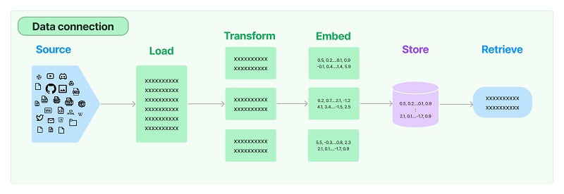

## 💡 这节课会带给你

1. 如何使用 LangChain：一套在大模型能力上封装的工具框架
2. 如何用几行代码实现一个复杂的 AI 应用
3. 面向大模型的流程开发的过程抽象

开始上课！


## 写在前面

- LangChain 也是一套面向大模型的开发框架（SDK）
- LangChain 是 AGI 时代软件工程的一个探索和原型
- LangChain 迭代速度明显快于 Semantic Kernel，几乎明天一个版本
- 学习 Langchain 要关注接口变更


## LangChain vs. Semantic Kernel

[](https://star-history.com/#langchain-ai/langchain&microsoft/semantic-kernel&langchain-ai/langchainjs&Date)

数据来源：https://star-history.com/#langchain-ai/langchain&microsoft/semantic-kernel&langchain-ai/langchainjs&Date

## LangChain 的核心组件

1. 模型 I/O 封装
   - LLMs：大语言模型
   - Chat Models：一般基于 LLMs，但按对话结构重新封装
   - PromptTemple：提示词模板
   - OutputParser：解析输出
2. 数据连接封装
   - Document Loaders：各种格式文件的加载器
   - Document Transformers：对文档的常用操作，如：split, filter, translate, extract metadata, etc
   - Text Embedding Models：文本向量化表示，用于检索等操作（啥意思？别急，后面详细讲）
   - Verctorstores: （面向检索的）向量的存储
   - Retrievers: 向量的检索
3. 记忆封装
   - Memory：这里不是物理内存，从文本的角度，可以理解为“上文”、“历史记录”或者说“记忆力”的管理
4. 架构封装
   - Chain：实现一个功能或者一系列顺序功能组合
   - Agent：根据用户输入，自动规划执行步骤，自动选择每步需要的工具，最终完成用户指定的功能
     - Tools：调用外部功能的函数，例如：调 google 搜索、文件 I/O、Linux Shell 等等
     - Toolkits：操作某软件的一组工具集，例如：操作 DB、操作 Gmail 等等
5. Callbacks


官方文档地址：https://python.langchain.com/docs/get_started

## 一、模型 I/O 封装

把不同的模型，统一封装成一个接口，方便更换模型而不用重构代码。

### 1.1 模型 API：LLM vs. ChatModel


```python
#安装最新版本
!pip install langchain==0.1.0
!pip install langchain-openai # v0.1.0新增的底包
```

### 1.1.1 OpenAI 模型封装


```python
from langchain_openai import ChatOpenAI
 
llm = ChatOpenAI(model="gpt-4") # 默认是gpt-3.5-turbo
response = llm.invoke("你是谁")
print(response.content)
```

    我是OpenAI的人工智能助手。我被设计出来是为了帮助解答问题、提供信息和帮助用户完成各种任务。


### 1.1.2 多轮对话 Session 封装


```python
from langchain.schema import (
    AIMessage, #等价于OpenAI接口中的assistant role
    HumanMessage, #等价于OpenAI接口中的user role
    SystemMessage #等价于OpenAI接口中的system role
)

messages = [
    SystemMessage(content="你是AGIClass的课程助理。"), 
    HumanMessage(content="我是学员，我叫王卓然。"), 
    AIMessage(content="欢迎！"),
    HumanMessage(content="我是谁") 
]
llm.invoke(messages) 
```


    AIMessage(content='您是学员王卓然。')


<div class="alert alert-success">
<b>划重点：</b>通过模型封装，实现不同模型的统一接口调用
</div>


```python
# 其它模型分装在 langchain_community 底包中
from langchain_community.chat_models import ErnieBotChat
from langchain.schema import HumanMessage

ernie = ErnieBotChat()

messages = [
    HumanMessage(content="你是谁") 
]

ernie.invoke(messages)
```


    AIMessage(content='您好，我是百度研发的知识增强大语言模型，中文名是文心一言，英文名是ERNIE Bot。我能够与人对话互动，回答问题，协助创作，高效便捷地帮助人们获取信息、知识和灵感。\n\n如果您有任何问题，请随时告诉我。')


### 1.2 模型的输入与输出


### 1.2.1 Prompt模板封装

PromptTemplate 可以在模板中自定义变量


```python
from langchain.prompts import PromptTemplate

template = PromptTemplate.from_template("给我讲个关于{subject}的笑话")
print(template)
print(template.format(subject='小明'))
```

    input_variables=['subject'] template='给我讲个关于{subject}的笑话'
    给我讲个关于小明的笑话


ChatPromptTemplate


```python
from langchain.prompts import ChatPromptTemplate
from langchain.prompts.chat import SystemMessagePromptTemplate, HumanMessagePromptTemplate
from langchain.chat_models import ChatOpenAI

template = ChatPromptTemplate.from_messages(
    [
        SystemMessagePromptTemplate.from_template("你是{product}的客服助手。你的名字叫{name}"),
        HumanMessagePromptTemplate.from_template("{query}"),
    ]
)

llm = ChatOpenAI()
prompt = template.format_messages(
        product="AGI课堂",
        name="瓜瓜",
        query="你是谁"
    )

llm.invoke(prompt)
```


    AIMessage(content='我是AGI课堂的客服助手，名字叫瓜瓜。我可以回答关于AGI课堂的问题，提供帮助和支持。有什么我可以帮助你的吗？')


<div class="alert alert-success">
<b>划重点：</b>把Prompt模板看作带有参数的函数，可类比于 SK 的 Semantic Function
</div>


### 1.2.2、从文件加载Prompt模板

Yaml格式
 _type: prompt
input_variables:
    ["adjective", "content"]
template: 
    Tell me a {adjective} joke about {content}.
JSON格式
{
    "_type": "prompt",
    "input_variables": ["adjective", "content"],
    "template": "Tell me a {adjective} joke about {content}."
}
Template单独存放

```sh
cat simple_template.txt
```

```
Tell me a {adjective} joke about {content}.
```
{
    "_type": "prompt",
    "input_variables": ["adjective", "content"],
    "template_path": "simple_template.txt"
}
加载方式


```python
from langchain.prompts import load_prompt

prompt = load_prompt("simple_prompt.yaml")

# OR 
# prompt = load_prompt("simple_prompt.json")

print(prompt.format(adjective="funny", content="Xiao Ming"))
```

    Tell me a funny joke about Xiao Ming.


### 1.3 输出封装 OutputParser

自动把 LLM 输出的字符串按指定格式加载。

LangChain 内置的 OutputParser 包括:

- ListParser
- DatetimeParser
- EnumParser
- PydanticParser
- XMLParser

等等

### 1.3.1 Pydantic (JSON) Parser

自动根据Pydantic类的定义，生成输出的格式说明


```python
from langchain_core.pydantic_v1  import BaseModel, Field, validator
from typing import List, Dict

# 定义你的输出对象
class Date(BaseModel):
    year: int = Field(description="Year")
    month: int = Field(description="Month")
    day: int = Field(description="Day")
    era: str = Field(description="BC or AD")

    # ----- 可选机制 --------
    # 你可以添加自定义的校验机制
    @validator('month')
    def valid_month(cls, field):
        if field <= 0 or field > 12:
            raise ValueError("月份必须在1-12之间")
        return field
        
    @validator('day')
    def valid_day(cls, field):
        if field <= 0 or field > 31:
            raise ValueError("日期必须在1-31日之间")
        return field

    @validator('day', pre=True, always=True)
    def valid_date(cls, day, values):
        year = values.get('year')
        month = values.get('month')

        # 确保年份和月份都已经提供
        if year is None or month is None:
            return day  # 无法验证日期，因为没有年份和月份

        # 检查日期是否有效
        if month == 2:
            if cls.is_leap_year(year) and day > 29:
                raise ValueError("闰年2月最多有29天")
            elif not cls.is_leap_year(year) and day > 28:
                raise ValueError("非闰年2月最多有28天")
        elif month in [4, 6, 9, 11] and day > 30:
            raise ValueError(f"{month}月最多有30天")

        return day

    @staticmethod
    def is_leap_year(year):
        if year % 400 == 0 or (year % 4 == 0 and year % 100 != 0):
            return True
        return False
```


```python
from langchain.prompts import PromptTemplate, ChatPromptTemplate, HumanMessagePromptTemplate
from langchain_openai import ChatOpenAI

from langchain.output_parsers import PydanticOutputParser


model_name = 'gpt-4'
temperature = 0
model = ChatOpenAI(model_name=model_name, temperature=temperature)

# 根据Pydantic对象的定义，构造一个OutputParser
parser = PydanticOutputParser(pydantic_object=Date)

template = """提取用户输入中的日期。
{format_instructions}
用户输入:
{query}"""

prompt = PromptTemplate(
    template=template,
    input_variables=["query"],
    # 直接从OutputParser中获取输出描述，并对模板的变量预先赋值
    partial_variables={"format_instructions": parser.get_format_instructions()} 
)

print("====Format Instruction=====")
print(parser.get_format_instructions())


query = "2023年四月6日天气晴..."
model_input = prompt.format_prompt(query=query)

print("====Prompt=====")
print(model_input.to_string())

output = model(model_input.to_messages())
print("====模型原始输出=====")
print(output)
print("====Parse后的输出=====")
date = parser.parse(output.content)
print(date)
```

    ====Format Instruction=====
    The output should be formatted as a JSON instance that conforms to the JSON schema below.
    
    As an example, for the schema {"properties": {"foo": {"title": "Foo", "description": "a list of strings", "type": "array", "items": {"type": "string"}}}, "required": ["foo"]}
    the object {"foo": ["bar", "baz"]} is a well-formatted instance of the schema. The object {"properties": {"foo": ["bar", "baz"]}} is not well-formatted.
    
    Here is the output schema:
    ```
    {"properties": {"year": {"title": "Year", "description": "Year", "type": "integer"}, "month": {"title": "Month", "description": "Month", "type": "integer"}, "day": {"title": "Day", "description": "Day", "type": "integer"}, "era": {"title": "Era", "description": "BC or AD", "type": "string"}}, "required": ["year", "month", "day", "era"]}
    ```
    ====Prompt=====
    提取用户输入中的日期。
    The output should be formatted as a JSON instance that conforms to the JSON schema below.
    
    As an example, for the schema {"properties": {"foo": {"title": "Foo", "description": "a list of strings", "type": "array", "items": {"type": "string"}}}, "required": ["foo"]}
    the object {"foo": ["bar", "baz"]} is a well-formatted instance of the schema. The object {"properties": {"foo": ["bar", "baz"]}} is not well-formatted.
    
    Here is the output schema:
    ```
    {"properties": {"year": {"title": "Year", "description": "Year", "type": "integer"}, "month": {"title": "Month", "description": "Month", "type": "integer"}, "day": {"title": "Day", "description": "Day", "type": "integer"}, "era": {"title": "Era", "description": "BC or AD", "type": "string"}}, "required": ["year", "month", "day", "era"]}
    ```
    用户输入:
    2023年四月6日天气晴...
    ====模型原始输出=====
    content='{"year": 2023, "month": 4, "day": 6, "era": "AD"}'
    ====Parse后的输出=====
    year=2023 month=4 day=6 era='AD'


### 1.3.2 Auto-Fixing Parser

利用LLM自动根据解析异常修复并重新解析


```python
from langchain.output_parsers import OutputFixingParser

new_parser = OutputFixingParser.from_llm(parser=parser, llm=ChatOpenAI(model="gpt-4"))

#我们把之前output的格式改错
output = output.content.replace("4","四月")
print("===格式错误的Output===")
print(output)
try:
    date = parser.parse(output)
except Exception as e:
    print("===出现异常===")
    print(e)
    
#用OutputFixingParser自动修复并解析
date = new_parser.parse(output)
print("===重新解析结果===")
print(date)
```

    ===格式错误的Output===
    {"year": 2023, "month": 四月, "day": 6, "era": "AD"}
    ===出现异常===
    Failed to parse Date from completion {"year": 2023, "month": 四月, "day": 6, "era": "AD"}. Got: Expecting value: line 1 column 25 (char 24)
    ===重新解析结果===
    year=2023 month=4 day=6 era='AD'


<div class="alert alert-warning">
<b>思考：</b>猜一下OutputFixingParser是怎么做到的
</div>

### 1.4、小结

1. LangChain 统一封装了各种模型的调用接口，包括补全型和对话型两种
2. LangChain 提供了 PromptTemplate 类，可以自定义带变量的模板
3. LangChain 提供了一些列输出解析器，用于将大模型的输出解析成结构化对象；额外带有自动修复功能。
4. 上述模型属于 LangChain 中较为优秀的部分；美中不足的是 OutputParser 自身的 Prompt 维护在代码中，耦合度较高。

## 二、数据连接封装



### 2.1 文档加载器：Document Loaders


```python
!pip install pypdf

```


```python
from langchain.document_loaders import PyPDFLoader

loader = PyPDFLoader("llama2.pdf")
pages = loader.load_and_split()

print(pages[0].page_content)
```

    Llama 2 : Open Foundation and Fine-Tuned Chat Models
    Hugo Touvron∗Louis Martin†Kevin Stone†
    Peter Albert Amjad Almahairi Yasmine Babaei Nikolay Bashlykov Soumya Batra
    Prajjwal Bhargava Shruti Bhosale Dan Bikel Lukas Blecher Cristian Canton Ferrer Moya Chen
    Guillem Cucurull David Esiobu Jude Fernandes Jeremy Fu Wenyin Fu Brian Fuller
    Cynthia Gao Vedanuj Goswami Naman Goyal Anthony Hartshorn Saghar Hosseini Rui Hou
    Hakan Inan Marcin Kardas Viktor Kerkez Madian Khabsa Isabel Kloumann Artem Korenev
    Punit Singh Koura Marie-Anne Lachaux Thibaut Lavril Jenya Lee Diana Liskovich
    Yinghai Lu Yuning Mao Xavier Martinet Todor Mihaylov Pushkar Mishra
    Igor Molybog Yixin Nie Andrew Poulton Jeremy Reizenstein Rashi Rungta Kalyan Saladi
    Alan Schelten Ruan Silva Eric Michael Smith Ranjan Subramanian Xiaoqing Ellen Tan Binh Tang
    Ross Taylor Adina Williams Jian Xiang Kuan Puxin Xu Zheng Yan Iliyan Zarov Yuchen Zhang
    Angela Fan Melanie Kambadur Sharan Narang Aurelien Rodriguez Robert Stojnic
    Sergey Edunov Thomas Scialom∗
    GenAI, Meta
    Abstract
    In this work, we develop and release Llama 2, a collection of pretrained and fine-tuned
    large language models (LLMs) ranging in scale from 7 billion to 70 billion parameters.
    Our fine-tuned LLMs, called Llama 2-Chat , are optimized for dialogue use cases. Our
    models outperform open-source chat models on most benchmarks we tested, and based on
    ourhumanevaluationsforhelpfulnessandsafety,maybeasuitablesubstituteforclosed-
    source models. We provide a detailed description of our approach to fine-tuning and safety
    improvements of Llama 2-Chat in order to enable the community to build on our work and
    contribute to the responsible development of LLMs.
    ∗Equal contribution, corresponding authors: {tscialom, htouvron}@meta.com
    †Second author
    Contributions for all the authors can be found in Section A.1.arXiv:2307.09288v2  [cs.CL]  19 Jul 2023


### 2.2 文档处理器

### 2.2.1 TextSplitter


```python
from langchain.text_splitter import RecursiveCharacterTextSplitter

text_splitter = RecursiveCharacterTextSplitter(
    chunk_size=200,
    chunk_overlap=100,  # 思考：为什么要做overlap
    length_function=len,
    add_start_index=True,
)

paragraphs = text_splitter.create_documents([pages[0].page_content])
for para in paragraphs:
    print(para.page_content)
    print('-------')
```

    Llama 2 : Open Foundation and Fine-Tuned Chat Models
    Hugo Touvron∗Louis Martin†Kevin Stone†
    Peter Albert Amjad Almahairi Yasmine Babaei Nikolay Bashlykov Soumya Batra
    -------
    Peter Albert Amjad Almahairi Yasmine Babaei Nikolay Bashlykov Soumya Batra
    Prajjwal Bhargava Shruti Bhosale Dan Bikel Lukas Blecher Cristian Canton Ferrer Moya Chen
    -------
    Prajjwal Bhargava Shruti Bhosale Dan Bikel Lukas Blecher Cristian Canton Ferrer Moya Chen
    Guillem Cucurull David Esiobu Jude Fernandes Jeremy Fu Wenyin Fu Brian Fuller
    -------
    Guillem Cucurull David Esiobu Jude Fernandes Jeremy Fu Wenyin Fu Brian Fuller
    Cynthia Gao Vedanuj Goswami Naman Goyal Anthony Hartshorn Saghar Hosseini Rui Hou
    -------
    Cynthia Gao Vedanuj Goswami Naman Goyal Anthony Hartshorn Saghar Hosseini Rui Hou
    Hakan Inan Marcin Kardas Viktor Kerkez Madian Khabsa Isabel Kloumann Artem Korenev
    -------
    Hakan Inan Marcin Kardas Viktor Kerkez Madian Khabsa Isabel Kloumann Artem Korenev
    Punit Singh Koura Marie-Anne Lachaux Thibaut Lavril Jenya Lee Diana Liskovich
    -------
    Punit Singh Koura Marie-Anne Lachaux Thibaut Lavril Jenya Lee Diana Liskovich
    Yinghai Lu Yuning Mao Xavier Martinet Todor Mihaylov Pushkar Mishra
    -------
    Yinghai Lu Yuning Mao Xavier Martinet Todor Mihaylov Pushkar Mishra
    Igor Molybog Yixin Nie Andrew Poulton Jeremy Reizenstein Rashi Rungta Kalyan Saladi
    -------
    Igor Molybog Yixin Nie Andrew Poulton Jeremy Reizenstein Rashi Rungta Kalyan Saladi
    Alan Schelten Ruan Silva Eric Michael Smith Ranjan Subramanian Xiaoqing Ellen Tan Binh Tang
    -------
    Alan Schelten Ruan Silva Eric Michael Smith Ranjan Subramanian Xiaoqing Ellen Tan Binh Tang
    Ross Taylor Adina Williams Jian Xiang Kuan Puxin Xu Zheng Yan Iliyan Zarov Yuchen Zhang
    -------
    Ross Taylor Adina Williams Jian Xiang Kuan Puxin Xu Zheng Yan Iliyan Zarov Yuchen Zhang
    Angela Fan Melanie Kambadur Sharan Narang Aurelien Rodriguez Robert Stojnic
    Sergey Edunov Thomas Scialom∗
    -------
    Sergey Edunov Thomas Scialom∗
    GenAI, Meta
    Abstract
    In this work, we develop and release Llama 2, a collection of pretrained and fine-tuned
    -------
    Abstract
    In this work, we develop and release Llama 2, a collection of pretrained and fine-tuned
    large language models (LLMs) ranging in scale from 7 billion to 70 billion parameters.
    -------
    large language models (LLMs) ranging in scale from 7 billion to 70 billion parameters.
    Our fine-tuned LLMs, called Llama 2-Chat , are optimized for dialogue use cases. Our
    -------
    Our fine-tuned LLMs, called Llama 2-Chat , are optimized for dialogue use cases. Our
    models outperform open-source chat models on most benchmarks we tested, and based on
    -------
    models outperform open-source chat models on most benchmarks we tested, and based on
    ourhumanevaluationsforhelpfulnessandsafety,maybeasuitablesubstituteforclosed-
    -------
    ourhumanevaluationsforhelpfulnessandsafety,maybeasuitablesubstituteforclosed-
    source models. We provide a detailed description of our approach to fine-tuning and safety
    -------
    source models. We provide a detailed description of our approach to fine-tuning and safety
    improvements of Llama 2-Chat in order to enable the community to build on our work and
    -------
    improvements of Llama 2-Chat in order to enable the community to build on our work and
    contribute to the responsible development of LLMs.
    -------
    contribute to the responsible development of LLMs.
    ∗Equal contribution, corresponding authors: {tscialom, htouvron}@meta.com
    †Second author
    -------
    ∗Equal contribution, corresponding authors: {tscialom, htouvron}@meta.com
    †Second author
    Contributions for all the authors can be found in Section A.1.arXiv:2307.09288v2  [cs.CL]  19 Jul 2023
    -------


<div class="alert alert-danger">
LangChain 的 PDFLoader 和 TextSplitter 实现都比较粗糙，实际生产中不建议使用。
</div>

### 2.3、内置的 RAG 实现 


```python
!pip install chromadb

```


```python
from langchain.document_loaders import UnstructuredMarkdownLoader
from langchain_openai import OpenAIEmbeddings
from langchain.text_splitter import RecursiveCharacterTextSplitter
from langchain.vectorstores import Chroma
from langchain_openai import ChatOpenAI
from langchain.chains import RetrievalQA
from langchain.document_loaders import PyPDFLoader

# 加载文档
loader = PyPDFLoader("llama2.pdf")
pages = loader.load_and_split()

# 文档切分
text_splitter = RecursiveCharacterTextSplitter(
    chunk_size=300, 
    chunk_overlap=100,
    length_function=len,
    add_start_index=True,
)

texts = text_splitter.create_documents([pages[2].page_content,pages[3].page_content])

# 灌库
embeddings = OpenAIEmbeddings()
db = Chroma.from_documents(texts, embeddings)

# LangChain内置的 RAG 实现
qa_chain = RetrievalQA.from_chain_type(
    llm=ChatOpenAI(temperature=0), 
    retriever=db.as_retriever() 
)

query = "llama 2有多少参数？"
response = qa_chain.invoke(query)
print(response["result"])
```

    Llama 2有7B、13B和70B参数的变体。


### 2.4、小结

1. 这部分能力 LangChain 的实现非常粗糙；
2. 实际生产中，建议自己实现，不建议用 LangChain 的工具。

## 三、记忆封装：Memory

### 3.1、对话上下文：ConversationBufferMemory


```python
from langchain.memory import ConversationBufferMemory, ConversationBufferWindowMemory

history = ConversationBufferMemory()
history.save_context({"input": "你好啊"}, {"output": "你也好啊"})

print(history.load_memory_variables({}))

history.save_context({"input": "你再好啊"}, {"output": "你又好啊"})

print(history.load_memory_variables({}))
```

    {'history': 'Human: 你好啊\nAI: 你也好啊'}
    {'history': 'Human: 你好啊\nAI: 你也好啊\nHuman: 你再好啊\nAI: 你又好啊'}


### 3.2、只保留一个窗口的上下文：ConversationBufferWindowMemory


```python
from langchain.memory import ConversationBufferWindowMemory

window = ConversationBufferWindowMemory(k=1)
window.save_context({"input": "第一轮问"}, {"output": "第一轮答"})
window.save_context({"input": "第二轮问"}, {"output": "第二轮答"})
window.save_context({"input": "第三轮问"}, {"output": "第三轮答"})
print(window.load_memory_variables({}))
```

    {'history': 'Human: 第三轮问\nAI: 第三轮答'}


### 3.3、通过 Token 数控制上下文长度：ConversationTokenBufferMemory


```python
from langchain.memory import ConversationTokenBufferMemory
from langchain_openai import ChatOpenAI

memory = ConversationTokenBufferMemory(
    llm=ChatOpenAI(),
    max_token_limit=40
)
memory.save_context(
    {"input": "你好啊"}, {"output": "你好，我是你的AI助手。"})
memory.save_context(
    {"input": "你会干什么"}, {"output": "我什么都会"})

print(memory.load_memory_variables({}))
```

    {'history': 'Human: 你会干什么\nAI: 我什么都会'}


### 3.4、更多类型

- ConversationSummaryMemory: 对上下文做摘要
  - https://python.langchain.com/docs/modules/memory/types/summary
- ConversationSummaryBufferMemory: 保存 Token 数限制内的上下文，对更早的做摘要
  - https://python.langchain.com/docs/modules/memory/types/summary_buffer
- VectorStoreRetrieverMemory: 将 Memory 存储在向量数据库中，根据用户输入检索回最相关的部分
  - https://python.langchain.com/docs/modules/memory/types/vectorstore_retriever_memory

### 3.5、小结

1. LangChain 的 Memory 管理机制属于可用的部分，尤其是简单情况如按轮数或按 Token 数管理；
2. 对于复杂情况，它不一定是最优的实现，例如检索向量库方式，建议根据实际情况和效果评估；
3. 但是**它对内存的各种维护方法的思路在实际生产中可以借鉴**。

## 四、Chain 和 LangChain Expression Language (LCEL)

LangChain Expression Language（LCEL）是一种声明式语言，可轻松组合不同的调用顺序构成 Chain。LCEL 自创立之初就被设计为能够支持将原型投入生产环境，**无需代码更改**，从最简单的“提示+LLM”链到最复杂的链（已有用户成功在生产环境中运行包含数百个步骤的 LCEL Chain）。

LCEL的一些亮点包括：

1. **流支持**：使用 LCEL 构建 Chain 时，你可以获得最佳的首个令牌时间（即从输出开始到首批输出生成的时间）。对于某些 Chain，这意味着可以直接从LLM流式传输令牌到流输出解析器，从而以与 LLM 提供商输出原始令牌相同的速率获得解析后的、增量的输出。

2. **异步支持**：任何使用 LCEL 构建的链条都可以通过同步API（例如，在 Jupyter 笔记本中进行原型设计时）和异步 API（例如，在 LangServe 服务器中）调用。这使得相同的代码可用于原型设计和生产环境，具有出色的性能，并能够在同一服务器中处理多个并发请求。

3. **优化的并行执行**：当你的 LCEL 链条有可以并行执行的步骤时（例如，从多个检索器中获取文档），我们会自动执行，无论是在同步还是异步接口中，以实现最小的延迟。

4. **重试和回退**：为 LCEL 链的任何部分配置重试和回退。这是使链在规模上更可靠的绝佳方式。目前我们正在添加重试/回退的流媒体支持，因此你可以在不增加任何延迟成本的情况下获得增加的可靠性。

5. **访问中间结果**：对于更复杂的链条，访问在最终输出产生之前的中间步骤的结果通常非常有用。这可以用于让最终用户知道正在发生一些事情，甚至仅用于调试链条。你可以流式传输中间结果，并且在每个LangServe服务器上都可用。

6. **输入和输出模式**：输入和输出模式为每个 LCEL 链提供了从链的结构推断出的 Pydantic 和 JSONSchema 模式。这可以用于输入和输出的验证，是 LangServe 的一个组成部分。

7. **无缝LangSmith跟踪集成**：随着链条变得越来越复杂，理解每一步发生了什么变得越来越重要。通过 LCEL，所有步骤都自动记录到 LangSmith，以实现最大的可观察性和可调试性。

8. **无缝LangServe部署集成**：任何使用 LCEL 创建的链都可以轻松地使用 LangServe 进行部署。

原文：https://python.langchain.com/docs/expression_language/

### 看个例子


```python
from langchain_openai import ChatOpenAI
from langchain.prompts import ChatPromptTemplate
from langchain.schema import StrOutputParser
from langchain.schema.runnable import RunnablePassthrough
from pydantic import BaseModel, Field, validator
from typing import List, Dict, Optional
from enum import Enum
```


```python
# 输出结构
class SortEnum(str, Enum):
    data = 'data'
    price = 'price'

class OrderingEnum(str, Enum):
    ascend = 'ascend'
    descend = 'descend'

class Semantics(BaseModel):
    name: Optional[str] = Field(description="流量包名称",default=None)
    price_lower: Optional[int] = Field(description="价格下限",default=None)
    price_upper: Optional[int] = Field(description="价格上限",default=None)
    data_lower: Optional[int] = Field(description="流量下限",default=None)
    data_upper: Optional[int] = Field(description="流量上限",default=None)
    sort_by: Optional[SortEnum] = Field(description="按价格或流量排序",default=None)
    ordering: Optional[OrderingEnum] = Field(description="升序或降序排列",default=None)

# OutputParser
parser = PydanticOutputParser(pydantic_object=Semantics)

# Prompt 模板
prompt = ChatPromptTemplate.from_messages(
    [
        (
            "system",
            "将用户的输入解析成JSON表示。输出格式如下：\n{format_instructions}\n不要输出未提及的字段。",
        ),
        ("human", "{query}"),
    ]
).partial(format_instructions=parser.get_format_instructions())

# 模型
model = ChatOpenAI(temperature=0)

# LCEL 表达式
runnable = (
    {"query": RunnablePassthrough()} | prompt | model | parser
)

# 运行
print(runnable.invoke("不超过100元的流量大的套餐有哪些"))
```

    name=None price_lower=None price_upper=100 data_lower=None data_upper=None sort_by=<SortEnum.data: 'data'> ordering=<OrderingEnum.descend: 'descend'>


### 换个复杂一点的 

回忆 SK 中的嵌套调用


```python
from langchain_openai import OpenAIEmbeddings
from langchain.schema.output_parser import StrOutputParser
from langchain.schema.runnable import RunnablePassthrough
from langchain.vectorstores import Chroma

# 向量数据库
vectorstore = Chroma.from_texts(
    [
        "Sam Altman是OpenAI的CEO", 
        "Sam Altman被解雇了",
        "Sam Altman被复职了"
    ], embedding=OpenAIEmbeddings()
)

# 检索接口
retriever = vectorstore.as_retriever()

# Prompt模板
template = """Answer the question based only on the following context:
{context}

Question: {question}
"""
prompt = ChatPromptTemplate.from_template(template)

# Chain
retrieval_chain = (
    {"question": RunnablePassthrough(),"context": retriever}
    | prompt
    | model
    | StrOutputParser()
)

retrieval_chain.invoke("OpenAI的CEO是谁")
```


    'OpenAI的CEO是Sam Altman。'


**注意**: 在当前的文档中 LCEL 产生的对象，被叫做 runnable 或 chain，经常两种叫法混用。本质就是一个自定义调用流程。

<div class="alert alert-success">
<b>使用 LCEL 的价值，也就是 LangChain 的核心价值。</b> <br />
官方从不同角度给出了举例说明：https://python.langchain.com/docs/expression_language/why
</div>

### 通过 LCEL，还可以实现

1. 配置运行时变量：https://python.langchain.com/docs/expression_language/how_to/configure
2. 故障回退：https://python.langchain.com/docs/expression_language/how_to/fallbacks
3. 并行调用：https://python.langchain.com/docs/expression_language/how_to/map
4. 逻辑分支：https://python.langchain.com/docs/expression_language/how_to/routing
5. 调用自定义流式函数：https://python.langchain.com/docs/expression_language/how_to/generators
6. 链接外部Memory：https://python.langchain.com/docs/expression_language/how_to/message_history

更多例子：https://python.langchain.com/docs/expression_language/cookbook/

<div class="alert alert-warning">
<b>思考：</b>从模块间解依赖角度，LCEL的意义是什么？
</div>

## 五、智能体架构：Agent


### 5.1 回忆：什么是智能体（Agent）

将大语言模型作为一个推理引擎。给定一个任务，智能体自动生成完成任务所需的步骤，执行相应动作（例如选择并调用工具），直到任务完成。


### 5.2 先定义一些工具：Tools

- 可以是一个函数或三方 API
- 也可以把一个 Chain 或者 Agent 的 run()作为一个 Tool


```python
from langchain import SerpAPIWrapper
from langchain.tools import Tool, tool

search = SerpAPIWrapper()
tools = [
    Tool.from_function(
        func=search.run,
        name="Search",
        description="useful for when you need to answer questions about current events"
    ),
]
```


```python
import calendar
import dateutil.parser as parser
from datetime import date

# 自定义工具
@tool("weekday")
def weekday(date_str: str) -> str:
    """Convert date to weekday name"""
    d = parser.parse(date_str)
    return calendar.day_name[d.weekday()]

tools += [weekday]
```

### 5.3 智能体类型：ReAct


```python
!pip install google-search-results
!pip install langchainhub
```


```python
from langchain import hub
import json

# 下载一个现有的 Prompt 模板
prompt = hub.pull("hwchase17/react")

print(prompt.template)
```

    Answer the following questions as best you can. You have access to the following tools:
    
    {tools}
    
    Use the following format:
    
    Question: the input question you must answer
    Thought: you should always think about what to do
    Action: the action to take, should be one of [{tool_names}]
    Action Input: the input to the action
    Observation: the result of the action
    ... (this Thought/Action/Action Input/Observation can repeat N times)
    Thought: I now know the final answer
    Final Answer: the final answer to the original input question
    
    Begin!
    
    Question: {input}
    Thought:{agent_scratchpad}


```python
from langchain_openai import ChatOpenAI
from langchain.agents import AgentExecutor, create_react_agent


llm = ChatOpenAI(model_name='gpt-3.5-turbo', temperature=0)

# 定义一个 agent: 需要大模型、工具集、和 Prompt 模板
agent = create_react_agent(llm, tools, prompt)
# 定义一个执行器：需要 agent 对象 和 工具集
agent_executor = AgentExecutor(agent=agent, tools=tools, verbose=True)

# 执行
agent_executor.invoke({"input": "周杰伦生日那天是星期几"})
```


​    
​    > Entering new AgentExecutor chain...
​    我需要知道周杰伦的生日是哪一天，然后我可以使用weekday函数来找出那天是星期几。
​    Action: Search
​    Action Input: 周杰伦的生日January 18, 1979我现在知道周杰伦的生日是1月18日，我可以使用weekday函数来找出那天是星期几。
​    Action: weekday
​    Action Input: "1979-01-18"Thursday我现在知道周杰伦的生日那天是星期四。
​    Final Answer: 星期四
​    
​    > Finished chain.


    {'input': '周杰伦生日那天是星期几', 'output': '星期四'}


### 5.4 智能体类型：SelfAskWithSearch


```python
# 下载一个模板
prompt = hub.pull("hwchase17/self-ask-with-search")

print(prompt.template)
```

    Question: Who lived longer, Muhammad Ali or Alan Turing?
    Are follow up questions needed here: Yes.
    Follow up: How old was Muhammad Ali when he died?
    Intermediate answer: Muhammad Ali was 74 years old when he died.
    Follow up: How old was Alan Turing when he died?
    Intermediate answer: Alan Turing was 41 years old when he died.
    So the final answer is: Muhammad Ali
    
    Question: When was the founder of craigslist born?
    Are follow up questions needed here: Yes.
    Follow up: Who was the founder of craigslist?
    Intermediate answer: Craigslist was founded by Craig Newmark.
    Follow up: When was Craig Newmark born?
    Intermediate answer: Craig Newmark was born on December 6, 1952.
    So the final answer is: December 6, 1952
    
    Question: Who was the maternal grandfather of George Washington?
    Are follow up questions needed here: Yes.
    Follow up: Who was the mother of George Washington?
    Intermediate answer: The mother of George Washington was Mary Ball Washington.
    Follow up: Who was the father of Mary Ball Washington?
    Intermediate answer: The father of Mary Ball Washington was Joseph Ball.
    So the final answer is: Joseph Ball
    
    Question: Are both the directors of Jaws and Casino Royale from the same country?
    Are follow up questions needed here: Yes.
    Follow up: Who is the director of Jaws?
    Intermediate answer: The director of Jaws is Steven Spielberg.
    Follow up: Where is Steven Spielberg from?
    Intermediate answer: The United States.
    Follow up: Who is the director of Casino Royale?
    Intermediate answer: The director of Casino Royale is Martin Campbell.
    Follow up: Where is Martin Campbell from?
    Intermediate answer: New Zealand.
    So the final answer is: No
    
    Question: {input}
    Are followup questions needed here:{agent_scratchpad}


```python
from langchain.agents import create_self_ask_with_search_agent

tools = [
    Tool(
        name="Intermediate Answer",
        func=search.run,
        description="useful for when you need to ask with search.",
    )
]

# self_ask_with_search_agent 只能传一个名为 'Intermediate Answer' 的 tool
agent = create_self_ask_with_search_agent(llm, tools, prompt)
agent_executor = AgentExecutor(agent=agent, tools=tools, verbose=True)

agent_executor.invoke({"input": "吴京的老婆主持过哪些综艺节目"})
```


​    
​    > Entering new AgentExecutor chain...
​    Yes.
​    Follow up: Who is 吴京's wife?['简介： 你知道吴京娶过几个老婆吗只结了一次婚目前他有两个孩子吴京的老婆是谢楠他们是在2014年结的婚2018年生的第二个孩子吴虑1974年4... 小李子真实影像.', "Li Bingbing's first-time in an English-language film is Wayne Wang's Snow Flower ... ^ 福布斯中国发布100名人榜 吴京黄渤胡歌位列前三 . Sina Entertainment (in ...", '吴京很霸气的拒绝了她的要求，表示他只选对的人，而不选贵的人。看到这里，很多网友就要高潮了，“哼，这些流量明星拽什么拽，现在肠子都悔青了吧！”.', 'Comments · 高清大S，吴京，聂远版（第34集） · 倩女幽魂吴京版幕后花絮 · Ending Chapter! · CEO attended party with mistress in high-profile, wife ...', '明星访谈一档宣扬态度的明星访谈新综艺，亦动亦静的对嘉宾励志故事做深度剖析，全方位、真实、立体地展现嘉宾的形象、性格，展现嘉宾鲜活真实的一面。', 'Lixiaopeng&#39;s wife, Zhou Yangqing, is a retired Olympic champion gymnast from China. She won a gold medal in the uneven bars event at the ...', '《影视风云》栏目是北京电视台唯一一档大型影视访谈节目。以回顾经典优秀影视作品、宣传推荐各频道热播电视剧及追踪国内即将上映电影为主要内容， ...', "Esther's wife · 提前给女儿做数据噜#虞书欣#虞书欣永夜星河#虞书欣小. 13.0 ... 吴京几个孩子. 7454. 00:00 · 吴京几个孩子 · @ 珠江视频 · 姜妍结婚了吗.", '【FULL】吴京谢楠夫妇乘坐甜蜜冒险专车战狼铁汉柔情尽显反差萌《真星话大冒险》第12期20170724[浙江卫视官方HD]. 249K views · 6 years ago ...more ...']Follow up: What variety shows has 谢楠 hosted?['TBA, Love Actually Season 3 add. Chinese TV Show, 0000, 10 eps. (Main Host). 10 ; 2023, Ace vs Ace Season 8 add. Chinese TV Show, 2023, 12 eps. (Ep. 1) (Guest).', '生平 于2005年“猫人超级魅力主持秀”冠军脱颖而出，现任光线传媒旗下主打节目《娱乐现场》、《最佳现场》、《影视风云榜》当家主持。 2011年11月24日,谢楠发行首张个人ep《最好的我们》。 2014年，吴京发布新年微博公布婚讯，表示已经与谢楠结婚。', '2016年，主演的奇幻片《大话西游3》上映。 2017年，主演电影《这位壮士》。 2019年，在美食真人秀《熟悉的味道第四季》中担任主持人。 2020年，主持的场景闯关式人物访谈节目《追梦人之开合人生》播出；同年，作为常驻嘉宾参加实景观察节目《幸福三重奏第三季》。', 'Xie Nan (谢楠) was born on November 6, 1983. Xie Nan movies and tv shows: After Love Actually 2022 (China), Snow Day 2022 (China).', '... has been held for thousands of years. Onentert New 700 views · 5:38 · Go ... Welcome Back To Sound EP5【芒果TV爱豆娱乐站】. 芒果TV爱豆MangoTV Idol ...', '中国内地女主持人、演员.', 'The sixth season of the Chinese reality talent show Sing! China premiered on 30 July 2021, on Zhejiang Television. Li Ronghao returned as coach for his ...', 'to perform. It has then transformed to an election show to choose the current show hosts. The current show model use Interviews and games ...', 'The couple joined the cast of Chinese variety show, “Happiness Trio 3” (lit. 幸福三重奏3), as one of three married couples revealing their ...', '... TV is an entertainment reality show aired since July 1997. The show often invites grassroots including kids with talent to perform. It has ...']So the final answer is: 谢楠 has hosted shows like "娱乐现场", "最佳现场", "影视风云榜", "熟悉的味道第四季", and "追梦人之开合人生".
​    
​    > Finished chain.


    {'input': '吴京的老婆主持过哪些综艺节目',
     'output': '谢楠 has hosted shows like "娱乐现场", "最佳现场", "影视风云榜", "熟悉的味道第四季", and "追梦人之开合人生".'}


### 5.5 OpenAI Assistants


```python
from langchain.agents.openai_assistant import OpenAIAssistantRunnable

interpreter_assistant = OpenAIAssistantRunnable.create_assistant(
    name="langchain assistant",
    instructions="You are a personal math tutor. Write and run code to answer math questions.",
    tools=[{"type": "code_interpreter"}],
    model="gpt-3.5-turbo",
)
output = interpreter_assistant.invoke({"content": "10减4的差的2.3次方是多少"})

print(output[0].content[0].text.value)
```

    10减4的差的2.3次方是61.62。


<div class="alert alert-success">
<b>划重点：</b>
<ol>
<li>ReAct 是比较常用的 Planner</li>
<li>SelfAskWithSearch 更适合需要层层推理的场景（例如知识图谱）</li>
<li>OpenAI Assistants 不是万能的，LangChain 的官方文档里也不强调述接口了</li>
<li>Agent落地应用需要更多细节，后面课程中我们会专门讲 Agent 的实现</li>
</ol>
</div>

## 六、LangServe

LangServe 用于将 Chain 或者 Runnable 部署成一个 REST API 服务。


```python
# 安装 LangServe
!pip install "langserve[all]"

# 也可以只安装一端
# !pip install "langserve[client]"
# !pip install "langserve[server]"
```

### 6.1、Server端

```python
#!/usr/bin/env python
from fastapi import FastAPI
from langchain.prompts import ChatPromptTemplate
from langchain_openai import ChatOpenAI
from langserve import add_routes
import uvicorn

app = FastAPI(
  title="LangChain Server",
  version="1.0",
  description="A simple api server using Langchain's Runnable interfaces",
)

model = ChatOpenAI()
prompt = ChatPromptTemplate.from_template("讲一个关于{topic}的笑话")
add_routes(
    app,
    prompt | model,
    path="/joke",
)

if __name__ == "__main__":
    uvicorn.run(app, host="localhost", port=9999)
```

### 6.2、Client端

```python
import requests


response = requests.post(

    "http://localhost:9999/joke/invoke",

    json={'input': {'topic': '小明'}}

)

print(response.json())
```

## 七、LangChain.js

Python 版 LangChain 的姊妹项目，都是由 Harrison Chase 主理。

项目地址：https://github.com/langchain-ai/langchainjs

文档地址：https://js.langchain.com/docs/

特色：

1. 可以和 Python 版 LangChain 无缝对接

2. 抽象设计完全相同，概念一一对应

3. 所有对象序列化后都能跨语言使用，但 API 差别挺大，不过在努力对齐

支持环境：

1. Node.js (ESM and CommonJS) - 18.x, 19.x, 20.x
2. Cloudflare Workers
3. Vercel / Next.js (Browser, Serverless and Edge functions)
4. Supabase Edge Functions
5. Browser
6. Deno

安装：
```
npm install langchain
```

当前重点：

1. 追上 Python 版的能力（甚至为此做了一个基于 gpt-3.5-turbo 的代码翻译器）
2. 保持兼容尽可能多的环境
3. 对质量关注不多，随时间自然能解决

## LangChain 与 Semantic Kernel 对比

| 功能/工具           | LangChain                       | Semantic Kernel                  |
|-------------------|:---------------------------------:|:----------------------------------:|
| 版本号        |  0.1.0  | python-0.4.4.dev  |
| 适配的 LLM        | 多   | 少 + 外部生态   |
| Prompt 工具        | 支持    | 支持     |
| Prompt 函数嵌套    | 需要通过 LCEL | 支持        |
| Prompt 模板嵌套    | 不支持  | 不支持       |
| 输出解析工具       | 支持  | 不支持  |
| 上下文管理工具           | 支持 | C#版支持，Python版尚未支持  |
| 内置工具           | 多，但良莠不齐  | 少 + 外部生态  |
| 三方向量数据库适配           | 多 | 少 + 外部生态  |
| 服务部署 | LangServe | 与 Azure 衔接更丝滑
| 管理工具 | LangSmith/LangFuse | Prompt Flow

## 总结

1. LangChain 随着版本迭代可用性有明显提升
2. 使用 LangChain 要避开存在大量代码内 Prompt 的模块
3. 它的内置基础工具，建议充分测试效果后再决定是否使用

## 作业


用 LangChain 重构 ChatPDF 的作业
