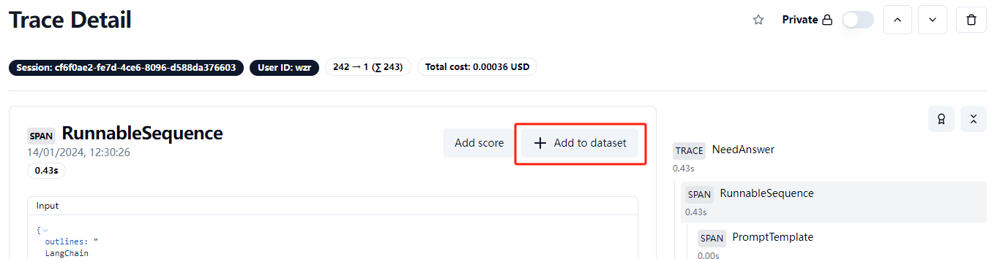
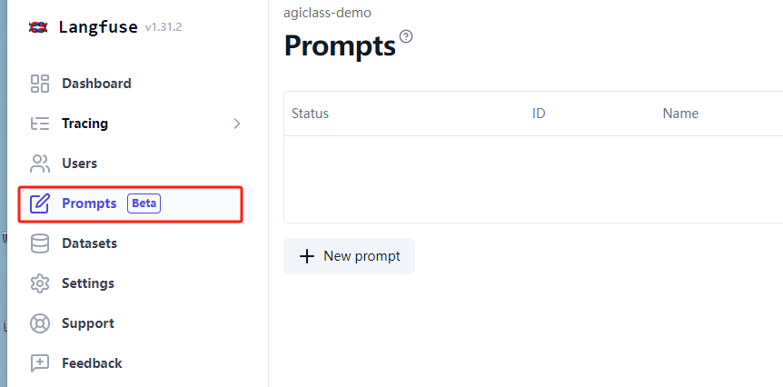
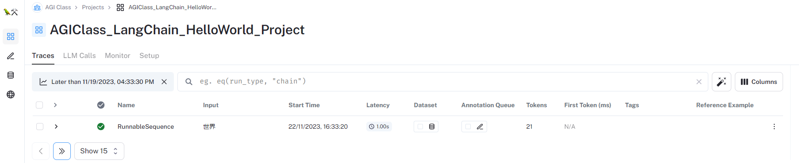
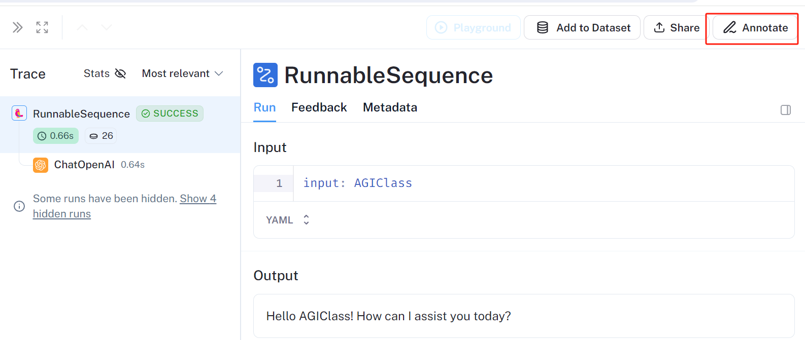
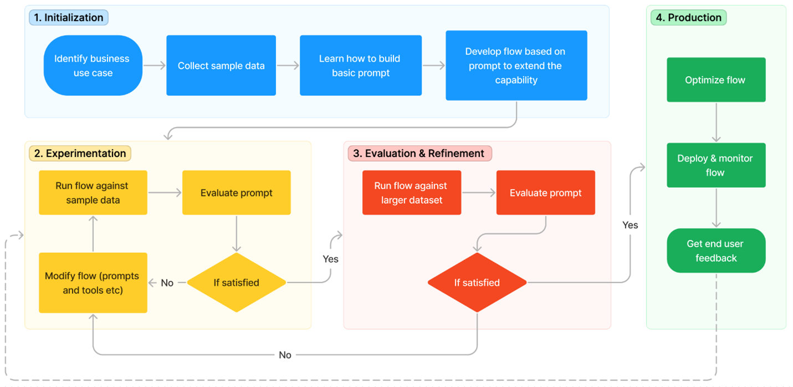
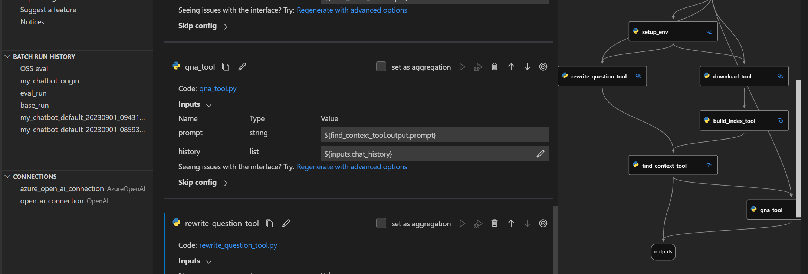

# 💡 这节课会带给你

1. 系统性维护、测试、监控一个 LLM 应用
2. 学习使用主流的工具完成上述工作

## 维护一个生产级的 LLM 应用，我们需要做什么？

1. 各种指标监控与统计：访问记录、响应时长、Token用量、计费等等
2. 调试 Prompt
3. 测试/验证系统的相关评估指标
4. 数据集管理（便于回归测试）
5. Prompt 版本管理（便于升级/回滚）

## 针对以上需求，我们介绍三个生产级 LLM App 维护平台

1. 重点讲解 **LangFuse**: 开源 + SaaS，LangSmith 平替，可集成 LangChain 也可直接对接 OpenAI API；
2. 简单讲解 **LangSmith**: LangChain 的官方平台，SaaS 服务，非开源，**目前需要排队注册**；
3. 简单讲解 **Prompt Flow**：微软开发，开源 + Azure AI云服务，可集成 Semantic Kernel（但貌合神离）。

## 1、LangFuse

开源，支持 LangChain 集成或原生 OpenAI API 集成

官方网站：https://langfuse.com/

项目地址：https://github.com/langfuse

1. 通过官方云服务使用：
   - 注册: cloud.langfuse.com
   - 创建 API Key

```sh
LANGFUSE_SECRET_KEY="sk-lf-..."
LANGFUSE_PUBLIC_KEY="pk-lf-..."
```

2. 通过 Docker 本地部署

```sh
# Clone repository
git clone https://github.com/langfuse/langfuse.git
cd langfuse
 
# Run server and db
docker compose up -d
```


```python
!pip install --upgrade langfuse
```

### 1.1、替换 OpenAI 客户端


```python
from datetime import datetime
from langfuse.openai import openai
from langfuse import Langfuse 
import os

trace = Langfuse().trace(
    name = "hello-world",
    user_id = "wzr",
    release = "v0.0.1"
)

completion = openai.chat.completions.create(
  name="hello-world",
  model="gpt-3.5-turbo",
  messages=[
      {"role": "user", "content": "对我说'Hello, World!'"}
  ],
  temperature=0,
  trace_id=trace.id,
)

print(completion.choices[0].message.content)

```

    Hello, World!


### 1.2、通过 LangChain 的回调集成


```python
from langfuse.callback import CallbackHandler

handler = CallbackHandler(
    trace_name="SayHello",
    user_id="wzr",
)
```


```python
from langchain_openai import ChatOpenAI
from langchain.prompts import PromptTemplate
from langchain.schema.output_parser import StrOutputParser
from langchain.schema.runnable import RunnablePassthrough

#from langchain.chat_models import ErnieBotChat
from langchain.schema import HumanMessage
from langchain.prompts.chat import HumanMessagePromptTemplate
from langchain.prompts import ChatPromptTemplate

model = ChatOpenAI(model="gpt-3.5-turbo-0613")

prompt = ChatPromptTemplate.from_messages([
    HumanMessagePromptTemplate.from_template("Say hello to {input}!") 
])


# 定义输出解析器
parser = StrOutputParser()

chain = (
    {"input":RunnablePassthrough()} 
    | prompt
    | model
    | parser
)
```


```python
chain.invoke(input="AGIClass", config={"callbacks":[handler]})
```

    ERROR:langchain_core.tracers.langchain:Authentication failed for https://api.smith.langchain.com/runs. HTTPError('401 Client Error: Unauthorized for url: https://api.smith.langchain.com/runs', '{"detail":"Invalid auth"}')
    ERROR:langchain_core.tracers.langchain:Authentication failed for https://api.smith.langchain.com/runs/6cb93a2c-2200-4062-8218-a20ac7f27753. HTTPError('401 Client Error: Unauthorized for url: https://api.smith.langchain.com/runs/6cb93a2c-2200-4062-8218-a20ac7f27753', '{"detail":"Invalid auth"}')


    'Hello AGIClass!'


### 1.3、构建一个实际应用

**AGI课堂跟课助手**，根据课程内容，判断学生问题是否需要老师解答

1. 判断该问题是否需要老师解答，回复'Y'或'N'
2. 判断该问题是否已有同学问过


```python
# 构建 PromptTemplate
from langchain.prompts import PromptTemplate

need_answer=PromptTemplate.from_template("""
*********
你是AIGC课程的助教，你的工作是从学员的课堂交流中选择出需要老师回答的问题，加以整理以交给老师回答。
 
课程内容:
{outlines}
*********
学员输入:
{user_input}
*********
如果这是一个需要老师答疑的问题，回复Y，否则回复N。
只回复Y或N，不要回复其他内容。""")

check_duplicated=PromptTemplate.from_template("""
*********
已有提问列表:
[
{question_list}
]
*********
新提问:
{user_input}
*********
已有提问列表是否有和新提问类似的问题? 回复Y或N, Y表示有，N表示没有。
只回复Y或N，不要回复其他内容。""")
```


```python
outlines="""
LangChain
模型 I/O 封装
模型的封装
模型的输入输出
PromptTemplate
OutputParser
数据连接封装
文档加载器：Document Loaders
文档处理器
内置RAG：RetrievalQA
记忆封装：Memory
链架构：Chain/LCEL
大模型时代的软件架构：Agent
ReAct
SelfAskWithSearch
Assistants API
LangServe
LangChain.js
"""

question_list=[
    "谢谢老师",
    "LangChain开源吗",
]
```


```python
# 创建 chain
model = ChatOpenAI(temperature=0,model_kwargs={"seed":42})
parser = StrOutputParser()

chain1 = (
    need_answer
    | model
    | parser
)

chain2 = (
    check_duplicated
    | model
    | parser
)
```

### 1.3.1、用 Trace 记录一个多次调用 LLM 的过程
TRACE (id: trace_id)
|
|-- SPAN: LLMCain (id: generated by Langfuse)
|   |
|   |-- GENERATION: OpenAI (id: generated by Langfuse)
|
|-- SPAN: LLMCain (id: generated by 'next_span_id')
|   |
|   |-- GENERATION: OpenAI (id: generated by Langfuse)

```python
import uuid
from langfuse.client import Langfuse

# 创建一个新trace
def create_trace(user_id):
    langfuse = Langfuse()
    trace_id = str(uuid.uuid4())
    trace = langfuse.trace(
        name="assistant",
        id=trace_id,
        user_id=user_id
    )
    return trace

# 主流程
def verify_question(
    question: str,
    outlines: str,
    question_list: list,
    user_id: str,
) -> bool:
    trace = create_trace(user_id)
    handler = trace.get_langchain_handler()
    # 判断是否需要回答
    if chain1.invoke(
        {"user_input":question,"outlines": outlines},
        config={"callbacks":[handler]}
    ) == 'Y':
        # 判断是否为重复问题
        if chain2.invoke(
            {"user_input":question,"question_list": "\n".join(question_list)},
            config={"callbacks":[handler]}
        ) == 'N':
            question_list.append(question)
            return True
    return False
```


```python
# 实际调用
ret = verify_question(
    #"LangChain和SK哪个好用",
    "LangChain支持Java吗",
    outlines,
    question_list,
    user_id="wzr",
)
print(ret)
```

    True


### 1.3.2、用 Session 记录一个用户的多轮对话
SESSION (id: session_id)
|
|-- TRACE
|-- TRACE
|-- TRACE
|-- ...

```python
import uuid
from langchain_openai import ChatOpenAI
from langchain.schema import (
    AIMessage, #等价于OpenAI接口中的assistant role
    HumanMessage, #等价于OpenAI接口中的user role
    SystemMessage #等价于OpenAI接口中的system role
)


llm = ChatOpenAI()

messages = [
    SystemMessage(content="你是AGIClass的课程助理。"), 
]

handler = CallbackHandler(
    user_id="wzr",
    trace_name="test_chat",
    session_id=str(uuid.uuid4())
)

while True:
    user_input=input("User: ")
    if user_input.strip() == "":
        break
    messages.append(HumanMessage(content=user_input))
    response = llm.invoke(messages,config={"callbacks":[handler]})
    print("AI: "+response.content)
    messages.append(response)
```

    User:  你好


    AI: 你好！有什么我能帮忙的吗？


    User:  你是谁


    AI: 我是一个AI程序，被称为AGIClass的课程助理。我被设计用来帮助提供关于AGIClass课程的信息和答疑解惑。有什么我能帮到你的吗？


    User:  


### 1.4、数据集与测试

### 1.4.1、在线标注



### 1.4.2、上传已有数据集


```python
import json

data = []
with open('my_annotations.jsonl','r',encoding='utf-8') as fp:
    for line in fp:
        example = json.loads(line.strip())
        item = {
            "input": {
                "outlines": example["outlines"],
                "user_input": example["user_input"]
            },
            "expected_output": example["label"]
        }
        data.append(item)
```


```python
from langfuse import Langfuse
from langfuse.model import CreateDatasetRequest, CreateDatasetItemRequest
from tqdm import tqdm

# init
langfuse = Langfuse()

# 考虑演示运行速度，只上传前50条数据
for item in tqdm(data[:50]):
    langfuse.create_dataset_item(
        dataset_name="teacher-assistant",
        input=item["input"],
        expected_output=item["expected_output"]
    )
```

    100%|██████████| 50/50 [00:16<00:00,  3.04it/s]


### 1.4.3、定义评估函数


```python
def simple_evaluation(output, expected_output):
  return output == expected_output
```

### 1.4.4、运行测试

Prompt 模板与 Chain（LCEL）


```python
from langchain.prompts import PromptTemplate

need_answer=PromptTemplate.from_template("""
*********
你是AIGC课程的助教，你的工作是从学员的课堂交流中选择出需要老师回答的问题，加以整理以交给老师回答。
 
课程内容:
{outlines}
*********
学员输入:
{user_input}
*********
如果这是一个需要老师答疑的问题，回复Y，否则回复N。
只回复Y或N，不要回复其他内容。""")

model = ChatOpenAI(temperature=0,model_kwargs={"seed":42})
parser = StrOutputParser()

chain_v1 = (
    need_answer
    | model
    | parser
)
```

在数据集上测试效果


```python
from concurrent.futures import ThreadPoolExecutor
from functools import partial
from langfuse import Langfuse

langfuse = Langfuse()

def run_evaluation(chain, dataset_name, run_name):
    dataset = langfuse.get_dataset(dataset_name)

    def process_item(item):
        handler = item.get_langchain_handler(run_name=run_name)
        
        # Assuming chain.invoke is a synchronous function
        output = chain.invoke(item.input, config={"callbacks": [handler]})
        
        # Assuming handler.root_span.score is a synchronous function
        handler.root_span.score(
            name="accuracy",
            value=simple_evaluation(output, item.expected_output)
        )
        print('.', end='',flush=True)

    # Using ThreadPoolExecutor with a maximum of 10 workers
    with ThreadPoolExecutor(max_workers=4) as executor:
        # Map the process_item function to each item in the dataset
        executor.map(process_item, dataset.items)
```


```python
run_evaluation(chain_v1, "teacher-assistant", "v1-"+str(uuid.uuid4())[:8])
```

### 1.4.5、Prompt 调优与回归测试

优化 Prompt：试试思维链（回忆[第二课](../02-prompt/index.ipynb)）


```python
from langchain.prompts import PromptTemplate

need_answer=PromptTemplate.from_template("""
*********
你是AIGC课程的助教，你的工作是从学员的课堂交流中选择出需要老师回答的问题，加以整理以交给老师回答。

你的选择需要遵循以下原则：
1 需要老师回答的问题是指与课程内容或AI/LLM相关的技术问题；
2 评论性的观点、闲聊、表达模糊不清的句子，不需要老师回答；
3 学生输入不构成疑问句的，不需要老师回答；
4 学生问题中如果用“这”、“那”等代词指代，不算表达模糊不清，请根据问题内容判断是否需要老师回答。
 
课程内容:
{outlines}
*********
学员输入:
{user_input}
*********
Analyse the student's input according to the lecture's contents and your criteria.
Output your analysis process step by step.
Finally, output a single letter Y or N in a separate line.
Y means that the input needs to be answered by the teacher.
N means that the input does not needs to be answered by the teacher.""")
```


```python
from langchain_core.output_parsers import BaseOutputParser
import re

class MyOutputParser(BaseOutputParser):
    """自定义parser，从思维链中取出最后的Y/N"""
    def parse(self, text: str)->str:
        matches = re.findall(r'[YN]', text)
        return matches[-1] if matches else 'N'
```


```python
chain_v2 = (
    need_answer
    | model
    | MyOutputParser()
)
```

回归测试


```python
run_evaluation(chain_v2, "teacher-assistant", "cot-"+str(uuid.uuid4())[:8])
```

    .............................................................................................

### 1.5、Prompt 版本管理

目前是 beta 版本



目前只支持 Langfuse 自己的 SDK


```python
# 按名称加载
prompt = langfuse.get_prompt("need_answer_v1")
 
# 按名称和版本号加载
prompt = langfuse.get_prompt("need_answer_v1", version=2)
 
# 对模板中的变量赋值
compiled_prompt = prompt.compile(input="老师好",outlines="test")

print(compiled_prompt)
```

    *********
    你是AIGC课程的助教，你的工作是从学员的课堂交流中选择出需要老师回答的问题，加以整理以交给老师回答。
     
    课程内容:
    test
    *********
    学员输入:
    老师好
    *********
    如果这是一个需要老师答疑的问题，回复Y，否则回复N。
    只回复Y或N，不要回复其他内容。


### 1.6、如何比较两个句子的相似性：一些经典 NLP 的评测方法（选）

1. **编辑距离**：也叫莱文斯坦距离(Levenshtein),是针对二个字符串的差异程度的量化量测，量测方式是看至少需要多少次的处理才能将一个字符串变成另一个字符串。
   - 具体计算过程是一个动态规划算法：https://zhuanlan.zhihu.com/p/164599274
   - 衡量两个句子的相似度时，可以以词为单位计算
2. **BLEU Score**:
   - 计算输出与参照句之间的 n-gram 准确率（n=1...4）
   - 对短输出做惩罚
   - 在整个测试集上平均下述值
   - 完整计算公式：$\mathrm{BLEU}_4=\min\left(1,\frac{output-length}{reference-length}\right)\left(\prod_{i=1}^4 precision_i\right)^{\frac{1}{4}}$
   - 函数库：https://www.nltk.org/_modules/nltk/translate/bleu_score.html
3. **Rouge Score**:
   - Rouge-N：将模型生成的结果和标准结果按 N-gram 拆分后，只计算召回率；
   - Rouge-L: 利用了最长公共子序列（Longest Common Sequence），计算：$P=\frac{LCS(c,r)}{len(c)}$, $R=\frac{LCS(c,r)}{len(r)}$, $F=\frac{(1+\beta^2)PR}{R+\beta^2P}$
   - 函数库：https://pypi.org/project/rouge-score/
   - 对比 BLEU 与 ROUGE：
     - BLEU 能评估流畅度，但指标偏向于较短的翻译结果（brevity penalty 没有想象中那么强）
     - ROUGE 不管流畅度，所以只适合深度学习的生成模型：结果都是流畅的前提下，ROUGE 反应参照句中多少内容被生成的句子包含（召回）
5. **METEOR**: 另一个从机器翻译领域借鉴的指标。与 BLEU 相比，METEOR 考虑了更多的因素，如同义词匹配、词干匹配、词序等，因此它通常被认为是一个更全面的评价指标。
   - 对语言学和语义词表有依赖，所以对语言依赖强。

<div class="alert alert-success">
<b>划重点：</b>此类方法常用于对文本生成模型的自动化评估。实际使用中，我们通常更关注相对变化而不是绝对值（调优过程中指标是不是在变好）。
</div>

### 1.7、基于 LLM 的测试方法

LangFuse 集成了一些原生的基于 LLM 的自动测试标准。

具体参考：https://langfuse.com/docs/scores/model-based-evals

<div class="alert alert-success">
<b>划重点：</b>此类方法，对于用于评估的 LLM 自身能力有要求。需根据具体情况选择使用。
</div>

## 2、LangSmith

LangChain 官方的 SaaS 服务，不开源，注册需要排队。

平台入口：https://www.langchain.com/langsmith

文档地址：https://python.langchain.com/docs/langsmith/walkthrough

将你的 LangChain 应用与 LangSmith 链接，需要：

1. 注册账号，并申请一个`LANGCHAIN_API_KEY`
2. 在环境变量中设置以下值

```shell
export LANGCHAIN_TRACING_V2=true
export LANGCHAIN_PROJECT=YOUR_PROJECT_NAME #自定义项目名称
export LANGCHAIN_ENDPOINT=https://api.smith.langchain.com #LangSmith的服务端点
export LANGCHAIN_API_KEY=LANGCHAIN_API_KEY # LangChain API Key
```

3. 程序中的调用将自动被记录


```python
import os
os.environ["LANGCHAIN_TRACING_V2"]="true"
os.environ["LANGCHAIN_PROJECT"]="my-test-project"
os.environ["LANGCHAIN_ENDPOINT"]="https://api.smith.langchain.com"
os.environ["LANGCHAIN_API_KEY"]="ls__2e0b732f882a45f48e06e26f9862c9da"
```


```python
from langchain_openai import ChatOpenAI
from langchain.prompts import PromptTemplate
from langchain.schema.output_parser import StrOutputParser
from langchain.schema.runnable import RunnablePassthrough

# 定义语言模型
llm = ChatOpenAI()

# 定义Prompt模板
prompt = PromptTemplate.from_template("Say hello to {input}!")

# 定义输出解析器
parser = StrOutputParser()

chain = (
    {"input":RunnablePassthrough()} 
    | prompt
    | llm
    | parser
)

chain.invoke("AGIClass")
```


    'Hello AGIClass! How can I assist you today?'




### 2.1、基本功能演示

1. Traces
2. LLM Calls
3. Monitor
4. Playground

### 2.2、数据集管理与测试

### 2.2.1、在线标注演示



### 2.2.2、上传数据集


```python
import json

data = []
with open('my_annotations.jsonl','r',encoding='utf-8') as fp:
    for line in fp:
        example = json.loads(line.strip())
        item = {
            "input": {
                "outlines": example["outlines"],
                "user_input": example["user_input"]
            },
            "expected_output": example["label"]
        }
        data.append(item)
```


```python
from langsmith import Client

client = Client()

dataset_name = "teacher-assistant"

dataset = client.create_dataset(
    dataset_name, #数据集名称
    description="AGIClass线上跟课助手的标注数据", #数据集描述
)


client.create_examples(
    inputs=[{"input":item["input"]} for item in data[:50]], 
    outputs=[{"output":item["expected_output"]} for item in data[:50]], 
    dataset_id=dataset.id
)
```

### 2.2.3、评估函数


```python
from langchain.evaluation import StringEvaluator
from nltk.translate.bleu_score import sentence_bleu, SmoothingFunction
import re
from typing import Optional, Any

class AccuracyEvaluator(StringEvaluator):

    def __init__(self):
        pass

    @property
    def requires_input(self) -> bool:
        return False

    @property
    def requires_reference(self) -> bool:
        return True

    @property
    def evaluation_name(self) -> str:
        return "accuracy"

    def _evaluate_strings(
        self,
        prediction: str,
        input: Optional[str] = None,
        reference: Optional[str] = None,
        **kwargs: Any
    ) -> dict:
        return {"score": int(prediction==reference)}
```


```python
from langchain.evaluation import EvaluatorType
from langchain.smith import RunEvalConfig

evaluation_config = RunEvalConfig(
    # 自定义评估标准
    custom_evaluators=[AccuracyEvaluator()],
)
```

### 2.2.4、运行测试


```python
from langchain.prompts import PromptTemplate

need_answer=PromptTemplate.from_template("""
*********
你是AIGC课程的助教，你的工作是从学员的课堂交流中选择出需要老师回答的问题，加以整理以交给老师回答。
 
课程内容:
{outlines}
*********
学员输入:
{user_input}
*********
如果这是一个需要老师答疑的问题，回复Y，否则回复N。
只回复Y或N，不要回复其他内容。""")

model = ChatOpenAI(temperature=0,model_kwargs={"seed":42})
parser = StrOutputParser()

chain_v1 = (
    {
        "outlines":lambda x: x["input"]["outlines"],
        "user_input":lambda x: x["input"]["user_input"],
    }
    | need_answer
    | model
    | parser
)
```


```python
from langchain.smith import (
    arun_on_dataset,
    run_on_dataset,
)

results = await arun_on_dataset(
    dataset_name=dataset_name,
    llm_or_chain_factory=chain_v1,
    evaluation=evaluation_config,
    verbose=True,
    client=client,
    project_name="test-my-assistant-v1",
    tags=[
        "prompt_v1",
    ],  # 可选，自定义的标识
)
```

    View the evaluation results for project 'test-my-assistant-v1' at:
    https://smith.langchain.com/o/97b8262a-9ab9-4b43-afeb-21ea05a90ba7/datasets/b8f34ad2-126b-47ee-a00b-80b9615f318a/compare?selectedSessions=e1742fe4-9c53-422d-a0a6-381d9d9753e4
    
    View all tests for Dataset teacher-assistant at:
    https://smith.langchain.com/o/97b8262a-9ab9-4b43-afeb-21ea05a90ba7/datasets/b8f34ad2-126b-47ee-a00b-80b9615f318a
    [------------------------------------------------->] 50/50


<h3>Experiment Results:</h3>


<div>
<style scoped>
    .dataframe tbody tr th:only-of-type {
        vertical-align: middle;
    }

    .dataframe tbody tr th {
        vertical-align: top;
    }
    
    .dataframe thead th {
        text-align: right;
    }
</style>
<table border="1" class="dataframe">
  <thead>
    <tr style="text-align: right;">
      <th></th>
      <th>output</th>
      <th>feedback.accuracy</th>
      <th>error</th>
      <th>execution_time</th>
      <th>run_id</th>
    </tr>
  </thead>
  <tbody>
    <tr>
      <th>count</th>
      <td>50</td>
      <td>50.000000</td>
      <td>0</td>
      <td>50.000000</td>
      <td>50</td>
    </tr>
    <tr>
      <th>unique</th>
      <td>2</td>
      <td>NaN</td>
      <td>0</td>
      <td>NaN</td>
      <td>50</td>
    </tr>
    <tr>
      <th>top</th>
      <td>N</td>
      <td>NaN</td>
      <td>NaN</td>
      <td>NaN</td>
      <td>ef33817b-1118-474b-ab31-8984b3cfadf1</td>
    </tr>
    <tr>
      <th>freq</th>
      <td>31</td>
      <td>NaN</td>
      <td>NaN</td>
      <td>NaN</td>
      <td>1</td>
    </tr>
    <tr>
      <th>mean</th>
      <td>NaN</td>
      <td>0.780000</td>
      <td>NaN</td>
      <td>1.352174</td>
      <td>NaN</td>
    </tr>
    <tr>
      <th>std</th>
      <td>NaN</td>
      <td>0.418452</td>
      <td>NaN</td>
      <td>0.353752</td>
      <td>NaN</td>
    </tr>
    <tr>
      <th>min</th>
      <td>NaN</td>
      <td>0.000000</td>
      <td>NaN</td>
      <td>1.006048</td>
      <td>NaN</td>
    </tr>
    <tr>
      <th>25%</th>
      <td>NaN</td>
      <td>1.000000</td>
      <td>NaN</td>
      <td>1.240261</td>
      <td>NaN</td>
    </tr>
    <tr>
      <th>50%</th>
      <td>NaN</td>
      <td>1.000000</td>
      <td>NaN</td>
      <td>1.289699</td>
      <td>NaN</td>
    </tr>
    <tr>
      <th>75%</th>
      <td>NaN</td>
      <td>1.000000</td>
      <td>NaN</td>
      <td>1.348476</td>
      <td>NaN</td>
    </tr>
    <tr>
      <th>max</th>
      <td>NaN</td>
      <td>1.000000</td>
      <td>NaN</td>
      <td>3.432141</td>
      <td>NaN</td>
    </tr>
  </tbody>
</table>
</div>


### 2.2.5、基于 LLM 的评估函数

https://docs.smith.langchain.com/evaluation/evaluator-implementations

## 3、Prompt Flow



项目地址 https://github.com/microsoft/promptflow

### 3.1、安装

```sh
pip install promptflow promptflow-tools
```

### 3.2、命令行运行

```sh
pf flow init --flow ./my_chatbot --type chat
```

### 3.3、VSCode 插件

https://marketplace.visualstudio.com/items?itemName=prompt-flow.prompt-flow



### 3.4、与 Semantic Kernel 结合使用

<演示>

Azure云服务：https://learn.microsoft.com/en-us/azure/machine-learning/prompt-flow/get-started-prompt-flow?view=azureml-api-2

## 总结

管理一个 LLM 应用的全生命周期，需要用到以下工具：

1. 调试 Prompt 的 Playground
2. 测试/验证系统的相关指标
3. 数据集管理
4. 各种指标监控与统计：访问量、响应时长、Token费等等

根据自己的技术栈，选择：

1. LangFuse：开源平台，支持 LangChain 和原生 OpenAI API
2. LangSmith: LangChain 的原始管理平台
3. Prompt Flow：开源平台，支持 Semantic Kernel

## 作业

选择一个工具平台，对自己之前开发的系统或模型做批量测试
