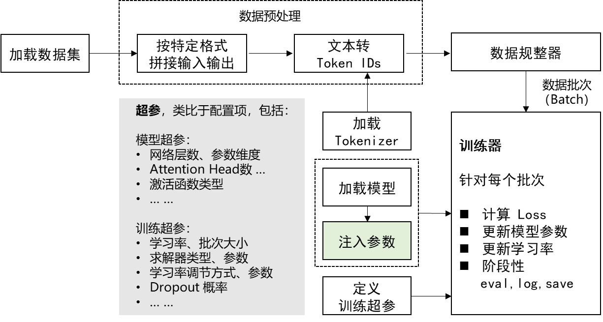
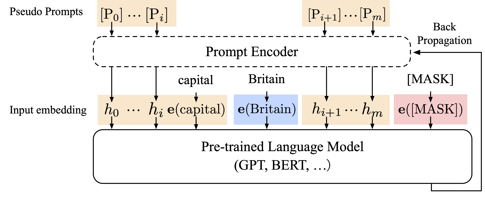

## 八、什么是训练/预训练/微调/轻量化微调

- 模型训练（Training）
- 预训练（Pre-Training）
- 微调（Fine-Tuning）
- 轻量化微调（Parameter Efficient Fine-Tuning, PEFT）

<br/>


回忆上节课的实验

- MNIST手写体识别实验，就是 Training
- 电影评论情感分类实验，就是 Fine-Tuning

Pretraing代码参考，以 GPT-2 模型为例
- 第一步：训练 Tokenizer，代码参考：[pretraining/train_tokenizer.py](pretraining/train_tokenizer.py) 
- 第二步：预训练模型，代码参考：[pretraining/pretrain_gpt2.py](pretraining/pretrain_gpt2.py)
- 训练条件：8 * A100(40G) GPUs，训练时间约2周

## 九、Transformer 结构简介

Transformer 是组成 LLM 的基本单元。

或者说，一个 LLM 就是一个 $N$ 层 Transformer 网络，例如 GPT-3.5 是96层。


### 9.1、Transformer 内部解构简图


**Self-Attention 的计算**


**全连接层：**
- 回忆上节课的全连接网络
- 这里的激活函数一般是 GELU 或 Swish

为了严谨：在 Self-Attention 和全连接网络之间还有个残差和LayerNorm，图中未展示

### 9.2、LM Head


<div class="alert alert-info">
<b>扩展阅读：</b> 
<ul>
<li>更详细的Transformer网络拆解（Encoder-Decoder）：https://jalammar.github.io/illustrated-transformer/</li>
<li>更详细的GPT模型拆解：https://jalammar.github.io/illustrated-gpt2/</li>
</ul>
</div>

## 十、轻量化微调



- 定义微调数据集加载器
- 定义数据处理函数
- 加载预训练模型：AutoModel.from_pretrained(MODEL_NAME_OR_PATH)
- 在预训练模型上增加任务相关输出层 （如果需要）
- 加载预训练 Tokenizer：AutoTokenizer.from_pretrained(MODEL_NAME_OR_PATH)
- **定义注入参数的方法（见下文）**
- 定义各种超参
- 定义 Trainer
- 定义 Evaluation Metric
- 开始训练

### 10.1、Prompt Tuning

- 在输入序列前，额外加入一组伪 Embedding 向量
- 只训练这组伪 Embedding，从而达到参数微调的效果


### 10.2、P-Tuning

- 用一个生成器生成上述伪 Embedding
- 只有生成器的参数是可训练的



### 10.3、Prefix-Tuning

- 伪造前面的 Hidden States
- 只训练伪造的这个 Prefix


### 10.4、LoRA

- 在 Transformer 的参数矩阵上加一个低秩矩阵（$A\times B$）
- 只训练 A，B
- 理论上可以把上述方法应用于 Transformer 中的任意参数矩阵，包括 Embedding 矩阵
- 通常应用于 Query, Value 两个参数矩阵


### 10.5、QLoRA

什么是模型量化


更多参考: https://huggingface.co/blog/hf-bitsandbytes-integration

QLoRA 引入了许多创新来在不牺牲性能的情况下节省显存：

- 4位 NormalFloat（NF4），一种对于正态分布权重而言信息理论上最优的新数据类型
- 双重量化，通过量化量化常数来减少平均内存占用
- 分页优化器，用于管理内存峰值

原文实现：单个48G的GPU显卡上微调65B的参数模型，保持16字节微调任务的性能

### 10.6、AdaLoRA

- 不预先指定可训练矩阵的秩
- 根据参数矩阵的重要性得分，在参数矩阵之间自适应地分配参数预算。


## 十一·、**实战** 

基于ChatGLM3或Llama2， 微调一个同时具有NLU和问答能力对话机器人

### 11.1、数据源

酒店预订场景
https://github.com/thu-coai/CrossWOZ

酒店数据库
https://github.com/thu-coai/CrossWOZ/blob/master/data/crosswoz/database/hotel_db.json

### 11.2、数据增强

- 从CrossWOZ数据集中抽取了只关于酒店的对话
- 利用ChatGPT进行如下修改和补充
    - 对设施的描述更口语化：“找一家有国际长途电话的酒店” -> “找一家能打国际长途的酒店”
    - 补充一定比例的多轮问答，和结束语对话（p=0.3）
    - 补充按酒店名（简称）、价格上限查询的对话（原数据中没有这类说法）

最终按8:1:1拆分训练集、验证集和测试集

**样本举例**

```json
[

    {

        "role": "user",

        "content": "请帮我找一个评分是4.5分以上的酒店。"

    },

    {

        "role": "search",

        "arguments": {

            "rating_range_lower": 4.5

        }

    },

    {

        "role": "return",

        "records": [

            {

                "name": "北京天伦王朝酒店",

                "type": "豪华型",

                "address": "北京东城区王府井大街50号",

                "subway": "灯市口地铁站A口",

                "phone": "010-58168888",

                "facilities": [

                    "公共区域和部分房间提供wifi",

                    "宽带上网",

                    "国际长途电话",

                    "吹风机",

                    "24小时热水",

                    "西式餐厅",

                    "中式餐厅",

                    "残疾人设施",

                    "室内游泳池",

                    "会议室",

                    "健身房",

                    "无烟房",

                    "商务中心",

                    "桑拿",

                    "棋牌室",

                    "早餐服务",

                    "接站服务",

                    "接机服务",

                    "接待外宾",

                    "洗衣服务",

                    "行李寄存",

                    "租车",

                    "叫醒服务"

                ],

                "price": 815.0,

                "rating": 4.5,

                "hotel_id": 4

            }

        ]

    },

    {

        "role": "assistant",

        "content": "推荐您去北京天伦王朝酒店。"

    },

    {

        "role": "user",

        "content": "这家酒店的价格是多少？"

    },

    {

        "role": "assistant",

        "content": "北京天伦王朝酒店的价格是每晚815元。"

    },

    {

        "role": "user",

        "content": "好的，我决定入住北京天伦王朝酒店了。"

    },

    {

        "role": "assistant",

        "content": "好的，祝您入住愉快！"

    }

]
```

### 11.3、数据的基本拼接方式


### 11.4、多轮对话怎么拼

### **方法一**：ChatGLM 2 的方式
user: 你好
assistant: 有什么可以帮您
user: 你喜欢什么颜色
assistant: 喜欢黑色
user: 为什么
assistant: 因为黑色幽默
按照轮次，上述对话将被拆分成3个单独的样本
- 每个样本以之前的历史为输入
- 当前轮的回复为输出

<span style="color:green"><b>样本1</b></span>

输入：
\[Round 0\]\\n
问: 你好\\n
答: 

输出：
有什么可以帮您

<span style="color:green"><b>样本2</b></span>

输入：
\[Round 0\]\\n
问: 你好\\n
答: 有什么可以帮您\\n
\[Round 1\]\\n
问: 你喜欢什么颜色\\n
答:

输出：
喜欢黑色

<span style="color:green"><b>样本3</b></span>

输入：
\[Round 0\]\\n
问: 你好\\n
答: 有什么可以帮您\\n
\[Round 1\]\\n
问: 你喜欢什么颜色\\n
答: 喜欢黑色\\n
问: 为什么\\n
答:

输出：
因为黑色幽默

### **方法二**：ChatGLM 3 的方式

因为CausalLM是一直从左往右预测的，我们可以直接在多轮对话中标识出多段输出。具体如下：

角色**special token**用于标识分隔出多轮对话，同时也可以防范注入攻击

 - <|system|>      #系统提示词，指明模型可使用的工具等信息
 - <|user|>        #用户输入，用户的指令
 - <|assistant|>   #模型回复，或模型思考要做的事情
 - <|observation|> #工具调用、代码执行结果

注意：**这里<|role|>这种是一个token**，而不是一串文本，所以不能通过`tokenizer.encode('<role>')`来得到

角色后跟随的是metadata，对于function calling来说，metadata是调用的函数和相应参数；对其他角色的对话，metadata为空

- 多轮对话finetune时根据角色添加loss_mask
- 在一遍计算中为多轮回复计算loss

---

<|system|>Answer the following questions as best as you can. 

You have access to the following tools:\n[...]

<|user|>\n北京的天气怎么样？

<|assistant|><span style="background-color: yellow; color: black;">\n我需要调用天气预报工具来获取北京的天气信息。</span>

<span style="background-color: yellow; color: brown;"><|assistant|>get_weather\n\`\`\`python\ntool_call(location="北京")\`\`\`</span>

<span style="background-color: yellow; color: black;"><|observation|>\n</span>{"temperature_c": 12, "description": "haze"}

<|assistant|><span style="background-color: yellow; color: black;">\n根据天气工具的信息，北京的天气是：温度 12 摄氏度，有雾。</span>

<span style="background-color: yellow; color: black;"><|user|></span>\n这样的天气适合外出活动吗？

<|assistant|><span style="background-color: yellow; color: black;">\n北京现在有雾，气温较低，建议您考虑一下是否适合外出进行锻炼。</span>

<span style="background-color: yellow; color: black;"><|user|></span>

---


高亮部分为需要计算loss的token。**注意<|assistant|＞后的内容和角色token都需要算loss。**

<div class="alert alert-info">
<b>参考：</b> 
<ul>
<li>官方讲解：https://www.bilibili.com/video/BV1uC4y1J7yA</li>
<li>数据格式部分约在 17'30"</li>
</ul>
</div>

### 11.4.1、ChatGLM 3 的数据加载

实际应用中，我们只需要将上述数据，与ChatGLM 3的标准数据格式对齐，就可调用其原生的数据加载器，自动完成数据拼接

ChatGLM 3原生的数据加载器代码：https://github.com/THUDM/ChatGLM3/blob/main/finetune_chatmodel_demo/preprocess_utils.py

**格式化后的数据样例**

```json
{
  "tools": [
    "search_hotels: 根据筛选条件查询酒店的函数\nparameters: {\"name\":\"酒店名称\",\"price_range_lower\":\"价格下限\",\"price_range_upper\":\"价格上限\",\"rating_range_lower\":\"评分下限\",\"rating_range_upper\":\"评分上限\",\"facilities\": \"酒店提供的设施\"}\noutput: 酒店信息dict组成的list"
  ],
  "conversations": [
    {
      "role": "user",
      "content": "请帮我找一家最低价格是300-400元，提供无烟房的经济型酒店。"
    },
    {
      "role": "assistant",
      "content": "我需要使用search_hotels工具来查询酒店"
    },
    {
      "role": "tool",
      "name": "search_hotels",
      "parameters": {
        "facilities": [
          "无烟房"
        ],
        "price_range_lower": 300,
        "price_range_upper": 400,
        "type": "经济型"
      },
      "observation": [
        {
          "name": "飘HOME连锁酒店(北京王府井店)",
          "type": "经济型",
          "address": "北京东城区东安门大街43号",
          "subway": "灯市口地铁站A口",
          "phone": "010-57305888",
          "facilities": [
            "酒店各处提供wifi",
            "宽带上网",
            "吹风机",
            "24小时热水",
            "暖气",
            "无烟房",
            "早餐服务",
            "行李寄存",
            "叫醒服务"
          ],
          "price": 303.0,
          "rating": 4.3,
          "hotel_id": 152
        }
      ]
    },
    {
      "role": "assistant",
      "content": "推荐您去飘HOME连锁酒店(北京王府井店)。"
    }
  ]
}
```

<div class="alert alert-success">
<b>划重点：</b> 
    <ol>
        <li>在 tools 字段中描述function和parameters的定义</li>
        <li>在 conversations 字段中组织对话轮次</li>
        <li>以 user 和 assistant 标识出用户输入与系统回复</li>
        <li>在 function call 的角色以 tool 标识，并填入 function 名称和参数</li>
        <li>以 observation 标识出 function 的返回结果</li>
    </ol>
</div>

### 11.5、如何在 Llama 2 中实现类似 Function Calling 的效果

参考 ChatGLM 2 的实现方式

1. 我们自定义user、assistant、search、return四个前缀。
   - 因为只有一个 function，我们直接把 function 标识成 search
2. 每轮 assistant 和 search 前缀也由模型自动生成，我们以此判断是 function 还是文本回复
3. 类似 ChatGLM 2，我们以“\[Round $i$\]\n\n”标识轮数 

#### **Function Call 的样例**

**输入** 

\[Round 0\]

user:  你好，请帮我推荐一个提供无烟房的舒适型酒店可以吗？

 **输出**

 search: {\"facilities\": \[\"无烟房\"\], \"type\": \"舒适型\"}}

#### **文本回复的样例**

**输入** 

\[Round 0\]

user: 你好，请帮我推荐一个提供无烟房的舒适型酒店可以吗？

search: {\"facilities\": \[\"无烟房\"\], \"type\": \"舒适型\"}}

\[Round 1\]

return: \[{\"name\": \"北京红驿栈酒店\", \"type\": \"舒适型\", \"address\": \"北京朝阳区东直门外春秀路太平庄10号(主副楼在一幢建筑里)\", \"subway\": \"东直门地铁站E口\", \"phone\": \"010-64171066\", \"facilities\": \[\"公共区域和部分房间提供wifi\", \"宽带上网\", \"国际长途电话\", \"吹风机\", \"24小时热水\", \"暖气\", \"无烟房\", \"早餐服务\", \"接待外宾\", \"行李寄存\", \"叫醒服务\"\], \"price\": 344.0, \"rating\": 4.7, \"hotel_id\": 51}, {\"name\": \"维也纳国际酒店(北京广安门店)\", \"type\": \"舒适型\", \"address\": \"北京西城区白广路7号\", \"subway\": \"广安门内地铁站C口\", \"phone\": \"010-83539988\", \"facilities\": \[\"酒店各处提供wifi\", \"宽带上网\", \"吹风机\", \"24小时热水\", \"中式餐厅\", \"会议室\", \"无烟房\", \"商务中心\", \"早餐服务\", \"洗衣服务\", \"行李寄存\", \"叫醒服务\"\], \"price\": 553.0, \"rating\": 4.7, \"hotel_id\": 56}\]}\]

**输出** 

assistant: 没问题，推荐你去北京红驿栈酒店和维也纳国际酒店(北京广安门店)，都挺好的。

### 11.6、编写训练代码

**见附件: [fine-tuning-lab.zip](fine-tuning-lab.zip)**

### 11.7、训练后，在测试集上的参考指标

1. 针对 Function Calling 的每个参数（即 Slot），我们评估准确率、召回率、F1值
2. 针对文本回复，我们评估输出文本与参考文本之间的 BLEU Score
3. 如果本该是 Function Calling 的轮次，模型回复了文本，则所有指标为 0，反之 BLEU Score 为 0

| Model       | Method      | BLEU-4 | SLOT-P | SLOT-R | SLOT-F1 | 
| :---------- | :---------- | :----: | :-----: | :-----: | :-----: | 
| ChatGLM3-6B | 原生 | 14.42 |  64.97 | 36.98 |  47.13  |   
|  | P-Tuning V2 | 54.57 |  93.53 |  92.93  |  93.23  |   
|             | LoRA        | 60.07  |  95.93  |  94.69  |  95.31  |   
| Llama2-7B | QLoRA | **63.05** | **95.96** |  **95.50**  |  **95.73**  | 


## 十二、数据准备与处理

### 12.1、数据采集

- 自然来源（如业务日志）：真实数据
- Web 抓取：近似数据
- 人造

### 12.2、数据标注

- 专业标注公司
  - 定标准，定验收指标
  - 预标注
  - 反馈与优化
  - 正式标注
  - 抽样检查：合格->验收；不合格->返工
- 众包
  - 定标准，定检验指标
  - 抽样每个工作者的质量
  - 维系高质量标注者社区
- 主动学习：通过模型选择重要样本，由专家标注，再训练模型
- 设计产品形态，在用户自然交互中产生标注数据（例如点赞、收藏）

### 12.3、数据清洗

- 去除不相关数据
- 去除冗余数据（例如重复的样本）
- 去除误导性数据（业务相关）

### 12.4、样本均衡性

- 尽量保证每个标签（场景/子问题）都有足够多的训练样本
- 每个标签对应的数据量尽量相当
  - 或者在保证每个标签样本充值的前提下，数据分布尽量接近真实业务场景的数据分布
- 数据不均衡时的策略
  - 数据增强：为数据不够类别造数据：（1）人工造；（2）通过模板生成再人工标注；（3）由模型自动生成（再人工标注/筛选）
  - 数据少的类别数据绝对数量也充足时，Downsample 一般比 Upsample 效果好
  - 实在没办法的话，在训练 loss 里加权（一般不是最有效的办法）
- 根据业务属性，保证其他关键要素的数据覆盖，例如：时间因素、地域因素、用户年龄段等

### 12.5、数据集构建

- 数据充分的情况下
  - 切分训练集（训练模型）、验证集（验证超参）、测试集（检验最终模型+超参的效果）
  - 以随机采样的方式保证三个集合的数据分布一致性
  - 在以上三个集合里都尽量保证各个类别/场景的数据覆盖
- 数据实在太少
  - 交叉验证


## 作业：训练自己的模型

请跟随[实验指导](lab/index.ipynb)完成本次作业。
