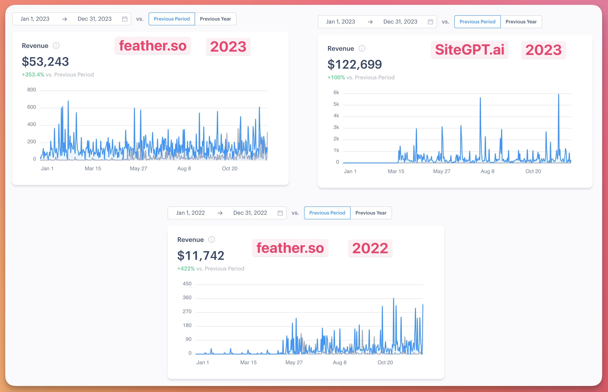
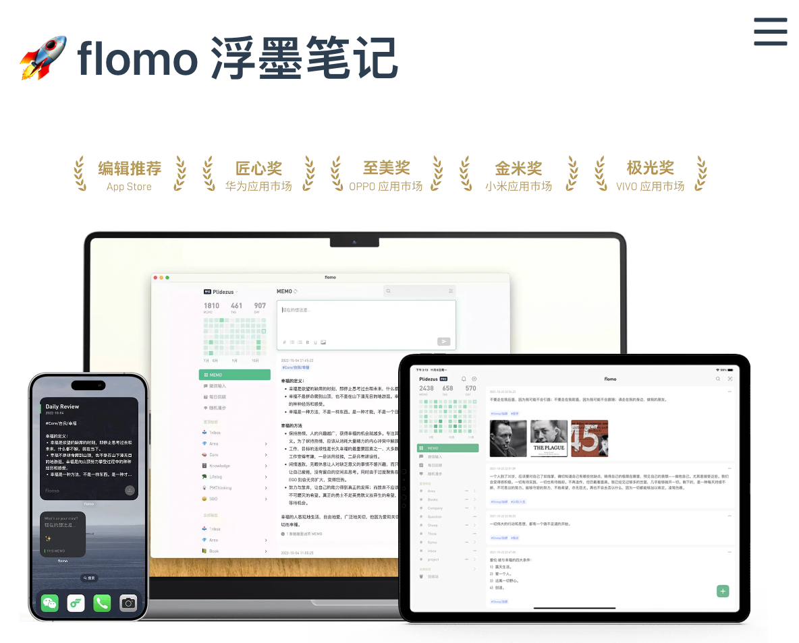
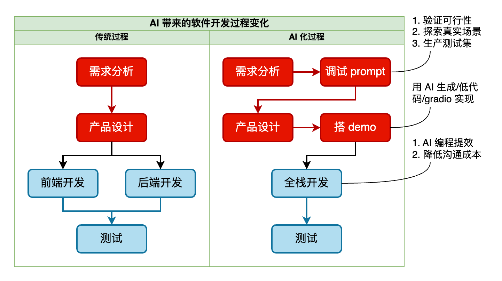
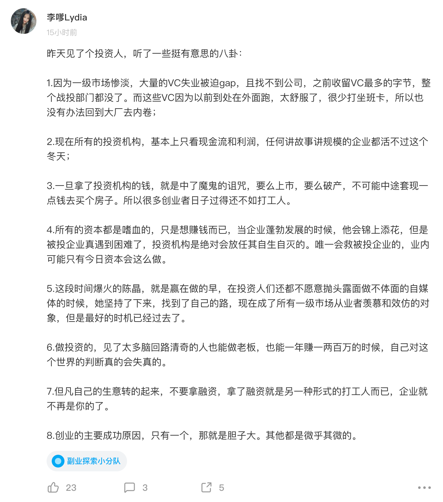

# 大模型时代的产品机遇

## 💡 这节课会带给你

1. 如何做好独立开发，拥有更自由的生活。但这是你想要的吗？
2. 机会在哪里？怎么做？
3. 公司内也可以独立开发

开始上课！

## 独立开发者

- 英文 indie hacker，是指独立开发软件产品的人
- 他们通常是一人团队，或者是一小群人
- 他们的产品通常是小而美，但是有着足以让团队体面生活的商业价值
- AI 时代，他们要**懂 AI、懂业务、懂编程**

### 成功的独立开发者们

#### 印度小哥 Bhanu Teja Pachipulusu

独立开发 [SiteGPT](https://sitegpt.ai/) 和 [feather](https://feather.so/) 两个产品的印度小哥 2023 全年收入 17.5 万美元。

SiteGPT.ai 踩到了 AI 风口。

https://twitter.com/pbteja1998/status/1741532904805880200

#### flomo - 浮墨笔记

主页：https://flomoapp.com/

<b>思考：</b>为什么 flomo 从未公布过收入情况？

### 大模型时代前所未有的程序员独立创业机会

我们有 72% 的同学有独立创业意向

1. 云计算提供了便捷的基础设施
2. AI 直接能做的越来越多，编程效率也被提升，开发成本下降
3. 大量渗透到毛细血管的场景，需要 AI 化
   1. Prompt 调优
   2. 体验定制
   3. 传统系统对接
   4. OpenAI GPTs/Actions
   5. 私有模型微调

一种趋势：**只为 5000 人写一个软件，体验足够好，每月收 10 元钱。** 大厂不会抢这种市场。

模型能力越来越强，技术路线越来越成熟，用户预期也在下降。2024 的 AI 应用爆发，值得期待。

### 但是，先冷静下

独立开发，香吗？

|          | 独立开发         | 打工                         |
| -------- | ---------------- | ---------------------------- |
| 收入     | 不稳定           | 稳定                         |
| 收入量级 | 正常             | 正常                         |
| 时间     | 自由             | 受限                         |
| 工作内容 | 自由             | 受限                         |
| 成长     | 自由             | 受限                         |
| 抗风险   | 弱               | 强                           |
| 为谁负责 | 客户、自己和家人 | 老板、同事、客户、自己和家人 |

_注：此表描述的是通常情况，非特例情况_

最香的，是只要让个人利益和客户利益一致，就没有乱七八糟的纠结了。

最大区别，其实是「自由」。所以：

1. 自由的时间，需要自律
2. 自由的工作内容，需要决策
3. 自由的成长，需要自律和决策

<b>思考：</b>自律和决策，哪个更重要？

### 做好独立开发，最重要的是自律

<b>划重点：</b> 宏观看，执行永远比思考更重要。建议思考占用的精力别超过 10%。

别信成功学的「选择比努力重要」。那是小概率事件，且做对选择也要努力才能拿到结果。

1. 靠谱的思考来源于执行的总结
2. 别期待完美的思考，有点儿小念头就立即执行，边执行边修正
3. 埋头执行容易陷入惯性，所以需要时不时跳出来做思考

独立开发是对执行力极大的考验，需要强大的自律。

### 如何自律

1. 定目标，并说出去。比如发到朋友圈
2. 设惩罚，找人监督。比如做不到，就发红包
3. 家里划定独立办公空间，甚至专门租用。比如王卓然老师的奢侈办公室

但一定要给自己安排休息时间。工作日出游，真的很爽。

此时，你是否决定做独立开发了？别急，讨厌的事情还很多。

### 注册公司

虽然没有公司，也可以做独立开发，但强烈建议注册，因为：

1. 有些客户只能和公司合作
2. 有些资质、知识产权只有公司才能申请
3. 缴社保等方便

#### 到哪注册

1. 驻地，办事方便
2. 其它有利好扶持政策的地方，但人最好也能过去

#### 注册要点

1. 找靠谱代理机构，流程、代账、地址，几千元搞定
2. 注册类型，从**小规模纳税人**起步（税率 3%）。经营规模大了（连续 9 个月超 500 万收入），或者受资质限制了，再转**一般纳税人**（税率 6%）。

### 日常事务性工作

1. 合同谈判、起草、签署（用 ChatGPT 写合同，超爽）
2. 申请软件著作权、商标、备案
3. 财务相关

虽然有专业机构代理，但也还是耗精力，挺烦的。

### 管理兼职

兼职最大的成本不是薪资，而是沟通成本。

#### 薪资

1. 如果与结果正相关，就按效果付费，分担你的风险
2. 如果与结果不正相关，就按件付费，尽量压低价格。千万别大方，因为风险都在你自己身上
3. 如果工作量不好估计，就按月付费，虽然这样的管理成本比较高

#### 沟通

降低沟通成本的方法：

1. **提升沟通频率**。把问题尽早暴露，避免返工
2. **提升沟通带宽**
   1. 能面聊就面聊。如果不具备条件，至少第一次沟通要面聊/视频
   2. 尽量写好文档、画好图表，别只用 IM 沟通（和 prompt 原则一样：具体、丰富、少歧义）
   3. 文档和图表都用协作型的。产出物也尽量实时共享

### 难

1. 起步阶段，很**难**有收入。时间可能长达半年、一年……
2. 遇事**难**以求助，只能自己解决
3. 一叶扁舟，遇到大风浪，很**难**抵挡

### 如何决策要不要走这条路

如果前面所述**不是**你愿意面对的，那么就别做独立开发了。

如果还想做，建议：

#### 现在有稳定收入

1. 别轻易放弃当前收入
2. 工作之余做一段时间的副业，积累经验和成果，看看自己是否适合，有眉目了再考虑全职
3. 多一手准备，肯定没错

#### 现在无稳定收入

在找工作和独立开发各放一半精力，因为：

1.  现在找工作，挺难的
2.  找工作不可能占满所有时间
3.  独立开发的经验和成果可以帮助找工作，反之不成立
4.  如果独立开发做顺了，就不需要找工作了。但有了工作，也还需要独立开发来兜底
5.  找工作常有挫败感，可以用独立开发的阶段成果来滋养自己

无论做不做独立开发，产品思维都是非常有用的。所以，后面课程，并不只能帮助到独立开发者。

### 参考阅读

- [flomo 的经营理念](https://help.flomoapp.com/about-us/about-us/company-concept.html)
- [这家公司只有创始人一名员工，年营收千万！他是如何做到的？](https://mp.weixin.qq.com/s/pznEq8JHRMtaSlO_OvzjYQ)
- [9 人小公司，细分领域 SaaS 工具从 0 到 1 做到 100 万美金 ARR 的过程](https://mp.weixin.qq.com/s/Xvj7Y7NyTILmyS287ymQOg)
- [一个独立创造者的五年](https://mp.weixin.qq.com/s/x6PLSIMn_1qcKnXWPT-J-Q)
- [中国的独立开发者都在开发些什么？](https://mp.weixin.qq.com/s/izJdOMP0LY1VeBmzpnXScQ)
- [想做“独立开发者”，第一步应该怎么做？](https://mp.weixin.qq.com/s/5q6WYfr6G2zKru0LcvvPUw)
- [#独立开发变现周刊](https://mp.weixin.qq.com/mp/appmsgalbum?__biz=MjM5OTM3NzAwNg==&action=getalbum&album_id=1857680644290478080&scene=173&from_msgid=2649285309&from_itemidx=1&count=3&nolastread=1#wechat_redirect)
- [一年的独立开发者生活](https://www.maliquankai.com/2018/08/08/2018-08-08-oneyear-developer/)

## 在公司内的「独立开发者」

- 懂编程才能把 AI 发挥到极致
  - GPTs 可控性太差，所以还有 Assistants API
  - Assistants API 太难微操，所以原生 API 调用价值仍然很大
- 所以，任何想 AI 化的公司，都需要一名全面的**懂 AI、懂业务、懂编程**人才
- 这个人就是在公司内的「独立开发者」

相比独立公司的独立开发者：

- 多些保障，少了自由
- 有团队，但技术方面只能靠自己 + AI

发展建议：

1. 给业务落地最佳的 AI 方案，是核心竞争力
2. 在「懂业务」上多下工夫，因为
   1. AI 会越来越厉害，业务不会
   2. 别做业务人员的内部外包

## 开工！

### 研发流程

AI 率先改变的是软件工程界。产品开发流程发生下面的变化。

主要改变：

1. 需求阶段就调试 prompt，不动代码，验证可行性
2. 后续迭代，prompt 也是独立维护，不和代码耦合
3. 借助工具快速搭出 demo，验证需求
4. 全栈开发

### 立项

在立项阶段，要对这三个要素有初步的答案：

1. 真实需求是什么？
2. 商业模式是什么？
3. 推广渠道在哪里？

初步答案可能不靠谱，没关系，后面都有修正机会。

但起点和要特别关注的是，寻找**真实**需求。然而，建议把思考顺序反过来，因为

1. 推广渠道和商业模式不是程序员的舒适区，所以要先想清楚
2. 需求想太多，容易陷入兴奋，后两者不多想就动手
3. 推广渠道决定用户群体，这确实应该最先定义
4. 不掌握渠道的人做出产品，很容易被掌握渠道的抄走，或分走最大利润

#### 推广渠道

<b>立项阶段只回答一个问题：</b>到哪找 100 个种子用户，或 1-2 个种子客户？

用户/客户在手边，不仅好触达，而且说明你离他们不远，是懂他们的（至少不陌生）。

推论：赚钱要先赚熟人的，不丢人。

<b>划重点：</b>AI 赋能万行万业。要从你最熟悉的行业找机会

<b>思考：</b>你身边都有什么人群/客群能成为种子？在纸上列出来

#### 可行的商业模式

##### 常见商业模式

| 模式       | 说明                        | 2C 产品                                          | 2B 产品                             |
| ---------- | --------------------------- | ------------------------------------------------ | ----------------------------------- |
| 免费模式   | 免费使用，广告/增值服务变现 | 微信、抖音、王者荣耀、ChatGPT、Bing Chat         | GitHub、钉钉、飞书                  |
| 计费模式   | 按次/按量/按时长收费        | 滴滴打车、共享单车、共享充电宝                   | 云服务器、云数据库、云存储          |
| 订阅模式   | 包月、包季、包年            | 网易云音乐、爱奇艺、ChatGPT Plus、GitHub Copilot | GitHub Copilot                      |
| 一次性付费 | 购买一次，终身使用          | Alfred、塞尔达传说                               | Confluence、JIRA、Windows、外包项目 |

<b>思考：</b>为什么 AI 产品采用订阅模式的更多？

##### 适合独立开发者/AI 的模式

1. 不要烧钱。如果用户/客户不肯为你的产品掏钱，说明需求选错了
2. 2B 外包项目，尽量一次性付费，且做好只收到首付款的准备
3. 订阅制最香
   1. 每月有固定收入，增长压力不大（很多好产品死于增长）
   2. 连续包月，很多人忘记退订……（但在中国较难获得权限）
   3. 订阅更匹配按 token 算成本的 AI 产品，参考手机按量付费 vs. 套餐制

支付宝[周期扣款的准入条件](https://opendocs.alipay.com/open/20190319114403226822/intro#%E5%87%86%E5%85%A5%E6%9D%A1%E4%BB%B6)：

1. 在开通时，商家需要在线提交营业执照，注册资本大于等于 100 万人民币。
2. 企业无经营风险，包含但不限于工商信息可查询到的风险信息：行政处罚、股权冻结、股权质押、动产抵押、动产抵押物等。

微信支付的门槛更高，参考[「微信支付——扣款服务（委托代扣）最全资料整理」](https://zhuanlan.zhihu.com/p/548443629)。基础条件：

1. 商户需要提供服务电话（要求通过微信支付认证，并展示在账单详情页中）
2. 接入商户一个月内整体客诉已经妥善处理并反馈平台，近一个月客诉小于万分之一（含主体）
3. 商户主体无违规
4. 接入代扣业务需要有一定的交易量要求，3 个月以上，主动支付的日交易笔数超过 1000 笔

##### 要融资吗？

请相信：**天下没有免费的午餐**

只在以下情况考虑融资：

1. 当有个「改变世界」的想法，无法低成本验证，必须先烧钱时，拉风投是最好的选择。保护好自己的底线
2. 但模式已经验证，需要资金快速扩张时，果断融资。但，优先考虑正规借贷，而不是风投
3. 当需要投资人除了钱以外的其它资源时，比如品牌、生态、渠道、人脉等

切记：没有融资经验，别贸然融资。找有经验的人帮忙

<b>思考：</b>你列出的种子群体，哪些付费能力较强？

#### 找到真实需求

超过半数的产品经理，都找不到真实需求。

人的语言、行为表达出的需求，往往不是真实需求。比如：

1. 「酱香拿铁」卖爆了，买的人是为了喝咖啡吗？
2. 妈妈要你给她买生日蛋糕，她是没钱买吗？她是想吃蛋糕吗？
3. 你来学习大模型技术，你的需求就是学大模型吗？

课堂练习：

客户想要一套「智能客服系统」。他真正需求是什么？

但是，真实需求不是猜出来的。

##### 5 why 法

丰田公司创始人，丰田佐吉，提出的一种「找根本原因」的方法：

> 接到一个需求，问为什么有这需求。得到答案后，再问为什么会有这样的答案，以此类推，直至找到根本性的核心需求。

实战中，通常问到 2-3 个 why，就已经找到真需求了。

举例：

看一段羞耻的视频：https://www.bilibili.com/video/BV1wW411Z7Fg/?t=13m49s

5 个 why，找到了真需求「她需要我对她用心」，解决方案是「更多关注她的感受，把过程表达出来」。

但是，5 why 法有两个致命缺点：

1. 如果你对业务理解不够，对方会不耐烦
2. 有时，显得不太礼貌

##### 躬身入局法

非常简单：自己去把业务做一遍。一遍不够就再来一遍。

真实案例：

1. 高途要求所有新入职的产研，必须先做一个月的销售
2. 美团骑手线的产品经理，都送过外卖

这是比「吃自己的狗粮」更彻底的做法。

缺点：

1. 成本高，时间和资源成本都高。但很值得
2. 有些业务，咱们真插不上手。那就像个学徒一样，全程跟随观察吧

<b>行动：</b>约付费能力强的群体中，你最熟悉的前三个人吃饭。你给 ta 讲 AI，ta 跟你聊需求

### 作业

用前面的方法，找到一个 AI 产品创意，用 AI 帮你撰写方案。

### 调试 prompt，验证可行性

先手工调试 prompt，确保需求可以解决，再继续。

- 最简单：
  - 在各个模型的 chat 界面，或 Playground 里，直接调试
  - GPTs
- 专业：
  - [Semantic Kernel Tools](https://marketplace.visualstudio.com/items?itemName=ms-semantic-kernel.semantic-kernel)
    - 和 SK 绝配，与工程代码库直接联动
  - [LangSmith](https://smith.langchain.com/)
    - 和 LangChain 绝配，自动日志 LC 代码的运行结果
    - 可以建测试集，自动测试
    - 类似 GitHub，可以和其它人共享 prompt
    - Hub 中的 prompt 可以直接在代码中引用
- 新潮，用 flow：
  - [Prompt flow](https://github.com/microsoft/promptflow)
    - 微软 AI 工具链的新成员
    - 可以和 SK 配合，也可以独立使用
    - 调试好的代码可直接部署到 Azure
    - 安装有些麻烦
    - [flows/chat/](flows/chat/) 中有示例
  - [Vellum](https://www.vellum.ai/)
    - 专业的 prompt 调试工具，使用最方便
    - 支持 scenario、prompt、LLM 三个维度的交叉比较
    - 支持 workflow

可惜，支持国产大模型的 prompt 调试工具，还没有出现。LangSmith 间接支持国产大模型

