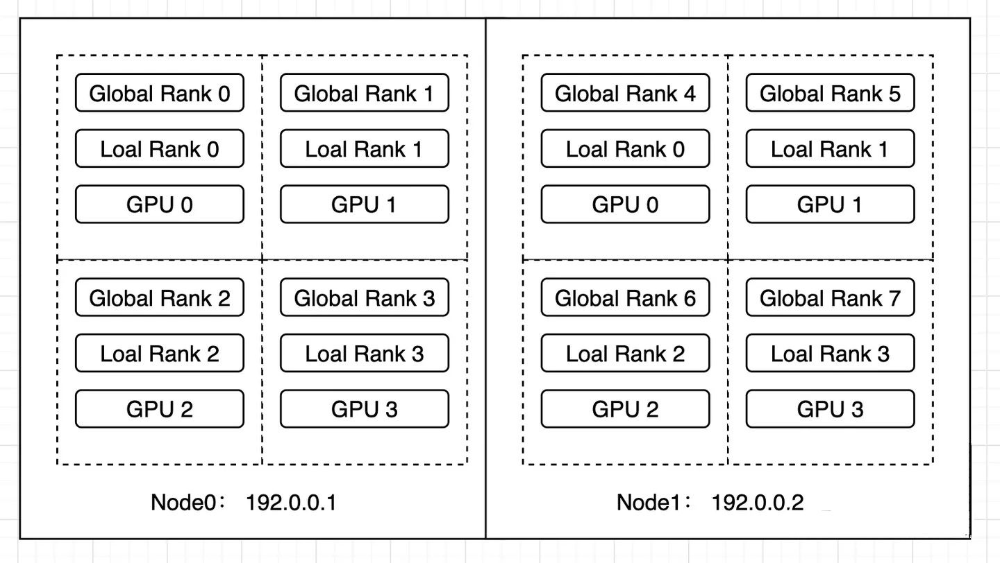

## 多卡训练

### 几个基础概念

- **world_size**: 总进程数，一般一张卡对应一个进程
- **global_rank**: 当前进程相对全部进程的编号
- **local_rank**: 当前进程相对本机进程的编号
- **node**: 节点，就是一台服务器
- **node_rank**: 当前节点编号
- **nproc_per_node**: 每个节点上启动几个进程，一般与节点上的GPU数一致
- **master_addr**: 主节点地址
- **master_port**: 主节点端口
- **group**: 一个进程组，一般一个训练任务对应一个进程组



### PyTorch 训练代码样例

初始化训练环境


```python
torch.distributed.init_process_group(
    backend="nccl", #通信后端，nccl, mpi, gloo （建议GPU训练用nccl，CPU训练用gloo）
    init_method=None, #前进程组初始化方式。默认为 env://，表示从环境变量读取 MASTER_ADDR, MASTER_PORT, WORLD_SIZE 和 RANK。
    timeout=default_pg_timeout,
    world_size=-1,
    rank=-1,
    store=None,
    group_name=''
)
```

加载模型和数据


```python
from torch.utils.data import Dataset, DataLoader
from torch.utils.data.distributed import DistributedSampler
from torch.nn.parallel import DistributedDataParallel as DDP

dataset = your_dataset()
datasampler = DistributedSampler(dataset, num_replicas=world_size, rank=rank)
dataloader = DataLoader(dataset, batch_size=batch_size_per_gpu, sampler=datasampler)
model = your_model()
model = DDP(model, device_ids=[local_rank], output_device=local_rank)
```

其它部分跟单机单卡训练一致

### Huggingface 训练 

上述步骤 Huggingface 的 Trainer 会自动帮你适配环境，代码与单机单卡训练一致。

### 启动训练（PyTorch原生）


```python
# 在 node0 上运行
torchrun --nproc_per_node=4 \

         --nnodes=2 \

         --node_rank=0  \ 

         --master_addr="192.0.0.1" \

         --master_port=1234 \

      ain_no --more_args_for_training_scriptde.py
```


```python
# 在 node1 上运行
torchrun --nproc_per_node=4 \

         --nnodes=2 \

         --node_ran1=0  \ 

         --master_addr="192.0.0.1" \

         --master_port=12
         train.py n_no --more_args_for_training_sde.py
```

### DeepSpeed

DeepSpeed 是一个由微软开发的开源深度学习优化库，旨在提高大规模模型训练的效率和可扩展性。

它通过多种技术手段来加速训练，包括模型并行化、梯度累积、动态精度缩放、本地模式混合精度等。

DeepSpeed 还提供了一些辅助工具，如分布式训练管理、内存优化和模型压缩等，以帮助开发者更好地管理和优化大规模深度学习训练任务。

此外，DeepSpeed 基于 PyTorch 构建，只需要简单修改即可迁移。DeepSpeed 已经在许多大规模深度学习项目中得到了应用，包括语言模型、图像分类、目标检测等等。

项目地址：https://github.com/microsoft/DeepSpeed

**启动训练**


```python
deepspeed --hostfile=hostfile.txt train.py \
          --deepspeed \
          --deepspeed_config deepspeed_config.json \
          --more_args_for_training_script
```


```python
# hostfile.txt

192.168.0.1 slots=4
192.168.0.2 slots=4
```

### 进程间数据同步：torch.distributed.barrier()

PyTorch在分布式训练过程中，对于数据的读取是采用主进程预读取并缓存，然后其它进程从缓存中读取，不同进程之间的数据同步具体通过torch.distributed.barrier()实现。

torch.distributed.barrier() 意味着设置一个阻塞栅栏，让此进程处于等待状态，等待所有进程到达栅栏处。

所有进程都到达了当前的栅栏处，这样所有进程就达到了同步，并同时得到释放。

以上节课的选修代码为例：[12-fine-tuning-02/pretraining/pretrain_gpt2.py](../12-fine-tuning-02/pretraining/pretrain_gpt2.py)


```python
if torch.distributed.get_rank() > 0:
    # 主进程加载数据，其它进程等待从缓存加载 arrow 文件
    torch.distributed.barrier()

tokenized_train_dataset = raw_train_dataset.map(
    prepare_train_features,
    batched=True,
    num_proc=num_proc
)

tokenized_valid_dataset = raw_valid_dataset.map(
    prepare_train_features,
    batched=True,
    num_proc=num_proc
)

if torch.distributed.get_rank() == 0:
    # 主进程加载数据结束
    torch.distributed.barrier()
```

## RLHF 简介

<div class="alert alert-warning">
<b>思考</b>
<ol>
    <li>RLHF 与 Fine-Tuning 在最终得到效果上有什么不同？</li>
    <li>RLHF 与 Fine-Tuning 在数据要求上有什么不同？</li>
    <li>所以，什么时候我们需要 RLHF ？</li>
</ol>
</div>

Reinforcement Learning from Human Feedback 使用强化学习的方式直接优化带有人类反馈的语言模型。

RLHF 使得在一般文本数据语料库上训练的语言模型能和**复杂的人类价值观对齐**。

### RLHF 的数据形式

- 偏好标注数据：即 Human Feedback，用于训练 Reward Model
  - 一些开源数据集
     - https://huggingface.co/datasets/Anthropic/hh-rlhf
     - https://huggingface.co/datasets/nvidia/HelpSteer
     - https://huggingface.co/datasets/HuggingFaceH4/stack-exchange-preferences
     - https://huggingface.co/datasets/PKU-Alignment/PKU-SafeRLHF
     - https://huggingface.co/datasets/lmsys/chatbot_arena_conversations
     - https://huggingface.co/datasets/OpenAssistant/oasst1
- Prompt数据：无标注，用于训练 RL，可以直接从 instruction 数据中采样

### RLHF 的训练过程

1. **预训练语言模型**

这里也可以用额外的标注文本或者条件对这个 LLM 进行微调，但不是必须步骤。


2. **训练奖励模型**


关于模型选择方面，奖励模型（Reward Model, RM）可以是另一个经过微调的 LLM，也可以是根据偏好数据从头开始训练的 LLM。

例如： 
- OpenAI 使用了 175B 的 LLM 和 6B 的 RM；
- Anthropic 使用的 LLM 和 RM 从 10B 到 52B 大小不等；
- DeepMind 使用了 70B 的 Chinchilla 模型分别作为 LLM 和 RM。

3. **RLHF**


这个过程有很多变体，例如:

- DeepMind 使用的事 A2C 算法做 RL: https://huggingface.co/blog/deep-rl-a2c
- Anthropic 尝试了将 RM 和 LLM 同时优化: https://arxiv.org/abs/2204.05862
- Llama 2 引入了2个独立的 RM 分别评估 helpfulness 和 safety；同时在 RL 之前加入 拒绝采样 让一个模型针对同一个 Prompt 生成 K 个答案，然后利用 RM 为这 K 个答案打分，选出最优的答案，再去对原本的模型进行 SFT，以增广模型的探索空间。https://arxiv.org/abs/2307.09288

### RLHF 的训练框架

- **Trlx**： https://github.com/CarperAI/trlx
  - 优点：使用广泛，实现了 OpenAI 的算法
  - 缺点：据说代码较乱，不支持 GLM
- **DeepspeedChat**：https://github.com/microsoft/DeepSpeedExamples/tree/master/applications/DeepSpeed-Chat
  - 优点：深度整合 DeepSpeed，支持 100B 以上模型训练
  - 缺点：只支持BLOOM，GPT，Llama2等几种网络结构
- **ColossalAI-Chat**：https://github.com/hpcaitech/ColossalAI/tree/main/applications/Chat
  - 优点：国产，代码质量高
  - 缺点：生态一般
